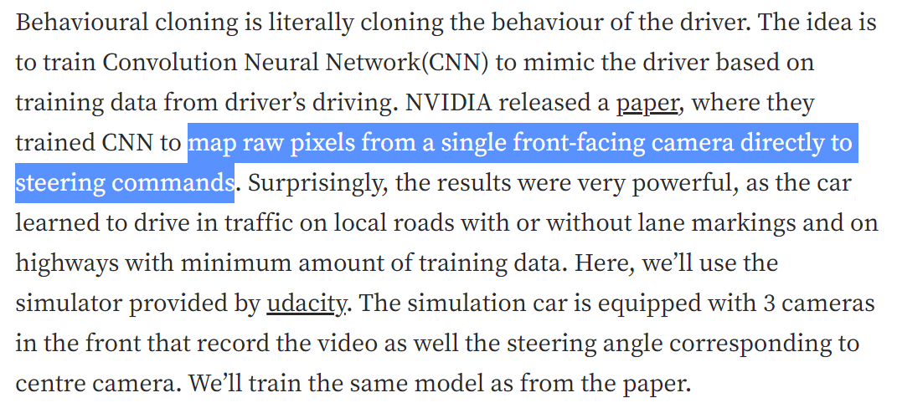
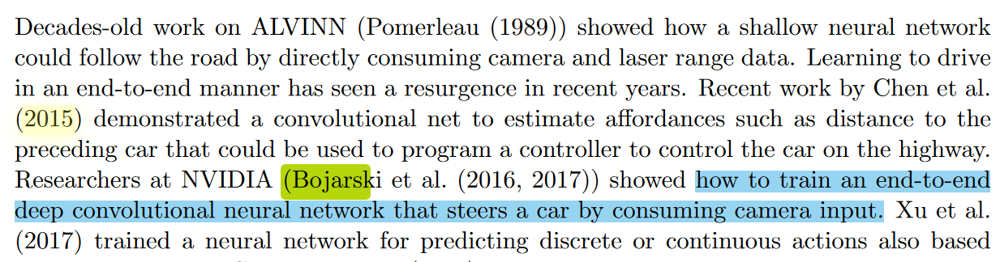
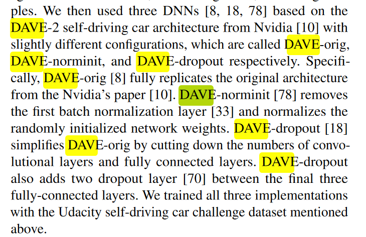
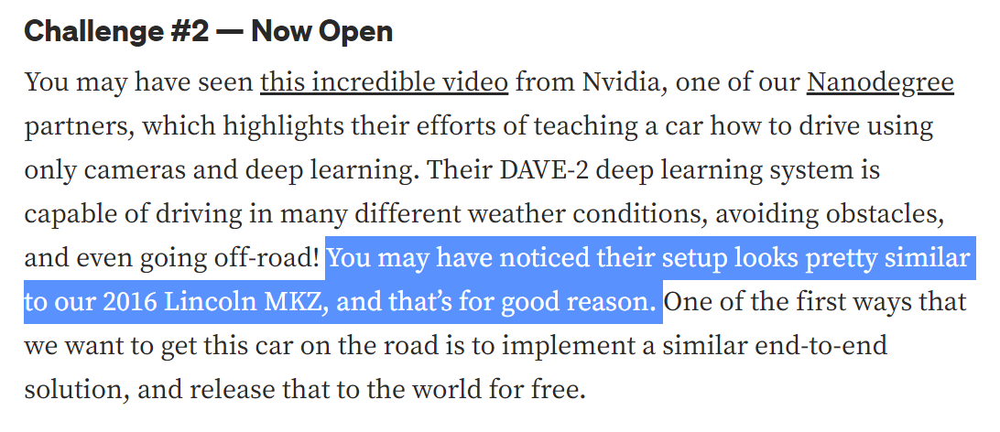
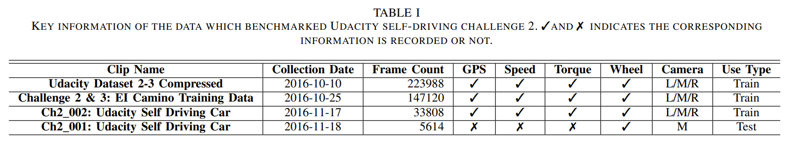
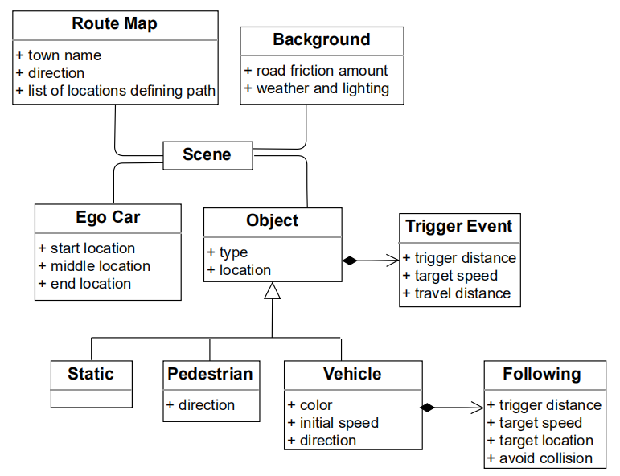

Created: 2022-1-6 20:05:09

Modified: 2022-1-21 15:23:02

<!--more-->

# computer vision

## video

attack/safety

sim、test

# Model

lane-change: 

traditional rule-based model: assesses the positions and speeds + decides gap acceptance

Reinforcement Learning-based: end-to-end; decision-making part (deep Q-learning) +  an optimal lattice planner + a model predictive controller

## ChauffeurNet

ChauffeurNet: Learning to Drive by Imitating the Best and Synthesizing the Worst

[ChauffeurNet: Learning to Drive by Imitating the Best and Synthesizing the Worst | Papers With Code](https://paperswithcode.com/paper/chauffeurnet-learning-to-drive-by-imitating)

[Iftimie/ChauffeurNet (github.com)](https://github.com/Iftimie/ChauffeurNet)

## Apollo

map:

## DAVE-2 (a steering angle model)

(refer to DeepXplore: Automated Whitebox Testing of Deep Learning Systems [peikexin9/deepxplore: DeepXplore code release (github.com)](https://github.com/peikexin9/deepxplore))

Dave-2 (End to end learning for self-driving cars, 2016, 3808 citations, 1+114 code implementations):

[End to End Learning for Self-Driving Cars | Papers With Code](https://paperswithcode.com/paper/end-to-end-learning-for-self-driving-cars)

[0bserver07/Nvidia-Autopilot-Keras: Keras Implementation of End to End Learning for Self-Driving Cars by (Baris Kayalibay, Grady Jensen, Patrick van der Smagt) (github.com)](https://github.com/0bserver07/Nvidia-Autopilot-Keras)

[GitHub - SullyChen/Autopilot-TensorFlow: A TensorFlow implementation of this Nvidia paper: https://arxiv.org/pdf/1604.07316.pdf with some changes](https://github.com/SullyChen/Autopilot-TensorFlow)

[tech-rules/DAVE2-Keras: Implementation of Nvidia's DAVE2 NN in Keras, with some enhancements (github.com)](https://github.com/tech-rules/DAVE2-Keras)

[End-to-End Deep Learning for Self-Driving Cars | NVIDIA Technical Blog](https://developer.nvidia.com/blog/deep-learning-self-driving-cars/) (video; also introduce how the simulator works)

[GitHub - milsun/AI-Driver-CNN-DeepLearning-PyTorch: AI-driving Vehicle Simulation using Machine Learning(CNN) | PyTorch implementation of &quot;End to End Learning for Self-Driving Cars&quot; (arXiv:1604.07316)](https://github.com/milsun/AI-Driver-CNN-DeepLearning-PyTorch)

[GitHub - nerdimite/behavioral-cloning: Code for Intro to Self Driving Cars Webinar (CellStrat AI Lab)](https://github.com/nerdimite/behavioral-cloning)

[ResearchNotes/implement_behavioral_cloning.md at 9d35c65c107978722ea1e85ed193862a6f389b83 · simonazy/ResearchNotes (github.com)](https://github.com/simonazy/ResearchNotes/blob/9d35c65c107978722ea1e85ed193862a6f389b83/CARLA/implement_behavioral_cloning.md)





Dave-norminit (Visualizations for understanding the regressed wheel steering angle for self driving cars):

[jacobgil/keras-steering-angle-visualizations: Visualizations for understanding the regressed wheel steering angle for self driving cars (github.com)](https://github.com/jacobgil/keras-steering-angle-visualizations)

[Visualizations for regressing wheel steering angles in self driving cars (jacobgil.github.io)](https://jacobgil.github.io/deeplearning/vehicle-steering-angle-visualizations)

Dave-dropout (Behavioral cloning: end-to-end learning for self-driving cars)

1 [End-to-end learning for self-driving cars - Alex Staravoitau’s Blog](https://navoshta.com/end-to-end-deep-learning/)

[navoshta/behavioral-cloning: Behavioral cloning: end-to-end learning for self-driving cars. (github.com)](https://github.com/navoshta/behavioral-cloning)

2 [Behavioural Cloning — End to End Learning for Self-Driving Cars. | by nachiket tanksale | The Startup | Medium](https://medium.com/swlh/behavioural-cloning-end-to-end-learning-for-self-driving-cars-50b959708e59)

[naokishibuya/car-behavioral-cloning: Built and trained a convolutional network for end-to-end driving in a simulator using Tensorflow and Keras (github.com)](https://github.com/naokishibuya/car-behavioral-cloning)

[Self_Driving_Car/CarND-Behavioral-Cloning-P3 at master · nachiket273/Self_Driving_Car (github.com)](https://github.com/nachiket273/Self_Driving_Car/tree/master/CarND-Behavioral-Cloning-P3)



## Other steering angle models

(refer to DeepTest: Automated Testing of Deep-Neural-Network-driven Autonomous Cars & DeepRoad: GAN-Based Metamorphic Testing and Input Validation Framework for Autonomous Driving Systems)

[self-driving-car/challenges/challenge-2 at master · udacity/self-driving-car · GitHub](https://github.com/udacity/self-driving-car/tree/master/challenges/challenge-2) (Udacity self-driving car challenge)

https://medium.com/udacity/challenge-2-using-deep-learning-to-predict-steering-angles-f42004a36ff3

[Teaching a Machine to Steer a Car | by Oliver Cameron | Udacity Inc | Medium](https://medium.com/udacity/teaching-a-machine-to-steer-a-car-d73217f2492c) (results)



refer to Deep Steering: Learning End-to-End Driving Model from Spatial and Temporal Visual Cues



The dataset we used is provided by Udacity, which is generated by NVIDIAs DAVE-2 System (refer to Self-Driving Car Steering Angle Prediction Based on Image Recognition)

[Open Sourcing 223GB of Driving Data | by Oliver Cameron | Udacity Inc | Medium](https://medium.com/udacity/open-sourcing-223gb-of-mountain-view-driving-data-f6b5593fbfa5#.50xu5fkz9) (dataset for challenge)

# industry

## safety

read: https://developer.nvidia.com/blog/training-self-driving-vehicles-challenge-scale/, https://www.rand.org/content/dam/rand/pubs/research_reports/RR1400/RR1478/RAND_RR1478.pdf

# LGSVL with  Apollo

https://www.youtube.com/watch?v=Ucr0aM334_k: about API

*LGSVL* graphical simulator (LG. Lgsvl simulator. [Online]. Available: https://www.lgsvlsimulator.com/) that supports both freeway and urban road structures.

api collect data: slow , so use bridge (like apollo)?# Typora

# CARLA

carla (CARLA: An Open Urban Driving Simulator)

data (routes and scenarios as source -> rbg, lidar) 

​    route (a sequence of waypoints (and optionally a weather condition))

​    scenario (a trigger transform (location and orientation) and other actors present in that scenario (optional))

```
run on colab:
https://github.com/carla-simulator/carla/issues/2820
```


