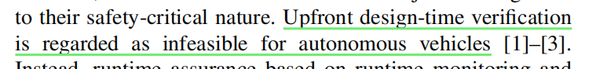
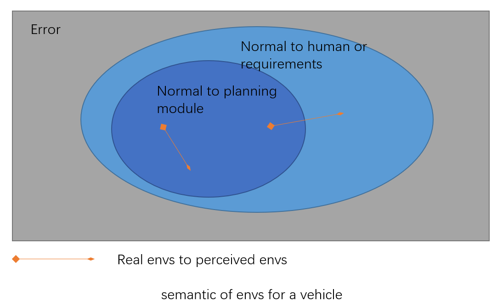

Created: 2022-1-4 21:11:13

Modified: 2022-1-4 21:11:13

<!--more-->

AV fuzzing: focus on diversity, find bugs (testing), evaluation

safety(collision testing), functionality "correctness"(planning&tracking) (traffic rules), mobility, and rider’s comfort

# traffic violations

traffic offenses can be vehicle-related

导航能够解决“压着导向车道实线变道”还是“应该变道”的问题

# semantic action

motivation e.g. “follow the car in front of you” or “quickly overtake that car on your left”

property: a semantic action can have a very long time horizon; small number; semantic action space -(kinematic calculations)> action space

formalize: goals & aggressiveness level

evaluation:  *quality function* based on a machine learning approach trained on a large variety of road types, instead of learning a Q function over immediate geometric action

# Responsibility-Sensitive Safety for planning in critical situations

A Lane-Based Coordinate System

requirement without usefulness -> keep Safe Distance

proper response -> best effort (Proper Response with Extra Evasive Effort) -> excessive response

assume: under reasonable Situation

1. a single lane road: cars cannot perform lateral maneuvers, cars never drive backward

   common sense rule: if someone hits you from behind it is not your fault

   metrics:  Safe longitudinal distance — same direction

   proper response: rear car's acceleration, brake according to safe distance

2. a straight road (a general lane geometry): cars cannot perform lateral maneuvers, cars can drive backward

   common sense: if someone hits you from behind while you are reversing it is your fault

   metrics:  Safe longitudinal distance — opposite directions

   proper response: both cars' acceleration, brake according to safe distance

3. a straight road (two routes of the same geometry)

   metrics:  Safe Lateral Distance

   proper response: both cars' acceleration, brake according to safe distance

4. common sense: if you can avoid an accident without causing another accident, you must do it

5. multiple different road geometries: roundabouts, junctions, and merge into highways; one route has priority over others, and vehicles riding on it have the *right of way*; two cars *on different routes*

   metrics:  Safe Lateral/Longitudinal Distance for Two Routes of Different Geometry (abstract? position relationship?)

6. special scenario at an intersections with traffic lights, like right of way is given, not taken

7. no route geometry, e.g. the parking lot

   (not consideration)

   

8. Pedestrians: zebra crossing or residential street / residential road (unstructured roads?)

   

9. Occlusion

   common sense:  When a human driver claims “but I couldn’t see him”, a counter argument is often “well, you should’ve been more careful”, like limit *v* or **proper Behaviour**(always adhering to proper response)

# stress-testing techniques

fitness functions in the area of testing autonomous systems [25]

## AST

Adaptive Stress Testing: Finding Likely Failure Events with Reinforcement Learning

Airborne Collision Avoidance System (ACAS X, TCAS)   scenarios of near mid-air collisions (NMACs)

(2 distinct types in 200 hours)

formulations: simulator state (stacked system and environment states) is fully observable or partially observable, Markov process with discrete time and continuous state,  sequential decision process -> MDP or MCTS-SA

partial observability: a modified Monte Carlo tree search (MCTS) algorithm using only pseudorandom number generator of the simulator

differential adaptive stress testing (DAST): failure in targeted system but in baseline

## AV-FUZZER

AV-FUZZER: Finding Safety Violations in Autonomous Driving Systems

adv: edge cases and diversity, all 5 types within 20 hours of search on Apollo

GA + local fuzzer + repeat differently

## CROUTE

labeled Petri net: map

place: a road

transition: a set of junction lanes connecting the same roads

labels assigned to transitions: traffic signs at junctions

*route type* at a junction: junction topology features, route features at a junction

junction topology feature: describe how a **road** connects with other **roads** at a junction

(a junction contains multiple topology features, junctions maybe topology equivalent)

route: consist of **lanes**

route feature: describe land changing and motions for traffic signs, to describe route feature (feature keep when only lane-changing times changes?no.)

param format: (initial lanes, target lanes, obstacles positions)

gene method: base + search obstacles (causing land changing)

mutate method: an adding operator

## ATLAS

classification:

road-topology characteristic of a junction lane: describe intersecting lanes of junction lane using incoming and outcoming roads

generate different abstract scenarios describing different interaction patterns

generate in each abstract scenario:

## AutoFuzz

## Paracosm

programmatically describe complex driving situations: a synchronous reactive programming model (reactive: refer to vehicles or persons)

Components: It -> Ot, graphical assets, physical properties

A Paracosm configuration: components

test parameter coverage: k-wise combinatorial coverage & low dispersion

various test input generation strategies: random sampling over discrete parameters & deterministic quasi-Monte Carlo methods for continuous parameters

## Generating and Characterizing Scenarios for Safety Testing of Autonomous Vehicles

interesting scenario:  where a collision or near collision happens, and the AV can avoid it in at least one way (including critical scenarios, can be ranked by complexity; scenario having less **CriticalTime** before collision is unavoidable)

Characterizing: how many safe paths exist and how hard is it to follow them (complexity of the scenario w.r.t. possibility of avoiding accidents)

metrics:  SafePathInv **UnsafePercent** AvgEffort MinEffort **NarrowInv** CriticalTime

using 'the number of computed safe driving paths, total paths in the scenario (all driving trajectories), narrowness of safe paths, and the effort required to follow each safe path'.

computed safe driving paths: calculating the annulus sector in the next time-step,  discretize the 2D sector with a grid, quantizing the AV valid state

tensor representation for AV only (fix the trajectories of all actors other):  enumerate all states of AV at time t

Generating method: 

generate an unsafe sequence (initial executed driving scenario as input + perturbations) (change the policy of closest actors (three different attacking modes) <-> distance as cost function;) diversity? , create a critical scenario (sample interesting scenarios by starting from collision time tc and moving back in time to find t0. )

Sequences: states of all the vehicles extracted from real-world data or from driving simulations

generate approximately 240 scenarios (80 accidents, more than 90% avoidable) per hour on a single system

## Suraksha

analyze the safety effects/sensitivities of using various perception (degraded perception due to HW/SW capabilities or inaccurate perception) parameters or level.

*Generating*: 

goal: efficient scenarios, difficulty levels(depend on AV velocity when the target is revealed)

results: 12 driving scenarios for the four categories with difficulty levels, select four scenarios for analysis.

*Metrics*: 

scenario-independent metrics:  Braking L1,  Throttle L1,  AV coordinate L1,  Minimum distance (AV info: Actuators, Location, Velocity, Acceleration; Target obstacle info: Location)

*Perception Quality Requirements Analysis* (**error** allowed analysis): 

component-level design choices depend on which metrics

AV implementations improvement & component-level requirements (trade-off principle: system has upper limit with poor components under requirements)

## Adversarial evaluation of autonomous vehicles in lane-change scenarios

reward: add penalty for violation of traffic rules

driving performance:  lane-change success, collision, velocity

traffic rules: rules break(?)

diversity: N agents (actor and critic in DDPG) with random initializations

*Clustering*: DP-Means by state Sequences generated

## Multimodal Safety-Critical Scenarios Generation for Decision-Making Algorithms Evaluation

Multimodal in multi-modality (pattern/logic Scenarios?)

 flow-based generative model (to estimate the multimodal distribution of safety-critical scenarios): 

 as the objective function

conditional input according to characteristics of the tasks

 generated: efficiently querying the task algorithms and a simulator

 flow-based to estimate the multimodal distribution

testing at different stress levels

pre-training a generative model (assuming RealNVP, a flow-based model) (by maximizing log-likelihood) (to approximate the distribution of the real data) , a modified flow-based model (with a conditional input) (weighted maximum likelihood estimation WMLE where weight related to the risk metric and data probability) (log-likelihood approximately proportional to risk level), adaptive sampler (step along gradient of worth exploring value related to risk metric minus risk level, calculated by NES under Monte Carlo method)

## SADL

neuron activation traces

Surprise. with respect to training data.

Surprise Adequacy of sets: the range of surprise

objective: higher(*Surprise Coverage*)

diversified goal: from those similar to those significantly different and adversarial. with respect to training data 

 adversarial example classifiers?

sampling inputs for retraining? broader? SA values

# reference

(attack and defence) Autonomous vehicle security: A taxonomy of attacks and defences 2016

(defense) A non-conservatively defensive strategy for urban autonomous driving 2016

Testing advanced driver assistance systems using multi-objective search and neural networks 2016 PreScan FCW

**Deepxplore: Automated whitebox testing of deep learning systems  2017**

Safe at any speed: A simulation-based test harness for autonomous vehicles 2017

**Automated generation of diverse and challenging scenarios for test and evaluation of autonomous vehicles 2017**

***Adaptive stress testing: Finding failure events with reinforcement learning 2018***

**Adaptive stress testing for autonomous vehicles  2018**

 **Scalable end-to-end autonomous vehicle testing via rare-event simulation 2018**

**Simulation-based adversarial test generation for autonomous vehicles with machine learning components 2018**

**Testing vision-based control systems using learnable evolutionary algorithms  2018**

**Deeptest: automated testing of deep-neural-network-driven autonomous cars. In: ICSE (2018)** 

**DeepRoad: GAN-based metamorphic testing and input validation framework for autonomous driving systems (*ASE*) 2018**

**Chauffeur-net: Learning to drive by imitating the best and synthesizing the worst. (2019) ***

**Guiding deep learning system testing using surprise adequacy 2019**

**Generating adversarial driving scenarios in high-fidelity simulators 2019**

**Boosting operational DNN testing efficiency through conditioning 2019 FSE/ESEC**

**Adaptive stress testing with reward augmentation for autonomous vehicle validation 2019**

**Automatically testing self-driving cars with search-based procedural content generation  2019**

**Did we test all scenarios for automated and autonomous driving systems? 2019**

**Towards system-level testing with coverage guarantees for autonomous vehicles 2019**

**Genetic algorithm-based test parameter optimization for adas system testing 2019**

**(attack) Attacking vision-based perception in end-to-end autonomous driving models 2019**

**(attack) Are self-driving cars secure? evasion attacks against deep neural networks for steering angle prediction 2019**

**Learning accurate and human-like driving using semantic maps and attention. CoRR (2020) ***

**Generating avoidable collision scenarios for testing autonomous driving systems  2020**

**Identification and explanation of challenging conditions for camera-based object detection of automated vehicles 2020 ***

***AV-FUZZER: Finding Safety Violations in Autonomous Driving Systems 2020***

***Coverage-based Scene Fuzzing for Virtual Autonomous Driving Testing 2021***

**PGFUZZ: Policy-Guided Fuzzing for Robotic Vehicles 2021**

**Simulation Driven Design and Test for Safety of AI Based Autonomous Vehicles 2021** CVPR

**Generating and characterizing scenarios for safety testing of autonomous vehicles 2021**

(scenario) Depiction of priority lightvehicle pre-crash scenarios for safety applications based on vehicleto-vehicle communications

(scenario) Pegasus—first steps for the safe introduction of automated driving

(*d*stop, under single bit-flip) Ml-based fault injection for autonomous vehicles: A case for bayesian fault injection

(*d*safe) Shared vehicle control using safe driving envelopes for obstacle avoidance and stability

(*d*safe) Design and evaluation of a driving mode decision algorithm for automated driving vehicle on a motorway

(fitness) Fitness functions for testing automated and autonomous driving systems

Understanding Error Propagation in Deep Learning Neural Network (DNN) Accelerators and Applications

Binfi: an efficient fault injector for safety-critical machine learning systems

Tensorfi: A configurable fault injector for tensorflow applications

Modeling input-dependent error propagation in programs

Understanding error propagation in gpgpu applications

VerifAI: A toolkit for the formal design and analysis of artificial intelligence-based systems

(test DL) Safety verification of deep neural networks. In: CAV (2017) *

(test DL) Reluplex: An efficient SMT solver for verifying deep neural networks. In: CAV (2017)  *

AV accidents reported: California DMV (https://www.dmv.ca.gov/portal/dmv/detail/vr/autonomous/testing), Waymo simulated driving behavior in reconstructed fatal crashes within an autonomous vehicle operating domain, Database approach for the sign-off process of highly automated vehicles, Survey on scenario-based safety assessment of  automated vehicles.

Generating effective test cases for self-driving cars from police reports 2019

攻击面在于软件输入：系统正常状态下能否正常实现某些功能

还有纯软件层面（系统不正常）和纯算法（实现某些功能时的满意度）层面。

（**Formal Verification**）a formal scenario description language: to represent an operational design domain (ODD) （ disa: only focus on one component of the system or a simple scenario, hard for perception component）

scenarios:  sensor noise, driving maneuvers

Scenic: a language for scenario specification and scene generation. (Defining and substantiating the terms scene, situation, and scenario for automated driving,  Scenarios for development, test and validation of automated vehicles, Ontology based scene creation for the development of automated vehicles)

failures: possible (frequency, realistic), dangerous, 

Adaptive stress testing (AST) : find the most likely **path** from a **start state** to a **failure state** in a discrete-time simulator, a **Markov decision process**. (disa: **failure is unavoidable**; **same types of failures** )

Fuzzing (AFL,  Fuzz revisited: A re-examination of the reliability of unix utilities and services.), grammar-based fuzzing ( Grammar-based whitebox fuzzing., Evolutionary grammar-based fuzzing.), structure-aware fuzzing ( GRIMOIRE: synthesizing structure while fuzzing., SLF: fuzzing without valid seed inputs.).

RL: Observing a repeated one, necessary for RL to be effective, requires RL to accumulate a huge set of historical data, which can be very time-consuming. In contrast, GA guides the search by trial and error without relying on having a huge set of historical data.

metamorphic testing:   if two inputs to a DL system are similar with respect to some human sense, the outputs should also be similar

看到奇怪的名词先在原文搜索， 如果是普通词组合的描述则一般要看原文整段。

论文直接的相关研究一般采用1年前的多一点，更老的更新的都会比较少。

distribution

function

workflow

objective: reward, fitness, loss

