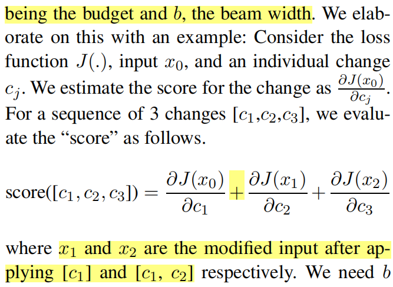
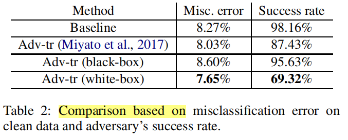

Created: 2021-11-26 19:43:58

Modified: 2021-11-26 19:43:58

<!--more-->

# introduction

ML

adversarial examples (not out-of-domain (OOD) samples, distribution shift, data transformation, shortcut learning[1-3])

semantics-preserving or not

perturbations/insertion

(function performance, attack/adversary success rate, perturbation rate)

gradient-based, query&score-based(*search method* and *search space*), query&class-based, none?

untargeted attack and targeted attack

applying on image, speech, language

Mnemonic Reader’s self-alignment layer against adversarial examples

defense goal: perform on par with human crowd-workers

 adversarial training[4-5]/randomized smoothing[6-7]

[1]The effect of natural distribution shift on question answering models.

[2] Tasty burgers, soggy fries: Probing aspect robustness in aspect-based sentiment analysis.

[3]Shortcut learning in deep neural networks.

[4] Explaining and harnessing adversarial examples.

[5]Towards deep learning models resistant to adversarial attacks.

[6]Certified adversarial robustness via randomized smoothing.

[7]SAFER: A structure-free approach for certifified robustness to adversarial word substitutions.( data augmentation approach)

# image

Christian Szegedy, Wojciech Zaremba, Ilya Sutskever,

Joan Bruna, Dumitru Erhan, Ian Goodfellow, and

Rob Fergus. 2013. Intriguing properties of neural

networks. *arXiv preprint arXiv:1312.6199*.

## 1 black box setting

N. Papernot, P. McDaniel, I. Goodfellow, S. Jha, Z. Ce

lik, and A. Swami. 2016a. Practical black-box

attacks against machine learning. 

*arXiv preprint*

*arXiv:1602.02697*.

## 2 white box setting

 Fast Gradient Sign method or iterative methods based on constrained gradient descent

# speech

Nicholas Carlini, Pratyush Mishra, Tavish Vaidya, Yuankai Zhang, Micah Sherr, Clay Shields, David

Wagner, and Wenchao Zhou. Hidden voice commands. In *USENIX Security Symposium*, pp. 513–

530, 2016.

Nicholas Carlini and David Wagner. 2018. Audio ad

versarial examples: Targeted attacks on speech-to

text. *arXiv preprint arXiv:1801.01944*.

obfuscated examples

# reinforcement learning

Vahid Behzadan and Arslan Munir. Vulnerability of deep reinforcement learning to policy induction

attacks. *arXiv preprint arXiv:1701.04143*, 2017

# language

language adversarial attack

vulnerabilities of NLP systems

discrete nature

human-crafted rules/models

sentence-level, word level and character-level

## 1 black box setting

no any explicit knowledge of the model parameters

only query

heuristic (scrambling, misspelling, or removing words

### distracting sentences

R. Jia and P. Liang, “Adversarial examples for evaluating reading comprehension systems,” in *EMNLP*, 2017

concatenative examples

model: *overstability*

SQuAD, paragraphs that contain adversarially inserted sentences

ADDSENT method: generate a raw distractor sentence (semantics-altering question, corresponding fake answer, declarative form, crowdsourcing, greater human-approved sentence)

ADDONESENT: control group (a random human-approved sentence, model-independent)

ADDANY method: random ungrammatical sentence, local search, 

ADDCOMMON: control group(words from common words)

motivation: questions answered with heuristics based on type and keyword-matching

note that: words from the question

### GANs

[2017] Zhao, Z.; Dua, D.; and Singh, S. 2017. Generating natural adversarial examples.

limited to short texts

### greedy heuristic

ICLR 2018 Adversarial Examples for Natural Language Classification Problems

Altered examples

propose: **Semantic similarity** & **Syntactic similarity**

method: one-word changes(N closest,  GloVE), choose best(improves the objective the most)

### back-translation

Ribeiro, M. T.; Singh, S.; and Guestrin, C. 2018. Semantically equivalent adversarial rules for debugging nlp models.

machine-generated rules

### genetic algorithms: population-based optimization

EMNLP 2018 Generating Natural Language Adversarial Examples

sentiment analysis and textual entailment

method: word replacements(GloVe +  counter-fitting method + Google 1 billion words language model), fitness is target label prediction probability ?

population-based (combinatorial optimization problems,  fewer modifications): fitness function to choose Fitter

### TextBugger

NDSS 2019

method: find important sentences (spaCy library), find important words(a scoring function, after removing word)

### PWWS

Generating natural language adversarial examples through probability weighted word saliency.

下游探测

### PSO

Word-level textual adversarial attacking as combinatorial optimization.

### TextFooler

AAAI 2020 (Oral)

text classification and textual entailment

utility-preserving

method: selection mechanism for important words (by deleting each word to affect prediction score) of model (&filter out stop words); replace in a special way (select Synonym with POS checking, success with highest USE as similarity scores or the closest success)

BERT, CNN, RNN (LSTM)

### BERT-ATTACK

method: finding the vulnerable words(high significance influence on the final output logit), generate substitutes using bert(BERT-based lexical substitution)

### BAE

### BU-MHS

AAAI 2021

Bigram and Unigram based Monotonic Heuristic Search (BU-MHS)

unigram: change one word -> phrases meaning may change

method: avoid producing meaningless outputs (Bigram and Unigram Based, HowNet), replace the input words (synonyms and sememe candidates), priority of word and its combinations(BU-MHS),

### BESA

(IJCAI-21)

BERT-based Simu lated Annealing algorithm

method: generate contextual-aware candidate words using BERT, determine order with global optima(Simulated Annealing (SA))

### MAYA

EMNLP 2021

label-based & score-based

**Multi-granularity** attack agent(RL?, behavior cloning with the expert knowledge)

method 1&2: generate( constituency parsing[1], rewriting constituents under strict grammatical constraints/word-level MLM before WordNet), {2: candidate selected by BERT,} verify, {pick}

advantage: less queries, more utility in real

[1]Fast and accurate neural CRF constituency parsing.

### QES

EMNLP 2021

method: select(attention model, without altering the semantics), with replace choose in search space(division with locality sensitive hashing using Random Projection Method (RPM) on a sentence encoder (USE))

advantage: less queries, regardless *search space*

### StyleAttack

EMNLP 2021

text style transfer

method: text style transfer(STRAP (Style Transfer via Paraphrasing), Sentence-BERT)

## white box setting

complete knowledge of the model: architecture, parameters, or training data

kerckhoff’s principle

### HotFilp

ACL 2018

classification

real-world adversarial examples (Multiple Changes)

a few atomic *flip* operation (character substitutions, enable insertion and deletion)

manipulate one-hot input vectors (each represents a character of a word of a sequence)

**gradients** ( the greatest absolute directional derivatives) based : estimate which individual change and beam search to find a set : 

efficiency (fast)

HotFlip at Word-Level (semantics-preserving constraints)

CharCNN-LSTM

related: S. Samanta and S. Mehta, “Towards crafting text adversarial samples,”

### TextBugger

NDSS 2019

method: find important words order (Jacobian matrix of the classifier), generate 5 types for each in order, choose optimal bug(change of confidence value, must below a threshould):

character-level perturbation: use words not in the dictionary (insert, delete, swap, visually similar characters)

word-level perturbation: semantic-preserving technique (GloVe model)

# code

A Survey on Adversarial Attacks for Malware Analysis.

constraint: not affect both the functionality and executability of malware file

transformation: manipulate, insert, delete, bytes; code obfuscation

domain: windows portable executable file, PDF file and android APK file: **mutable** and immutable section of the file

targered model: signature based and behavioral based(against zero-day attacks) malware detector

## apg

Intriguing Properties of Adversarial ML Attacks in the Problem Space.

Android malware detection

DREBIN classifier(Linear SVM, Sec SVM)

transformation: automated software transplantation(extract slices of bytecode (i.e., *gadgets*) from benign *donor* app, inject full slices into a malicious *host*, i.e., only *addition* of bytecode): *program slicing*, never executed at runtime, *opaque predicates* to avoid Program analysis techniques,  collect in an *ice-box* *G* without on-the-fly, 

side-effect feature vectors:  inject each gadget into a *minimal app*


DeepDetectNet vs RLAttackNet: An

adversarial method to improve deep learning

based static malware detection model

Version:0.9 StartHTML:0000000105 EndHTML:0000000533 StartFragment:0000000141 EndFragment:0000000493

**Black-Box Adversarial Attacks Against Deep Learning**

**Based Malware Binaries Detection with GAN**

Version:0.9 StartHTML:0000000105 EndHTML:0000000511 StartFragment:0000000141 EndFragment:0000000471

Generating End-to-End Adversarial Examples for

Malware Classififiers Using Explainability

Version:0.9 StartHTML:0000000105 EndHTML:0000000350 StartFragment:0000000141 EndFragment:0000000310

SAFE: Self-Attentive Function Embeddings for Binary Similarity


# tool kit

## TextAttack

### new attack design

refer to query-attack

```
textattack/__init__.py
textattack/attack_args.py(args.attention_model, arg, build())# for arg process

textattack/attack_recipes/__init__.py
textattack/attack_recipes/lsh_with_attention_maheshwary_2021.py # queryatt: search method

textattack/search_methods/greedy_word_swap_wir.py # queryatt: search method add lsh_with_attention

textattack/attention_models/*
```

### class

```python
class ModelWrapper(ABC):
    """A model wrapper queries a model with a list of text inputs.

    Classification-based models return a list of lists, where each sublist
    represents the model's scores for a given input.

    Text-to-text models return a list of strings, where each string is the
    output – like a translation or summarization – for a given input.
    """
    def __call__(self):
        return outputs

class HuggingFaceDataset(Dataset):
    def __getitem__(self, i):
        """Return i-th sample."""
```

# list

https://nicholas.carlini.com/writing/2019/all-adversarial-example-papers.html

# Application

adversarial training: interleaves training with generation of adversarial examples

interpretability: Feng, S.; Wallace, E.; Grissom, I.; Iyyer, M.; Rodriguez, P.; Boyd-Graber, J.; et al. 2018. Pathologies of neural models make interpretations difficult

# vocabulary&knowledge

with respect to, like "of"

a one-hot vector:


adversary

L2 norm:


L ∞ norm: 


*L* *≥* 1 constraints: 

-ed, means previous introduction in above paragraph

, or more concretely

Specifically

L0 distance

greedy or beam search: r being the budget and b, the beam width

We elaborate on this with an example:



as:


Comparison based on:



effective:  outperforms the previous

efficient: lower computational complexity 

utility-preserving:  preserves semantic content, grammaticality, and correct types classified by humans

trivial: ordinary

strikes a balance between 

raw texts: edit distance and Jaccard similarity coefficient

word vectors:  Euclidean distance and semantic similarity 

Universal Sentence Encoder: a encoder transferring sentence to high dimensional vector

greater than 0.5

with probability proportional to 

perform on par with human crowd-workers

shed light on

thick solid line

thin solid line

is attributed to: 取决于,归咎于

# end
