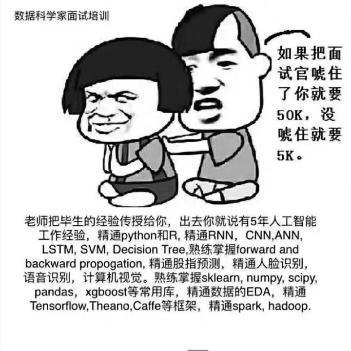

CS学习笔记概述。

<!--more-->

[TOC]

学习内容：算法，os，network，db，unix编程，计算机体系结构，数据结构、计算机组成原理、操作系统和计算机网络

计算机 书：csapp

算法学习：dp,dijkstra,backtrack(dfs,bfs),sort,单调栈,kmp,AI

[LEETCODE1362：最接近因子,Leetcode1362,因数,解法](https://www.pythonf.cn/read/35870)

#