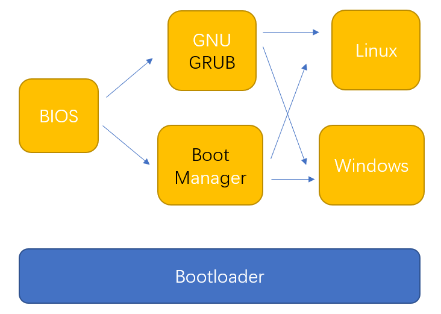

Created: 2021-06-28 11:06:34

Modified: 2021-06-28 11:06:34

<!--more-->



```bash
# grub: refer to https://blog.csdn.net/qq_33406883/article/details/106708621
# m1:
sudo gedit /boot/grub/grub.cfg
# set default="2"
# m2:
sudo gedit /etc/default/grub
# GRUB_DEFAULT=2
sudo update-grub

# bootmgr: refer to https://www.reneelab.com.cn/m/windows-10-windows-boot-manager.html
bcdedit /set {bootmgr} displaybootmenu yes
bcdedit /set {bootmgr} timeout 30
```


refer to https://blog.csdn.net/liao20081228/article/details/81297143

# Installation

refer to [Windows10安装ubuntu18.04双系统教程 - 不妨不妨，来日方长 - 博客园 (cnblogs.com)](https://www.cnblogs.com/masbay/p/11627727.html), [How to Install Ubuntu 18.04 Alongside With Windows 10 or 8 in Dual Boot (itzgeek.com)](https://www.itzgeek.com/how-tos/linux/ubuntu-how-tos/how-to-install-ubuntu-18-04-alongside-with-windows-10-or-8-in-dual-boot.html).

Download: [Ubuntu 18.04.5 LTS (Bionic Beaver) offical websit](https://releases.ubuntu.com/18.04.5/)

Notice: 

1. BIOS and Boot GUIs differ from each other due to different vendor of Computer, so it is better to search the guide according to Computer on the Internet. And in some GUIs, there is no `USB Boot` option, but only USB model name instead, like Kingston Data Traveler.

2. if you have specific independent display card, you may meet troubles into `Install Ubuntu` on the GNU GRUB. To solve it, you need to restart to `USB Boot` and disable the graphics features by setting the`nomodeset`option before `Install Ubuntu`, please consult tips on the GNU GRUB bootloader screen and partly refer to [Manual "nomodeset" Kernel Boot Line Option for Linux Booting | Dell 中国](https://www.dell.com/support/kbdoc/zh-cn/000123893/manual-nomodeset-kernel-boot-line-option-for-linux-booting?lang=en), [ubuntu U盘安装时黑屏花屏 nouveau错误 - 极客分享 (geek-share.com)](https://www.geek-share.com/detail/2718521163.html), [启动Ubuntu 16.04 Live DVD/USB碰到花屏的解决方案_Linux系统教程_红联Linux门户 (linuxdiyf.com)](https://www.linuxdiyf.com/linux/20266.html).

   

3. During `Install Ubuntu`, there is a step called `installation type`, where there is a option ''**Install Ubuntu alongside Windows Boot Manager**", which means you now Install Ubuntu 18.04 Alongside With Windows 10 in Dual Boot correctly. But you can choose "**Something else**" for partition layout and its size.

   

4. It maybe unnecessary to use individual `efi` for ubuntu booter, refer to [ThinkPad笔记本安装win10+Ubuntu17.10双系统](https://blog.csdn.net/weixin_39450145/article/details/82940745?utm_source=app&app_version=4.13.0&code=app_1562916241&uLinkId=usr1mkqgl919blen). And the `swap area` is used for virtual memory, which means you needn't set too much for it if you have adequate memory.

5. During `Restart` after installation, you may meet trouble again after choosing `Ubuntu` on the GNU GRUB menu if you specific independent display card. To solve it, refer to [ubuntu双系统启动时卡死解决办法 - 不妨不妨，来日方长 - 博客园 (cnblogs.com)](https://www.cnblogs.com/masbay/p/10718514.html), [Manual "nomodeset" Kernel Boot Line Option for Linux Booting | Dell 中国](https://www.dell.com/support/kbdoc/zh-cn/000123893/manual-nomodeset-kernel-boot-line-option-for-linux-booting?lang=en). If you access to Internet right now, I suggest you to install GPU drivers instead of modifying `/etc/default/grub` and setting to `nomodeset` mode as above websits mentioned, seeing next notice.

6. Install NVIDIA driver, refer to [Ubuntu 安装Nvidia显卡驱动-百度经验 (baidu.com)](https://jingyan.baidu.com/article/7e440953e161436ec0e2efb3.html?qq-pf-to=pcqq.c2c). Use the following command line to check your diver, if nothing outputs, try to restart.

   ```bash
    nvidia-smi
   ```


For more comprehensive guide, refer to [windows10安装ubuntu双系统教程（绝对史上最详细） - 不妨不妨，来日方长 - 博客园 (cnblogs.com)](https://www.cnblogs.com/masbay/p/10745170.html).

# Troubleshoting

1. Time sync between ubuntu and windows, refer to [windows10和ubuntu双系统，切换到windows后时间少8小时不对的解决](https://www.cnblogs.com/arxive/p/13198291.html).

