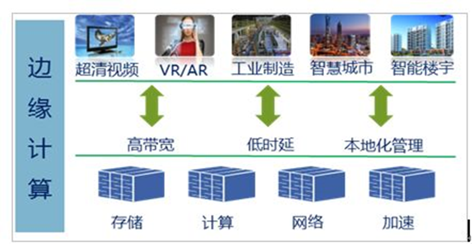

总结对边缘计算及其芯片与开发板，不定期更新。

<!--more-->

[TOC]

- [边缘计算的由来](#边缘计算的由来)
	- [与云计算对应](#与云计算对应)
	- [边缘计算](#边缘计算)
	- [边缘计算芯片运行算法更好](#边缘计算芯片运行算法更好)
	- [边缘计算的优点](#边缘计算的优点)
- [边缘计算开发板](#边缘计算开发板)
	- [intel](#intel)
	- [google](#google)
	- [英伟达](#英伟达)
	- [华为](#华为)
	- [比特大陆](#比特大陆)
- [开发与使用方法](#开发与使用方法)
	- [开发思路](#开发思路)
	- [开发流程与方法](#开发流程与方法)
	- [利用服务器的开发方式](#利用服务器的开发方式)
	- [边缘计算开发板与一般芯片开发板的不同](#边缘计算开发板与一般芯片开发板的不同)
- [参考文献及资料](#参考文献及资料)

# 边缘计算的由来

## 与云计算对应

以语音识别为例，输入法里的语音输入，需要联网才能运行，联网的过程就是把语音数据上传到云端进行处理，处理后的结果再下传回用户。语音识别属于AI里的“自然语言理解”，复杂的语句识别要经历语音分析、词法分析、句法分析、语义分析、语用分析等层层过程，整个过程的运算会越来越复杂，而且还要结合训练后的语音模型，而云端既完成了基于海量数据的语音模型的训练，又能够对语音进行分析与识别。

## 边缘计算

还是从输入法里的语音输入说起。下载离线语音包，就可以实现不联网的语音识别，整个过程在本地运算算法，这就是一种边缘计算。

下载的语音包其实是来自云端的训练，而语音分析与识别分过程确确实实是在手机端即“边缘”进行的，这就体现出一种云端与边缘的分工。

在过去的手机中通常是利用CPU运行这种算法，而现在的趋势是利用集成的AI/边缘计算芯片来运行这种算法 。

## 边缘计算芯片运行算法更好

因为芯片的结构。目前的高级算法主要是进行神经网络的计算，比如CNN（卷积神经网络），这些运算本质上是向量、矩阵的乘加运算（如图），而AI/边缘计算芯片的结构能够高效地进行并行计算（如图）。

 

## 边缘计算的优点

运用AI/边缘计算芯片进行AI本地推理可以显著节约云端的带宽和云计算的成本，并能将数据保存在本地从而保护用户隐私。

# 边缘计算开发板

边缘计算开发板(EDB)就是以AI/边缘计算芯片为核心的开发板，用于开发者对芯片的学习与开发，和普通的开发板外观上没有什么区别，下面按照芯片供应商分类举一些典型的例子。

## intel

芯片：第八代Intel®Core™处理器
开发板：Pico-WHU4开发板

## google

Google形成了以Edge TPU为核心的边缘计算开发体系。Google的开发板有很多种。

芯片：Edge TPU
开发板：
	Coral Dev Board	

​	Coral System-on-Module

​	Tinker Edge T/E

​	Tiorb AIX

## 英伟达

NVIDIA

开发板：Jetson Nano

## 华为

华为也有比较完善的边缘计算开发生态。

芯片：麒麟970
开发板：HiHope Hikey 970

芯片：昇腾310
开发套件：Atlas 200 DK

## 比特大陆

芯片：BM1880
开发板：算丰边缘计算开发板

# 开发与使用方法

## 开发思路

SOC开发板一般有两种开发思路：

1.把开发板作为USB device（即把SDK安装在电脑进行开发）

2.开发板作为host role（即把SDK安装在开发板的SOC芯片中）

## 开发流程与方法

典型的边缘计算开发板都具有相似的开发流程：

1.准备硬件（电源、TF卡、网卡网线、显示器、鼠标、摄像头等）

2.运行（或者更换）操作系统

3.下载对应的SDK，开发应用程序

## 利用服务器的开发方式

以华为Atlas 200 DK为例，

1.环境部署：

○硬件准备：包括SD卡、读卡器、摄像头、MIPI-CSI连接线（常用于嵌入式视觉领域）、Type-C等；

○**准备Ubuntu服务器**，为了下一步准备；

○运行环境搭建：**与服务器连接制作SD卡**，开发套件读取SD卡运行系统，**连接服务器在服务器中部署开发工具/平台**（如有UI界面的集成了DDK的专用软件SDK或者用于使用命令行的DDK）；

2.应用开发：

○模型转换，导入已训练好的第三方网络模型，基于模型接口进行编程；算子开发；

○应用开发、应用编译及部署。

## 边缘计算开发板与一般芯片开发板的不同

边缘计算开发板的开发一般都与AI相关，因此离不开AI训练/模型相关的平台，通过一些平台导入模型进行训练或者推理（如Model Play），还需要借助通用的框架在移动或者嵌入式设备上调用模型（如TensorFlow Lite）。

# 参考文献及资料

[1]蔡自兴,刘丽珏,蔡竞峰,等.人工智能及其应用.第5版[M].清华大学出版社:北京,2016:152-159.

[2]Intel开发者社区

https://software.intel.com/content/www/us/en/develop/home.html

[3]Coral Dev Board官方开发资料

https://www.coral.ai/docs/dev-board/get-started

[4]Nvidia Jetson Nano官方开发资料

[https://developer.nvidia.com/embedded/learn/get-started-jetson-nano-devkit#setup](https://developer.nvidia.com/embedded/learn/get-started-jetson-nano-devkit)

[5]算丰边缘计算开发板官方开发资料

https://sophon-edge.gitbook.io/project/overview/edge-tpu-developer-board

[6] HiHope Hikey 970官方开发资料

https://www.96boards.org/documentation/consumer/hikey/hikey970/

[7] Atlas 200 DK官方开发资料

https://www.huaweicloud.com/ascend/doc/atlas200dk/1.32.0.0(beta)/zh/zh-cn_topic_0204328966.html

[8]人工智能芯片与传统芯片的区别

https://blog.csdn.net/zhangbijun1230/article/details/80717351

[9]基于大数据及云计算的语音识别及其深度学习平台

http://www.cbdio.com/BigData/2015-04/08/content_2802203.htm