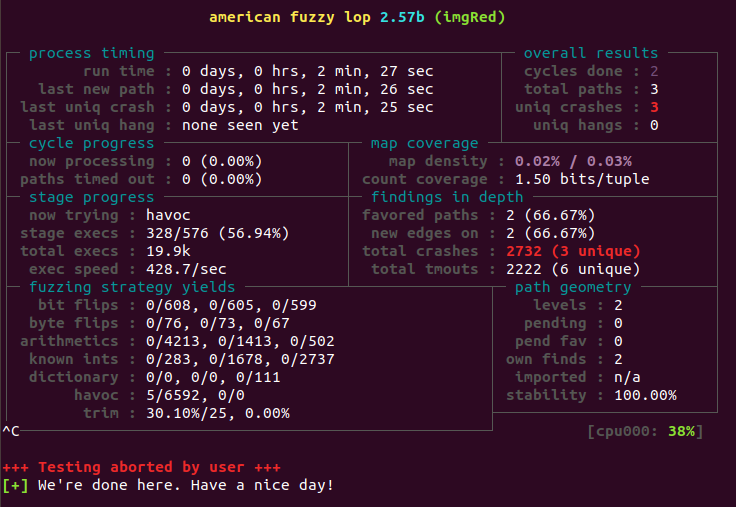

Created: 2021-05-28 09:09:58

Modified: 2021-11-15 19:17:10


<!--more-->

# AFL

[Technical "whitepaper" for afl-fuzz](https://lcamtuf.coredump.cx/afl/technical_details.txt).

## quick use

1. installation.

   ```bash
   git clone git@github.com:google/AFL.git
   cd AFL
   make
   sudo make install
   # check installation
   afl-gcc
   ```

2. fuzzing test.

   ```bash
   cd ~/Documents
   mkdir test
   cd test
   mkdir ipnut output
   # prepare targeted file imgRead.c, refer to Appendix A
   touch imgRead.c
   # after writing  imgRead.c, compile the program using afl-gcc
   afl-gcc -fsanitize=address -fsanitize=undefined imgRead.c -o imgRed
   # prepare input, refer to https://www.youtube.com/watch?v=NiGC1jxFx78&list=PLHGgqcJIME5koI76OlBdBj7sCid1hbjf-&index=3
   echo "aaaa" > input/image.img
   echo "IMG" > input/image.img
   xxd input/image.img
   afl-fuzz -i input/ -o output -m none -- ./imgRed @@
   # for troubleshooting refer to Appendix B
   # press Ctrl + C to exit from afl-fuzz
   ```



3. analysis.

   ```bash
   xxd id:000000,sig:06,src:000000,op:havoc,rep:64
   # or use crashwalk, refer to https://www.freebuf.com/articles/system/197678.html
   sudo apt-get install gdb golang
   cd ~
   mkdir tools
   cd tools
   git clone https://github.com/jfoote/exploitable.git
   mkdir go
   export GOPATH=~/tools/go
   export CW_EXPLOITABLE=~/tools/exploitable/exploitable/exploitable.py
   go get -u github.com/bnagy/crashwalk/cmd/...
   # wait for downloading, then use cwtriage
   ~/tools/go/bin/cwtriage -root ~/Documents/mycode/test/ -afl
   ```
   
   Code Coverage.
   
   ```bash
   # use afl-cov, refer to https://www.freebuf.com/articles/system/197678.html
   ```
   
   

# Concept

## CFG

CFG, [control flow graph](https://en.wikipedia.org/wiki/Control-flow_graph), consists of node(block) and edge.

## Code Coverage

refer to [SanitizerCoverage](https://clang.llvm.org/docs/SanitizerCoverage.html).

# Appendix

## A. targeted file


   ```c
   // imgRead.c
   // refer to https://www.youtube.com/watch?v=NiGC1jxFx78&list=PLHGgqcJIME5koI76OlBdBj7sCid1hbjf-&index=3
   #include<stdio.h>
   #include<stdlib.h>
   #include<string.h>
   
   struct Image
   {
       char header[4];
       int     width;
       int     height;
       char  data[10];
   };
   
   int ProcessImage(char* filename){
       FILE *fp;
       char ch;
       struct Image img;
   
       fp = fopen(filename, "r");
       
       if (fp == NULL)
       {
           printf("fp == NULL");
           exit(0);
       }
       
       printf("\n\tHeader\twidth\theight\tdata\t\r\n");
   
       while (fread(&img, sizeof(img), 1, fp) > 0)
       {
           printf("\n\t%s\t%d\t%d\t%s\r\n", img.header, img.width, img.height, img.data);
           int size1 = img.width * img.height;
           printf("size1: %d ", size1);
           char* buff  = (char*)malloc(size1);
           memcpy(buff, img.data, sizeof(img.data));
           int size2 = img.width / img.height;
           printf("size2: %d", size2);
           free(buff);
           if (size1 / 2 == 0)
           {
               free(buff);
           }
           
       }
       fclose(fp);
   }
   
   int main(int argc, char **argv){
       ProcessImage(argv[1]);
   }
   ```

   

## B. troubleshooting

1. for the first time

```bash
sudo su root

echo core >/proc/sys/kernel/core_pattern

cd /sys/devices/system/cpu
echo performance | tee cpu*/cpufreq/scaling_governor
```

*`Ctrl + D`: exit from root

or refer to https://i-m.dev/posts/20191001-225746.html, https://blog.csdn.net/qysh123/article/details/114794833

```bash
export AFL_SKIP_CPUFREQ=1
# or 
export AFL_I_DONT_CARE_ABOUT_MISSING_CRASHES=1
# or 
echo core | sudo tee /proc/sys/kernel/core_pattern
echo performance | sudo tee /sys/devices/system/cpu/cpu*/cpufreq/scaling_governor
```


