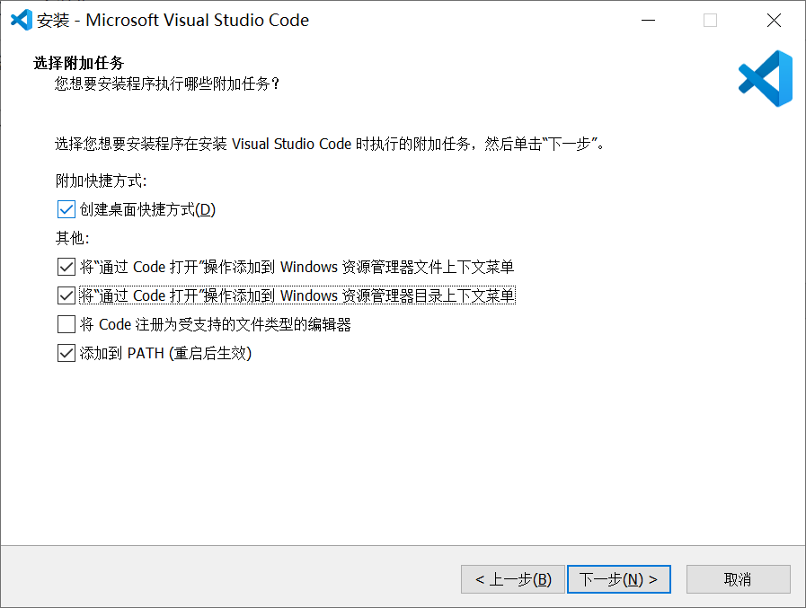
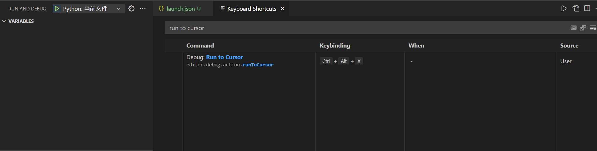
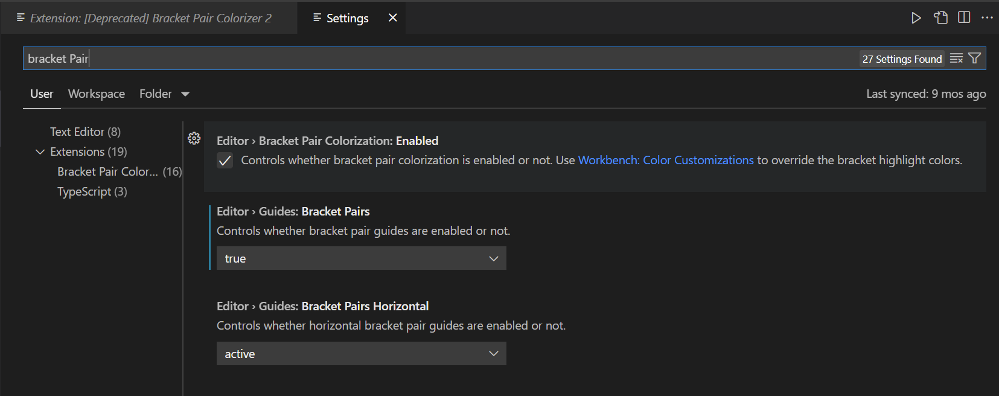
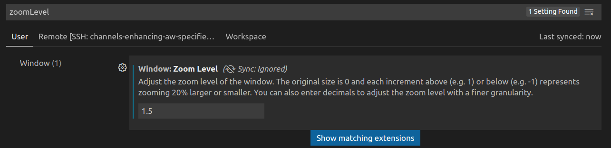
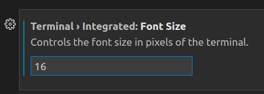
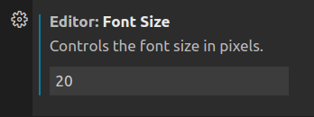
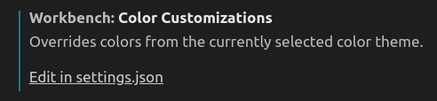
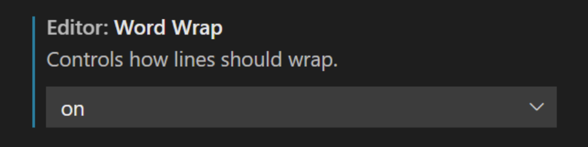

Created: Jul 7 2021 11:36:46

Modified: 2021-7-29 12:06:43

<!--more-->

# configuration

use extension `Setting Sync`, refer to https://code.visualstudio.com/docs/editor/settings-sync

# Portable Mode

refer to https://code.visualstudio.com/docs/editor/portable and https://www.zhihu.com/question/57671963/answer/1139906712

Note that there are no `additional tasks`, like:



In order to add `code` to Windows Explorer file and directory context menu, use a `.bat` script:

```shell
@ECHO OFF
rem Please ensure that this script is in the same directory as code.exe
PUSHD %~DP0
TITLE VSCode for Windows
Md "%WinDir%\System32\test_permissions" 2>NUL||(Echo 请使用右键管理员身份运行&&Pause >NUL&&Exit)
Rd "%WinDir%\System32\test_permissions" 2>NUL
SetLocal EnableDelayedExpansion

SET /P ST=输入a添加右键菜单，输入d删除右键菜单：
if /I "%ST%"=="a" goto Add
if /I "%ST%"=="d" goto Remove

:Add
echo Add VSCode for opening files.
reg add "HKEY_CLASSES_ROOT\*\shell\VSCode"         /t REG_SZ /v "" /d "&VSCode"   /f
reg add "HKEY_CLASSES_ROOT\*\shell\VSCode"         /t REG_EXPAND_SZ /v "Icon" /d "%~dp0Code.exe" /f
reg add "HKEY_CLASSES_ROOT\*\shell\VSCode\command" /t REG_SZ /v "" /d "%~dp0Code.exe \"%%1\"" /f
echo Add VSCode for opening directories.
reg add "HKEY_CLASSES_ROOT\Directory\shell\VSCode"         /t REG_SZ /v "" /d "Open with VSCode"   /f
reg add "HKEY_CLASSES_ROOT\Directory\shell\VSCode"         /t REG_EXPAND_SZ /v "Icon" /d "%~dp0Code.exe" /f
reg add "HKEY_CLASSES_ROOT\Directory\shell\VSCode\command" /t REG_SZ /v "" /d "%~dp0Code.exe \"%%1\"" /f
echo Add VSCode for opening directories in background.
reg add "HKEY_CLASSES_ROOT\Directory\Background\shell\VSCode"         /t REG_SZ /v "" /d "Open with VSCode"   /f
reg add "HKEY_CLASSES_ROOT\Directory\Background\shell\VSCode"         /t REG_EXPAND_SZ /v "Icon" /d "%~dp0Code.exe" /f
reg add "HKEY_CLASSES_ROOT\Directory\Background\shell\VSCode\command" /t REG_SZ /v "" /d "%~dp0Code.exe \"%%V\"" /f
exit

:Remove
reg delete "HKEY_CLASSES_ROOT\*\shell\VSCode" /f
reg delete "HKEY_CLASSES_ROOT\Directory\shell\VSCode" /f
reg delete "HKEY_CLASSES_ROOT\Directory\Background\shell\VSCode" /f
exit
```

To [Update Portable VS Code](https://code.visualstudio.com/docs/editor/portable#_update-portable-vs-code), On **Windows** and **Linux**, you can update VS Code by copying the `data` folder over to a more recent version of VS Code. On **mac OS**, automatic updates should work as always, no extra work needed.

# Debugging

## configure

Refer to https://code.visualstudio.com/docs/editor/debugging, https://code.visualstudio.com/docs/editor/variables-reference.

Take [bert for classification demo](https://github.com/google-research/bert#sentence-and-sentence-pair-classification-tasks) for example:

```js
{
    // Use IntelliSense to learn about possible attributes.
    // Hover to view descriptions of existing attributes.
    // For more information, visit: https://go.microsoft.com/fwlink/?linkid=830387
    "version": "0.2.0",
    "configurations": [
        {
            "name": "Python: 当前文件",
            "type": "python",
            "request": "launch",
            "program": "${file}",
            "console": "integratedTerminal",
            "args": [
                "--task_name=MRPC",
                "--do_train=true",
                "--do_eval=true",
                "--data_dir=${input:GLUE_DIR}/MRPC",
                "--vocab_file=${input:BERT_BASE_DIR}/vocab.txt",
                "--bert_config_file=${input:BERT_BASE_DIR}/bert_config.json",
                "--init_checkpoint=${input:BERT_BASE_DIR}/bert_model.ckpt",
                "--max_seq_length=128",
                "--train_batch_size=2",
                "--learning_rate=2e-5",
                "--num_train_epochs=1.0",
                "--output_dir=/tmp/mrpc_output/",
            ]
        }
    ],
    "inputs": [
        {
            "id": "GLUE_DIR",
            "type": "promptString",
            "description": "path GLUE_DIR.",
            "default": "MyMLData/DataSets"
        },
        {
            "id": "BERT_BASE_DIR",
            "type": "promptString",
            "description": "path BERT_BASE_DIR.",
            "default": "MyMLData/CheckPoint/uncased_L-12_H-768_A-12"
        }
    ]
}
```

## run to cursor

Set the shortcut for it in `File - Preference - Keyboard Shortcuts`.



## Bracket Pair Colorizer



# other setting










