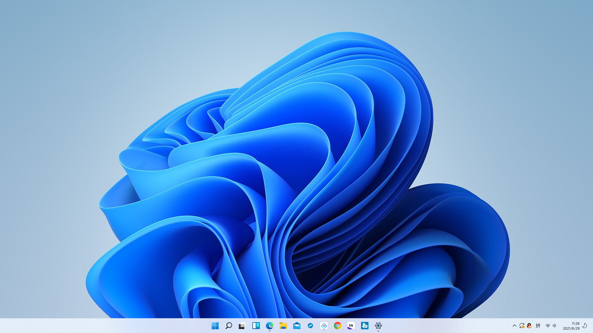
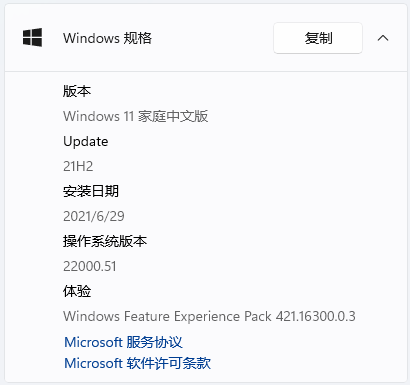
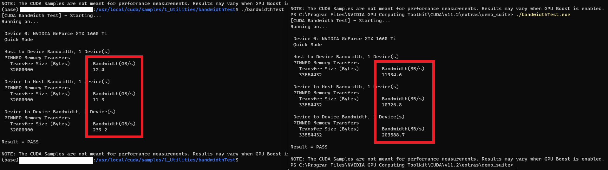
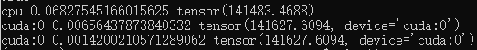
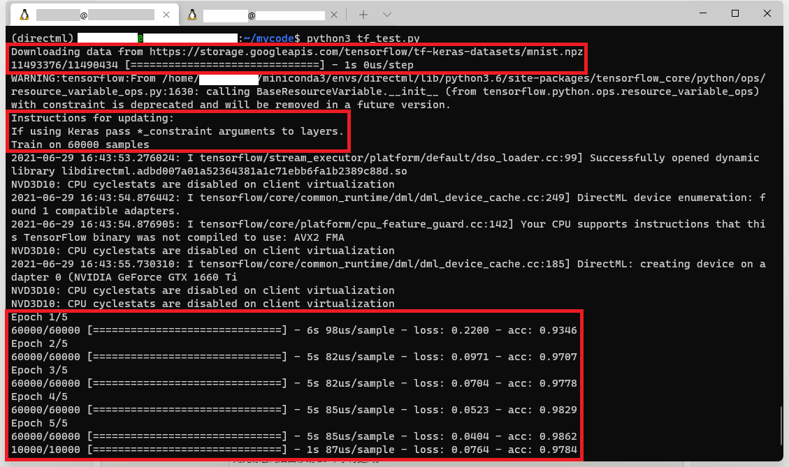
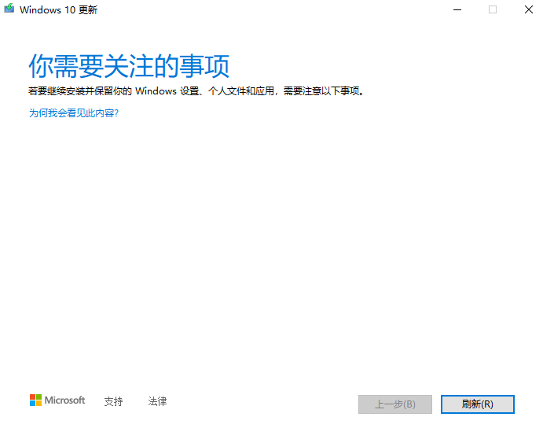
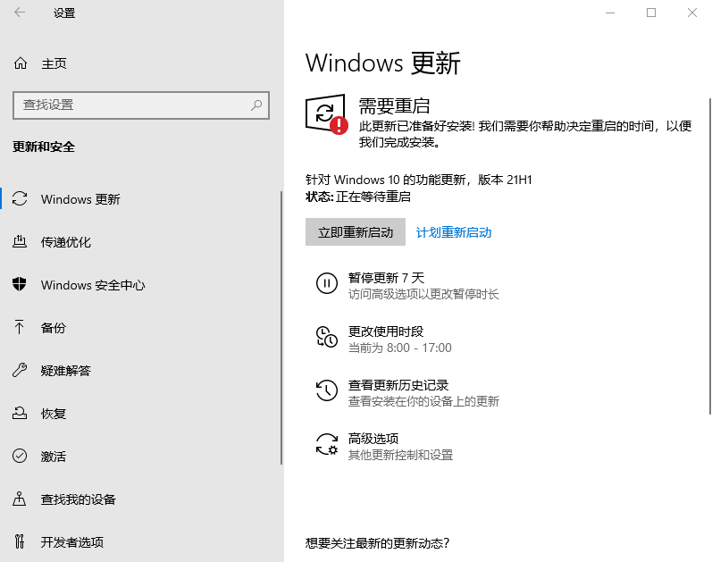
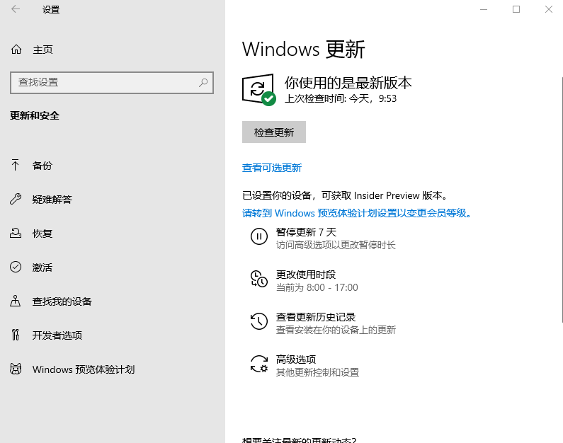
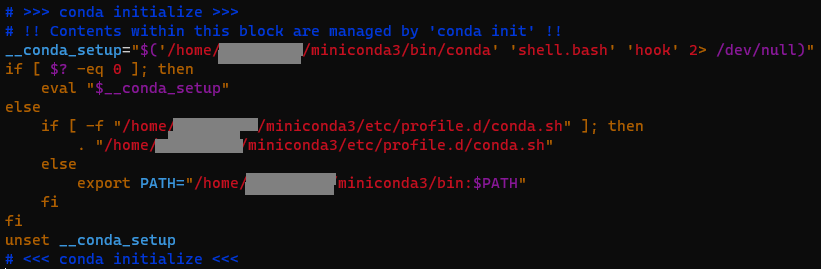

<!--more-->

# what is WSL

WSL is a Microsoft official solution for GNU/Linux environment running on windows, instead of either virtual machine or double system, for more information referring to [What is Windows Subsystem for Linux | Microsoft Docs](https://docs.microsoft.com/en-us/windows/wsl/about).

GNU/Linux environment is a application on windows via WSL, and you can manage this environment by terminal. Now there are several GUI tool having supported it, while Microsoft team **is now trying** to develop GPU compute on WSL.

# installation

for installation refer to [Install WSL on Windows 10 | Microsoft Docs](https://docs.microsoft.com/en-us/windows/wsl/install-win10), [WSL | Ubuntu](https://ubuntu.com/wsl), [WSL - Ubuntu Wiki](https://wiki.ubuntu.com/WSL)

Notice: The Windows Subsystem for Linux only runs on your system drive(usually this is your `C:` drive).

# GPU compute support

Support for GPU compute, the #1 most requested WSL feature, is now **ONLY** available for preview via the Windows Insider program, referring to [GPU accelerated ML training in WSL | Microsoft Docs](https://docs.microsoft.com/en-us/windows/wsl/tutorials/gpu-compute), [GPU accelerated ML training inside the Windows Subsystem for Linux - Windows Developer Blog](https://blogs.windows.com/windowsdeveloper/2020/06/17/gpu-accelerated-ml-training-inside-the-windows-subsystem-for-linux/).

To make it, refer to [NVIDIA CUDA preview in WSL 2 | Microsoft Docs](https://docs.microsoft.com/en-us/windows/win32/direct3d12/gpu-accelerated-training#professionals), [Latest CUDA/CUDA on Windows Subsystem for Linux topics - NVIDIA Developer Forums](https://forums.developer.nvidia.com/c/accelerated-computing/cuda/cuda-on-windows-subsystem-for-linux/303), 

## install Insider Preview Builds

download and install the Windows 10 Insider Preview Builds(actually Windows 11 Insider Preview-6/29/2021).






## install preview GPU driver

refer to [preview GPU driver | Microsoft Docs](https://docs.microsoft.com/en-us/windows/win32/direct3d12/gpu-tensorflow-wsl#install-the-preview-gpu-driver).

## develop

develop based on the above preview GPU driver

1. if use NVIDIA GPU, the preview GPU driver actually includes the CUDA on WSL 2, refer to [CUDA on Windows Subsystem for Linux (WSL) - Public Preview | NVIDIA Developer](https://developer.nvidia.com/cuda/wsl),

   so you can use directly CUDA C++, consulting the CUDA C++ Programming Guide, located in `/usr/local/cuda-10.1/doc`, or referring to [CUDA 高性能并行计算入门_cyhbrilliant的博客-CSDN博客_cuda并行计算](https://blog.csdn.net/cyhbrilliant/article/details/79434090), and its performance is really good(Ubuntu > WSL > Windows);

   

   besides, you can start using your existing Linux workflows through [NVIDIA Docker](https://github.com/NVIDIA/nvidia-docker), refer to [CUDA on WSL Documentation (nvidia.com)](https://docs.nvidia.com/cuda/wsl-user-guide/index.html#setting-containers);

   Wrong try: go on installing cuDNN based on CUDA, you may need to use mirrors source, refer to [使用conda安装python包_cathar的专栏-CSDN博客_conda安装python包](https://blog.csdn.net/cathar/article/details/53729007) or [pip 使用国内镜像源 | 菜鸟教程 (runoob.com)](https://www.runoob.com/w3cnote/pip-cn-mirror.html), actually there is error around CUDA `lib64` and hence almost frameworks (like TensorFlow2, MindSpore) cannot access to NVIDIA GPU, but **PyTorch**.

   

2. Besides, use TensorFlow with DirectML. AMD, Intel and NVIDIA preview GPU drivers all include DirectX WSL driver supporting DX12 APIs, so TensorFlow with a DirectML backend can access to those GPUs,refer to [Install the Tensorflow with DirectML package | Microsoft Docs](https://docs.microsoft.com/en-us/windows/win32/direct3d12/gpu-tensorflow-wsl#set-up-python-environment). There is a **sample** in the following section.

Notice: many operations on WSL need root, so if you meet something wrong, try to type `sudo` ahead, and it is also really useful and important to look up the output information; maybe you need some knowledge of Ubuntu

## sample

bash:

```bash
cd ~
ls
mkdir mycode
cd mycode
touch tf_test.py
ls
vim tf_test.py
```

python, refer to [docs/site/en/r1/tutorials at master · tensorflow/docs · GitHub](https://github.com/tensorflow/docs/tree/master/site/en/r1/tutorials):

```python
import tensorflow as tf

mnist = tf.keras.datasets.mnist

(x_train, y_train),(x_test, y_test) = mnist.load_data()
x_train, x_test = x_train / 255.0, x_test / 255.0

model = tf.keras.models.Sequential([
  tf.keras.layers.Flatten(input_shape=(28, 28)),
  tf.keras.layers.Dense(512, activation=tf.nn.relu),
  tf.keras.layers.Dropout(0.2),
  tf.keras.layers.Dense(10, activation=tf.nn.softmax)
])

model.compile(optimizer='adam',
              loss='sparse_categorical_crossentropy',
              metrics=['accuracy'])

model.fit(x_train, y_train, epochs=5)
model.evaluate(x_test, y_test)
```

bash:

```bash
<Esc>
:wq<Enter>

conda info --envs
conda activate directml
ls
python3 tf_test.py
```

output:



You can see it working well, though there are several warnings, which are almost due to versions, refer to [How can I address these warning messages on my first directml attempt? · Issue #117 · microsoft/DirectML · GitHub](https://github.com/microsoft/DirectML/issues/117), [成功解决Your CPU supports instructions that this TensorFlow binary was not compiled to use: AVX AVX2_张齐贤的博客-CSDN博客](https://blog.csdn.net/zqx951102/article/details/88897117).

For more samples, refer to [DirectML/TensorFlow at master · microsoft/DirectML · GitHub](https://github.com/microsoft/DirectML/tree/master/TensorFlow).

# Running Graphical Applications

refer to [Running Graphical Applications - Ubuntu Wiki](https://wiki.ubuntu.com/WSL#Running_Graphical_Applications),

# troubleshooting

## installation

refer to [troubleshooting installation of WSL on Windows 10 | Microsoft Docs](https://docs.microsoft.com/en-us/windows/wsl/install-win10#troubleshooting-installation),

## GPU support

## Windows 10 Insider Preview Builds

install the Windows 10 Insider Preview Builds, but stop here




solution:

before building this preview, update Windows as well as kernel to the latest general version





## Python environment

when you try to use TensorFlow with DirectML, following official steps and setting up Python environment, you may meet errors using either `sudo conda` or `conda`.

solution:

1. First, check the `bashrc` program on WSL:

```bash
vim ~/.bashrc
```

make sure there is `export PATH` of miniconda3, like



and then execute it:

```bash
source ~/.bashrc
```

2. Root. you need to give root to write in the direction of miniconda3, refer to [conda创建环境报错：NotWritableError: The current user does not have write permissions to a required path._HaotianYan的博客-CSDN博客](https://blog.csdn.net/weixin_41804998/article/details/107499405):

```bash
cd ~
sudo chown -R {username} anaconda3
```

*username: user name of your Ubuntu; besides, `~` means `/home/{username}`.

