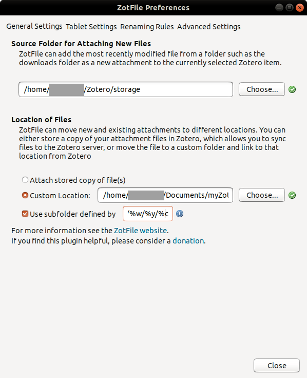
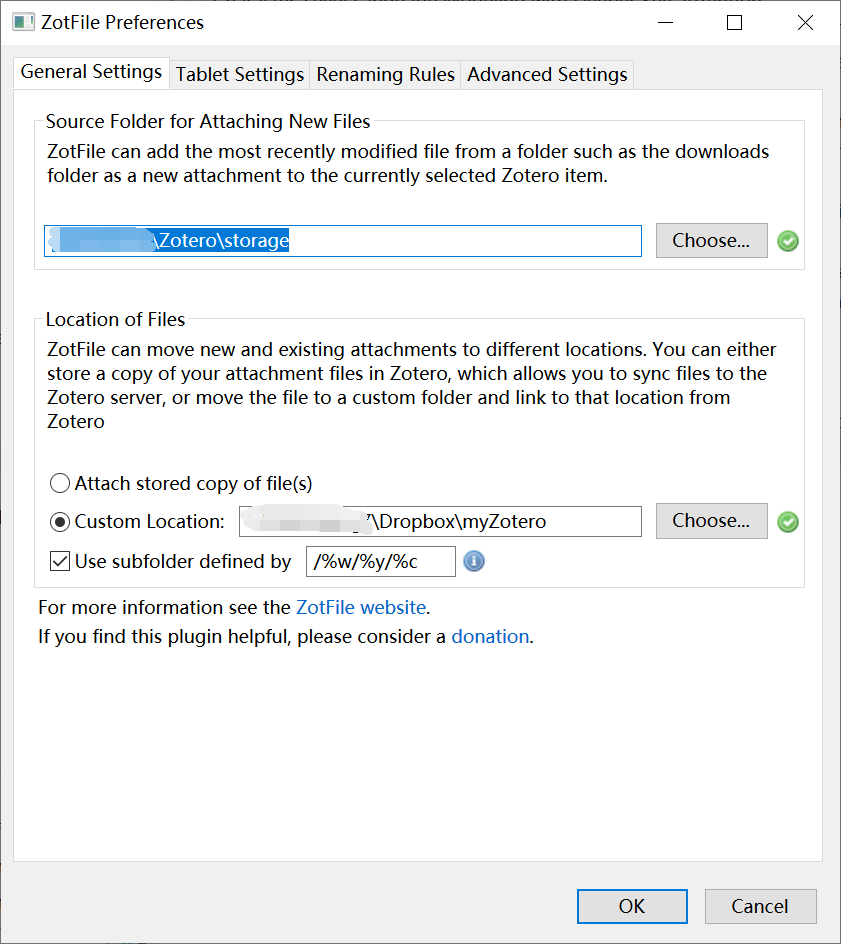
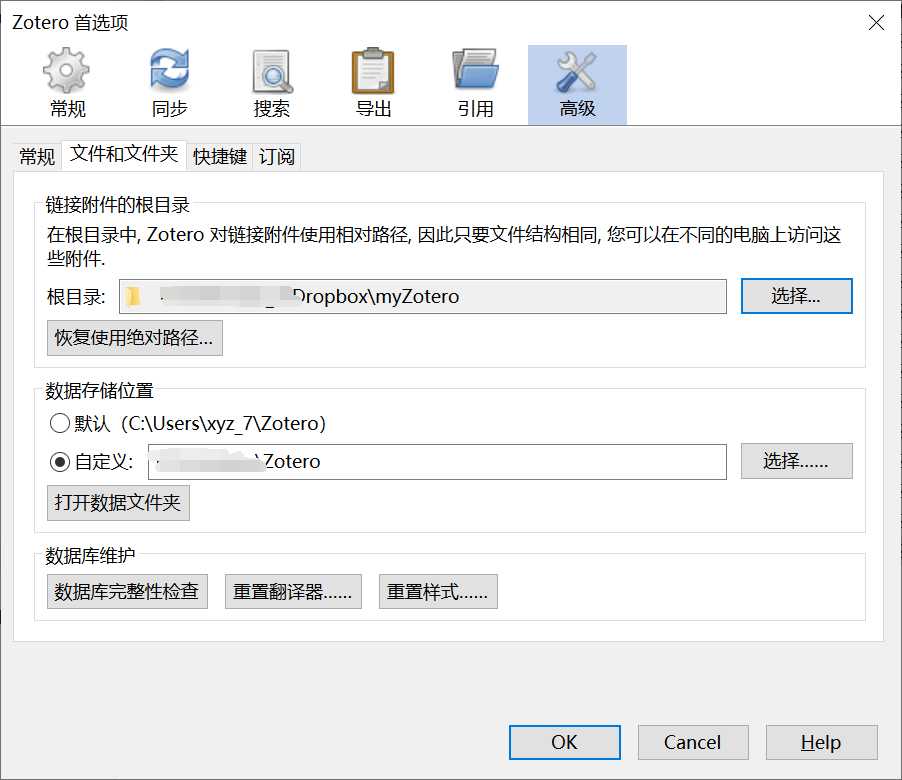

Created: Mon Jul 12 10:19:53 CST 2021

Modified: 2021-11-4 22:49:06

<!--more-->

# Installation

Refer to [安装](https://blog.csdn.net/xinjieyuan/article/details/105407564),

```bash
sudo apt-add-repository ppa:smathot/cogscinl
sudo apt-get update
sudo apt-get install zotero-standalone
cd /opt
sudo chown -R root:root zotero/
sudo chmod 777 zotero/
cd zotero
sudo chmod -R a+rx *.desktop
sudo chown -R <user name>:<user name> *.desktop
```

or use `.deb` file

```bash
./set_launcher_icon
ln -s ~/zotero/zotero.desktop ~/.local/share/applications/zotero.desktop
```

# Configuration

Refer to [初始设定](https://zhuanlan.zhihu.com/p/31852030)

# Cloud

prepare a own cloud for sync, taking **Dropbox** for example (installation on Ubuntu refer to [How to Install and Sync DropBox on Ubuntu 18.04 LTS - VITUX](https://vitux.com/how-to-install-and-sync-dropbox-on-ubuntu/), [安装Dropbox客户端 - 哈库 - 个人维基 (mywiki.cn)](https://www.mywiki.cn/hovercool/index.php/%E5%AE%89%E8%A3%85Dropbox%E5%AE%A2%E6%88%B7%E7%AB%AF))

Note: if you use proxy, you'd better to configure it manually in **Dropbox Preferences**.

## Configuration

Refer to [ZotFile 配合同步盘](https://zhuanlan.zhihu.com/p/31453719), [Zotero和zotfile插件关联以及使用](https://zhuanlan.zhihu.com/p/104848524).

From [zotfile offical website](https://link.zhihu.com/?target=http%3A//zotfile.com/) download `zotfile` Add-ons, then install and configure it.





Source folder：插件自动检索文件夹里的新增文件。



Linked files/相对路径下的文件：对应云端文件，用于Zotero的读。

Stored files：终端文件。

## Operation

1. local_clound

manage attachments - rename attachments meanwhile move from local

Tools - manage attachments - to stored files

2. tablet

manage attachments - send to tablet

manage attachments - get from tablet with **contents**
