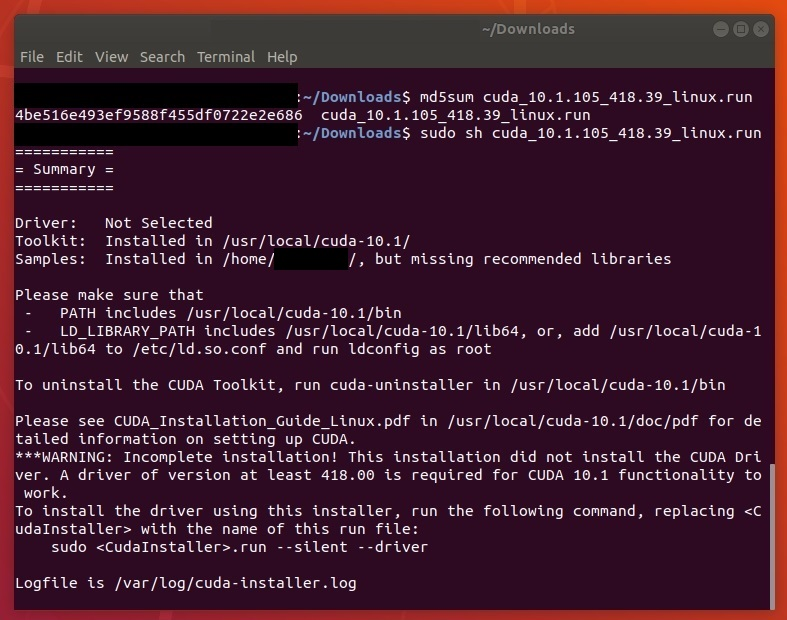
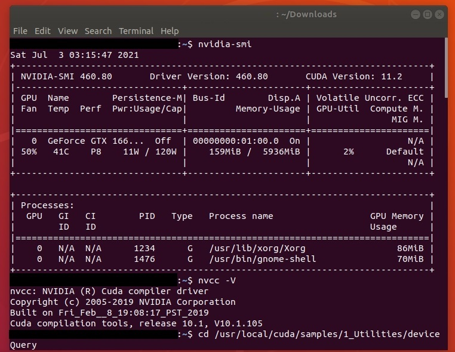
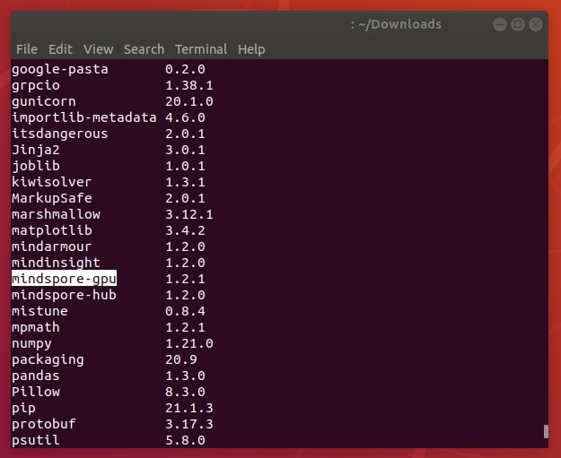
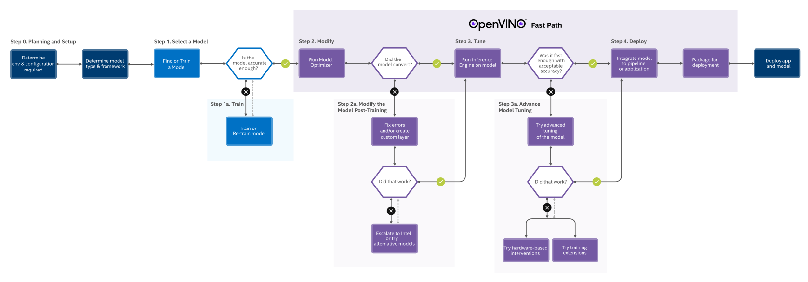
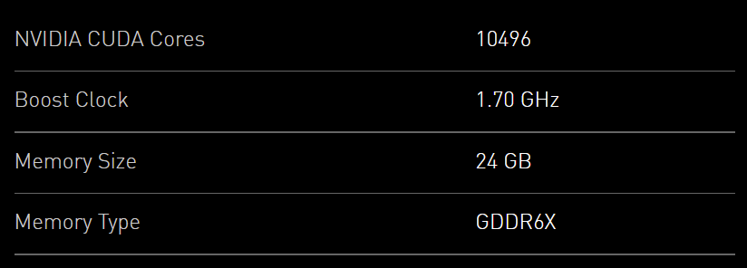
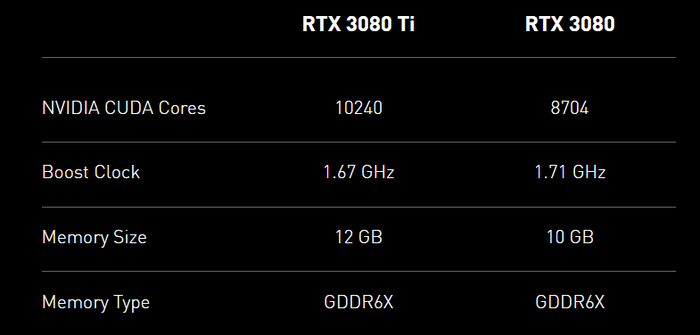

Created: 2021-07-04 11:18:30

Modified: Fri Sep 17 18:39:12 CST 2021

<!--more-->

```bash
CUDA_VISIBLE_DEVICES=0
```

# CPU/GPU/NPU support

What you need to install to support advanced computing depends on your hardware of device, and the requirements of machine learning library, like TensorFlow, Torch, MindSpore and so on.

1. if use **NVIDIA GPU** supporting CUDA ([how to choose](https://timdettmers.com/2020/09/07/which-gpu-for-deep-learning/#General_Recommendations)), usually the following NVIDIA® dependencies need installed:
   
   - version check, refer to https://blog.csdn.net/weixin_41803874/article/details/91913063, https://docs.nvidia.com/deploy/cuda-compatibility, https://tensorflow.google.cn/install/source#gpu. ps. [cuda 10.0 seems to not support RTX30](https://github.com/tensorflow/tensorflow/issues/43718#issuecomment-703871083), so that [use cuda 11](https://blog.csdn.net/Gxy19980906/article/details/119654306).
   
   - [NVIDIA® GPU drivers](https://www.nvidia.com/drivers).
     
     check GPU:
     
     ```bash
     lspci | grep 'VGA'
     ```
     
     It usually has been installed since operation system was installed.
     
     In Ubuntu, it is recommended to use GUI to install or change your GPU driver, refer to [Ubuntu Linux Install Nvidia Driver (Latest Proprietary Driver) - nixCraft (cyberciti.biz)](https://www.cyberciti.biz/faq/ubuntu-linux-install-nvidia-driver-latest-proprietary-driver/), OR use terminal:
     
     ```bash
     # refer to https://cyfeng.science/2020/05/02/ubuntu-install-nvidia-driver-cuda-cudnn-suits/
     ubuntu-drivers devices
     sudo ubuntu-drivers autoinstall
     # or sudo apt install nvidia-driver-440
     # reboot
     ```
     
     In windows, download the installation packages from [NVIDIA official website](https://www.nvidia.com/Download/index.aspx) and install it.
     
     Now, if you use `conda`, you can just install the runtime files of `cuda` and `cudnn`, and skip the following two installation([the differences](https://blog.csdn.net/qq_40947610/article/details/114707085)):
     
     ```bash
     # conda isntall `cuda` and `cudnn`, for example:
     conda install cudatoolkit=10.0 -c https://mirrors.tuna.tsinghua.edu.cn/anaconda/pkgs/free/linux-64/
     conda install cudnn=7.4 -c https://mirrors.tuna.tsinghua.edu.cn/anaconda/pkgs/main/linux-64/
     ```
- [CUDA® Toolkit](https://developer.nvidia.com/cuda-toolkit-archive).
  
  Read related software documents, like [GPU support  | TensorFlow (google.cn)](https://tensorflow.google.cn/install/gpu), to choose correct CUDA version.
  
  Note: you need to choose `runfile` packages to install old version if you use Ubuntu.
  
  For Ubuntu 18.04 LTS, refer to the CUDA installation section in [Ubuntu 18.04安装CUDA和cuDNN - 知乎 (zhihu.com)](https://zhuanlan.zhihu.com/p/72298520) and install CUDA without selecting driver component. Note that you would better to record those information.
  
  
  
  For Windows 10, you can refer to the CUDA installation section in [win10安装CUDA和cuDNN的正确姿势 - 知乎 (zhihu.com)](https://zhuanlan.zhihu.com/p/94220564). Uninstall and install CUDA refer to [windows下CUDA的卸载以及安装_m0_37605642的博客-CSDN博客_cuda卸载](https://blog.csdn.net/m0_37605642/article/details/99100924), note that you can keep the high version of components of Display Driver, PhysX, NVIDIA GeForce Experience.
  
  Notice: do not care about the GPU drivers, you can verify CUDA firstly according to the following instructions, and if there is mismatching information printed, change your drivers later. To verify your installation:
  
  1. check `nvcc`, execute the following command line in shell:
  
  ```bash
  nvcc -V
  ```
  
  - If there is no information printed, check your environment variables:
    
    in Ubuntu, execute the following command line in shell, refer to [ubuntu－设置系统环境变量 - 简书 (jianshu.com)](https://www.jianshu.com/p/12fbfa8c7489), [Environment Setup :: CUDA Toolkit Documentation (nvidia.com)](https://docs.nvidia.com/cuda/cuda-installation-guide-linux/index.html#environment-setup), [Ubuntu 18.04安装CUDA和cuDNN - 知乎 (zhihu.com)](https://zhuanlan.zhihu.com/p/72298520):
    
    ```bash
    echo '# CUDA' >> ~/.bashrc
    echo 'export PATH=/usr/local/cuda/bin${PATH:+:${PATH}}' >> ~/.bashrc
    echo 'export LD_LIBRARY_PATH=/usr/local/cuda/lib64\
    ${LD_LIBRARY_PATH:+:${LD_LIBRARY_PATH}}' >> ~/.bashrc
    source ~/.bashrc
    ```
  
  If environment variables has been set done, CUDA **Runtime** version will be printed according to CUDA Runtime API, which should be not higher than CUDA **Driver** version, which you can look up by executing the following command line:
  
  ```bash
  nvidia-smi
  
  pip install gpustat
  gpustat -i 1 -cup --force-color
  # watch --color -n 1 gpustat --force-color -cup
  ```
  
  
  
  if you do not get CUDA **Driver** version printed or your CUDA **Driver** version is lower than **Runtime** version, install or update your **NVIDIA® GPU drivers** according to next step.
  
  2. running compiled examples,
  
  in windows, refer to [windows 验证CUDA和CUDNN是否安装成功 - 知乎 (zhihu.com)](https://zhuanlan.zhihu.com/p/139668028), [Installation Guide Windows :: CUDA Toolkit Documentation (nvidia.com)](https://docs.nvidia.com/cuda/cuda-installation-guide-microsoft-windows/index.html):
  
  ```shell
  cd C:\Program Files\NVIDIA GPU Computing Toolkit\CUDA\v11.1
  cd extras\demo_suite
  deviceQuery.exe
  bandwidthTest.exe
  ```
  
  *v11.1 is the version of your CUDA.
  
  in Ubuntu,
  
  ```bash
  cd /usr/local/cuda/samples/1_Utilities/deviceQuery
  sudo make
  ./deviceQuery
  cd ..
  cd bandwidthTest
  sudo make
  ./bandwidthTest
  ```
  
  If `Result = PASS` is printed, your CUDA has been installed well, and you can **skip** the step of **NVIDIA® GPU drivers**, while if there is something wrong with mismatching between driver version and CUDA version, carry out the next step.

- [cuDNN](https://developer.nvidia.com/cudnn). Refer to https://docs.nvidia.com/deeplearning/cudnn/install-guide/index.html.
  
  Check your installation version, in windows, 
  
  ```shell
  cd C:\Program Files\NVIDIA GPU Computing Toolkit\CUDA\v11.1
  cd include
  cudnn_version.h
  ```
  
  in Ubuntu,
  
  ```bash
  cat /usr/local/cuda/include/cudnn.h | grep CUDNN_MAJOR -A 2
  ```
2. if use **Intel iGPU/FPGA(deprecated)/VPUs/HDDL/MYRIAD/HETERO** with OpenVINO, 

3. if use **Huawei Ascend** which supports CANN,

4. if use **AMD/ATI GPU** which supports AMD-MLP, which is based on OpenCL supporting parallel computing across various devices, give it up.

5. if use DirectML on Windows hardware include **AMD, Intel and NVIDIA GPUs**,
   
   refer to [GPU accelerated ML training inside the Windows Subsystem for Linux - Windows Developer Blog](https://blogs.windows.com/windowsdeveloper/2020/06/17/gpu-accelerated-ml-training-inside-the-windows-subsystem-for-linux/), [直接机器学习 (DirectML) - Win32 apps | Microsoft Docs](https://docs.microsoft.com/zh-cn/windows/win32/direct3d12/dml), [GitHub - microsoft/DirectML](https://github.com/microsoft/DirectML), [GPU with DirectML | Microsoft Docs](https://docs.microsoft.com/en-us/windows/win32/direct3d12/gpu-accelerated-training#students-and-beginners).
   
   Refer to https://docs.microsoft.com/en-us/windows/win32/direct3d12/gpu-faq, to know how to use multiple GPUs by DirectML.

6. if use CUDA supports a laptop with an iGPU and a dGPU running Ubuntu, refer to [Installation Guide Linux :: CUDA Toolkit Documentation (nvidia.com)](https://docs.nvidia.com/cuda/cuda-installation-guide-linux/index.html#faq7).

7. if use Google Cloud or kaggle,

# Python

## install python

1. if use windows, go into [Download Python | Python.org](https://www.python.org/downloads/), download and install what you need; To choose which windows version, refer to [python官网的几个windows版本的区别 - 简书 (jianshu.com)](https://www.jianshu.com/p/bcb44e9d8efb).
   
   *suggestion: add python to PATH of environment variables;install pip.

2. if use Ubuntu, 
   
   ```bash
   # use source file
   wget https://www.python.org/ftp/python/3.7.5/Python-3.7.5.tgz
   tar -zxvf Python-3.7.5.tgz
   cd Python-3.7.5
   #  --enable-loadable-sqlite-extensions if use libsqlite3-dev
   ./configure --prefix=/usr/local/python3.7.5 --enable-shared
   make
   sudo make install
   # or use apt
   apt-get install python3.7
   #set environmental variables
   vim .bashrc
   export LD_LIBRARY_PATH=/usr/local/python3.7.5/lib:$LD_LIBRARY_PATH
   export PATH=/usr/local/python3.7.5/bin:$PATH
   source .bashrc
   # test
   python3 --version
   pip3 --version
   ```

3. use [Anaconda](https://www.anaconda.com/) or [Miniconda](https://conda.io/miniconda.html)(recommended), 

## install ML-lib

machine learning libraries(frameworks) include TensorFlow, PyTorch, MindSpore and so on

### TensorFlow 2

1. if use TensorFlow 2, refer to [Install TensorFlow 2 (google.cn)](https://tensorflow.google.cn/install):
   
   ```shell
   # Current stable release for CPU and GPU
   pip3 install tensorflow
   # Successfully installed absl-py-0.13.0 astunparse-1.6.3 cached-property-1.5.2 cachetools-4.2.2 certifi-2021.5.30 chardet-4.0.0 flatbuffers-1.12 gast-0.4.0 google-auth-1.32.0 google-auth-oauthlib-0.4.4 google-pasta-0.2.0 grpcio-1.34.1 h5py-3.1.0 idna-2.10 importlib-metadata-4.6.0 keras-nightly-2.5.0.dev2021032900 keras-preprocessing-1.1.2 markdown-3.3.4 numpy-1.19.5 oauthlib-3.1.1 opt-einsum-3.3.0 protobuf-3.17.3 pyasn1-0.4.8 pyasn1-modules-0.2.8 requests-2.25.1 requests-oauthlib-1.3.0 rsa-4.7.2 six-1.15.0 tensorboard-2.5.0 tensorboard-data-server-0.6.1 tensorboard-plugin-wit-1.8.0 tensorflow-2.5.0 tensorflow-estimator-2.5.0 termcolor-1.1.0 typing-extensions-3.7.4.3 urllib3-1.26.6 werkzeug-2.0.1 wheel-0.36.2 wrapt-1.12.1 zipp-3.4.1
   ```
   
   To verify your installation:
   
   ```shell
   python -c "import tensorflow.compat.v1 as tf; tf.test.gpu_device_name(); tf.test.is_gpu_available()"
   # ...Successfully opened dynamic library xxx
   ```
   
   For more verification, refer to [Tensorflow 2环境下,程序快速测试 GPU是否安装成功_sTeven LI-CSDN博客_tensorflow2测试gpu](https://blog.csdn.net/weixin_40726794/article/details/108169440).
   
   or install CPU version:
   
   ```bash
   pip3 install tensorflow-cpu
   # Successfully installed absl-py-0.13.0 astunparse-1.6.3 cached-property-1.5.2 cachetools-4.2.2 charset-normalizer-2.0.4 clang-5.0 flatbuffers-1.12 gast-0.4.0 google-auth-1.35.0 google-auth-oauthlib-0.4.6 google-pasta-0.2.0 grpcio-1.40.0 h5py-3.1.0 idna-3.2 importlib-metadata-4.8.1 keras-2.6.0 keras-preprocessing-1.1.2 markdown-3.3.4 numpy-1.19.5 oauthlib-3.1.1 opt-einsum-3.3.0 protobuf-3.17.3 pyasn1-0.4.8 pyasn1-modules-0.2.8 requests-2.26.0 requests-oauthlib-1.3.0 rsa-4.7.2 six-1.15.0 tensorboard-2.6.0 tensorboard-data-server-0.6.1 tensorboard-plugin-wit-1.8.0 tensorflow-cpu-2.6.0 tensorflow-estimator-2.6.0 termcolor-1.1.0 typing-extensions-3.7.4.3 urllib3-1.26.6 werkzeug-2.0.1 wrapt-1.12.1 zipp-3.5.0
   ```

### TensorFlow 1.3

If you use [Anaconda](https://www.anaconda.com/download/) or the smaller [Miniconda](https://conda.io/miniconda.html), following the steps in https://docs.anaconda.com/anaconda/user-guide/tasks/tensorflow/:

```shell
conda create -n tf tensorflow=1.13
conda activate tf
```

Note that `MSVC 2015 update 3` is needed as Compiler for TensorFlow 1.3, refer to https://www.tensorflow.org/install/source_windows#cpu, so you need to install the [Visual Studio 2015, 2017 and 2019](https://support.microsoft.com/en-gb/topic/the-latest-supported-visual-c-downloads-2647da03-1eea-4433-9aff-95f26a218cc0), refer to https://www.tensorflow.org/install/pip#system-requirements.

```shell
for CPU only
pip3 install tensorflow==1.13
python -c "import tensorflow as tf; tf.test.gpu_device_name(); tf.test.is_gpu_available()"
```

```python
# pyhton
import tensorflow as tf
#session = tf.Session()
file_handle = tf.gfile.GFile('face_mask_detection.pb', "rb")
graph_def = tf.GraphDef()
graph_def.ParseFromString(file_handle.read())
tf.import_graph_def(graph_def, name="net")
input_name="images" {input name of model}
input_var = tf.get_default_graph().get_tensor_by_name("net/%s:0" % input_name)
input_var.get_shape().as_list()
```

### PyTorch

2. if use Torch, refer to [PyTorch](https://pytorch.org/):
   
   ```shell
   pip3 install torch==1.9.0+cu111 torchvision==0.10.0+cu111 torchaudio===0.9.0 -f https://download.pytorch.org/whl/torch_stable.html
   # Successfully installed numpy-1.21.0 pillow-8.2.0 torch-1.9.0+cu111 torchaudio-0.9.0 torchvision-0.10.0+cu111 typing-extensions-3.10.0.0
   ```
   
   To verify your installation:
   
   ```shell
   python -c "import torch; \
   print(torch.__version__); \
   print(torch.version.cuda); \
   print(torch.backends.cudnn.version()); \
   print(torch.cuda.is_available()); \
   print(torch.cuda.device_count()); \
   print(torch.cuda.current_device()); \
   print(torch.cuda.device(0)); \
   print(torch.cuda.get_device_name(0))"
   # 1.9.0+cu111
   # 11.1 # may not consist with above
   # 8005
   # True
   # 1
   # 0
   # <torch.cuda.device at 0x7efce0b03be0>
   # 'GeForce GTX 950M'
   # refer to: https://stackoverflow.com/questions/48152674/how-to-check-if-pytorch-is-using-the-gpu
   ```

For more verification, refer to [pytorch：测试GPU是否可用_明月几时有，把酒问青天-CSDN博客](https://blog.csdn.net/weixin_35576881/article/details/89709116), [PyTorch_GPU加速测试_liming_2464的博客-CSDN博客](https://blog.csdn.net/liming_2464/article/details/99457626).

### pytorch_lightning

https://blog.csdn.net/weixin_46062098/article/details/109713240

https://zhuanlan.zhihu.com/p/157742258

https://zhuanlan.zhihu.com/p/235392539

https://zhuanlan.zhihu.com/p/319810661

### MindSpore

3. if use MindSpore, refer to [MindSpore安装指南](https://www.mindspore.cn/install),[手把手安装和体验](https://www.mindspore.cn/tutorial/training/zh-CN/r1.2/quick_start/quick_video.html):
   
   Before installing MindSpore, you should install GCC, refer to [如何在Ubuntu 18.04上安装GCC编译器 (linuxidc.com)](https://m.linuxidc.com/Linux/2019-06/159059.htm), [Ubuntu下gcc安装及使用_lucifa_li的博客-CSDN博客_ubuntu下载gcc](https://blog.csdn.net/lucifa_li/article/details/79483686), and m4,
   
   ```bash
   sudo apt-get install m4
   ```
   
   and gmp, refer to [安装gmp-6.1.2库 - 云+社区 - 腾讯云 (tencent.com)](https://cloud.tencent.com/developer/article/1828724), 
   
   ```bash
   xz -d gmp-6.1.2.tar.xz
   tar -xvf gmp-6.1.2.tar
   cd gmp-6.1.2
   ./configure --enable-cxx --prefix=/usr/local/gmp6 --build=x86_64-linux
   make
   make check
   sudo make install
   # vim ~/.bashrc
   export LD_LIBRARY_PATH=/usr/local/gmp6/lib:$LD_LIBRARY_PATH
   # :wq
   # test
   cd ..
   gcc test_gmpxx.cpp -lgmp -lm -o test
   ./test
   ```
   
   and cmake, refer to [update cmake](https://support.huaweicloud.com/prtg-kunpengdbs/kunpengpercona_02_0006.html):
   
   ```bash
   # slowly download
   wget https://cmake.org/files/v3.21/cmake-3.21.2.tar.gz --no-check-certificate
   tar -zxvf cmake-3.21.2.tar.gz
   cd cmake-3.21.2
   ./bootstrap
   make
   sudo make install
   hash -r
   cmake --version
   ```
   
   then install CPU version:

```shell
pip install https://ms-release.obs.cn-north-4.myhuaweicloud.com/1.2.1/MindSpore/cpu/windows_x64/mindspore-1.2.1-cp37-cp37m-win_amd64.whl --trusted-host ms-release.obs.cn-north-4.myhuaweicloud.com -i https://pypi.tuna.tsinghua.edu.cn/simple
# Successfully installed asttokens-2.0.5 cffi-1.14.5 decorator-5.0.9 easydict-1.9 mindspore-1.2.1 mpmath-1.2.1 packaging-20.9 psutil-5.8.0 pycparser-2.20 pyparsing-2.4.7 scipy-1.7.0 sympy-1.8
```

   or install CUDA GPU version:

```bash
pip install https://ms-release.obs.cn-north-4.myhuaweicloud.com/1.2.1/MindSpore/gpu/ubuntu_x86/cuda-10.1/mindspore_gpu-1.2.1-cp37-cp37m-linux_x86_64.whl --trusted-host ms-release.obs.cn-north-4.myhuaweicloud.com -i https://pypi.tuna.tsinghua.edu.cn/simple
# Successfully installed asttokens-2.0.5 astunparse-1.6.3 cffi-1.14.5 decorator-5.0.9 easydict-1.9 mindspore-gpu-1.2.1 mpmath-1.2.1 numpy-1.21.0 packaging-20.9 pillow-8.2.0 protobuf-3.17.3 psutil-5.8.0 pycparser-2.20 pyparsing-2.4.7 scipy-1.7.0 six-1.16.0 sympy-1.8
```

   

   Otherwise, install Ascend 310 Linux version:

```bash
# check environmental variables ahead
ldd --version
gcc --version
# gmp
cmake --version
python3.7.5 --version
pip3.7.5 --version

pip3.7.5 install https://ms-release.obs.cn-north-4.myhuaweicloud.com/1.3.0/MindSpore/ascend/x86_64/mindspore_ascend-1.3.0-cp37-cp37m-linux_x86_64.whl --trusted-host ms-release.obs.cn-north-4.myhuaweicloud.com -i https://pypi.tuna.tsinghua.edu.cn/simple
# Successfully installed asttokens-2.0.5 astunparse-1.6.3 mindspore-ascend-1.3.0 packaging-21.0 protobuf-3.18.0 wheel-0.37.0
```

   install `Ascend Data Center Solution 21.0.2`, inlcude driver, firmware of nnrt(neural network runtime) and toolkit(the last two are included in the insider CANN version ?), then

```bash
cd ${install_path}
cd ..
ls -l
sudo chown HwHiAiUser:HwHiAiUser Ascend

pip3.7.5 install ${install_path}/fwkacllib/lib64/topi-0.4.0-py3-none-any.whl
pip3.7.5 install ${install_path}/fwkacllib/lib64/te-0.4.0-py3-none-any.whl

# add environmental variables
# control log level. 0-DEBUG, 1-INFO, 2-WARNING, 3-ERROR, default level is WARNING.
export GLOG_v=2
# lib libraries that the mindspore depends on, modify "pip3" according to the actual situation
export LD_LIBRARY_PATH=`pip3.7.5 show mindspore-ascend | grep Location | awk '{print $2"/mindspore/lib"}' | xargs realpath`:${LD_LIBRARY_PATH}
```

   Optional:

   install MindInsight:

```bash
pip install https://ms-release.obs.cn-north-4.myhuaweicloud.com/1.2.0/MindInsight/ascend/ubuntu_x86/mindinsight-1.2.0-cp37-cp37m-linux_x86_64.whl --trusted-host ms-release.obs.cn-north-4.myhuaweicloud.com -i https://pypi.tuna.tsinghua.edu.cn/simple
# Successfully installed Click-8.0.1 Flask-2.0.1 Flask-Cors-3.0.10 Jinja2-3.0.1 MarkupSafe-2.0.1 Werkzeug-2.0.1 future-0.18.2 google-pasta-0.2.0 grpcio-1.38.1 gunicorn-20.1.0 importlib-metadata-4.6.0 itsdangerous-2.0.1 joblib-1.0.1 marshmallow-3.12.1 mindinsight-1.2.0 pandas-1.3.0 python-dateutil-2.8.1 pytz-2021.1 pyyaml-5.4.1 scikit-learn-0.24.2 threadpoolctl-2.1.0 treelib-1.6.1 typing-extensions-3.10.0.0 yapf-0.31.0 zipp-3.4.1
```

   install MindArmour:

```bash
pip install https://ms-release.obs.cn-north-4.myhuaweicloud.com/1.2.0/MindArmour/x86_64/mindarmour-1.2.0-cp37-cp37m-linux_x86_64.whl --trusted-host ms-release.obs.cn-north-4.myhuaweicloud.com -i https://pypi.tuna.tsinghua.edu.cn/simple
# Successfully installed cycler-0.10.0 kiwisolver-1.3.1 matplotlib-3.4.2 mindarmour-1.2.0
```

   install MindSpore Hub:

   Download `.whl` file from [MindSpore Hub下载页面](https://www.mindspore.cn/versions), then

```bash
pip install mindspore_hub-1.2.0-py3-none-any.whl
# Successfully installed mindspore-hub-1.2.0 mistune-0.8.4
```

### OpenVINO

4. if use OpenVINO, refer to [Intel® Distribution of OpenVINO™ Toolkit](https://software.intel.com/content/www/us/en/develop/tools/openvino-toolkit.html). There are several [requirements](https://docs.openvinotoolkit.org/2021.4/openvino_docs_install_guides_installing_openvino_windows.html#system_requirements), like [cmake](https://cmake.org/download/) if you use Windows 10 OS. You need to set the related environment variables:
   
   ```shell
   conda create -n openvino python=3.7
   
   conda activate openvino
   "E:\Program Files (x86)\Intel\openvino_2021\bin\setupvars.bat"
   # Python 3.7.11
   # [setupvars.bat] OpenVINO environment initialized
   ```
   
   Then you need to configure the Model Optimizer:
   
   ```shell
   cd /d E:\Program Files (x86)\Intel\openvino_2021\deployment_tools\model_optimizer\install_prerequisites
   # the Internet access is required for the next step
   install_prerequisites.bat
   # WARNING: The script normalizer.exe is installed in '~\AppData\Roaming\Python\Python37\Scripts' which is not on PATH.
   # Consider adding this directory to PATH or, if you prefer to suppress this warning, use --no-warn-script-location.
   # Successfully installed absl-py-0.13.0 astunparse-1.6.3 cachetools-4.2.2 charset-normalizer-2.0.4 defusedxml-0.7.1 flatbuffers-1.12 gast-0.3.3 google-auth-1.35.0 google-auth-oauthlib-0.4.6 google-pasta-0.2.0 graphviz-0.17 grpcio-1.32.0 h5py-2.10.0 idna-3.2 importlib-metadata-4.8.1 keras-preprocessing-1.1.2 markdown-3.3.4 mxnet-1.2.0 networkx-2.6.2 numpy-1.19.5 oauthlib-3.1.1 onnx-1.10.1 opt-einsum-3.3.0 protobuf-3.17.3 pyasn1-0.4.8 pyasn1-modules-0.2.8 requests-2.26.0 requests-oauthlib-1.3.0 rsa-4.7.2 six-1.15.0 tensorboard-2.6.0 tensorboard-data-server-0.6.1 tensorboard-plugin-wit-1.8.0 tensorflow-2.4.3 tensorflow-estimator-2.4.0 termcolor-1.1.0 typing-extensions-3.7.4.3 urllib3-1.26.6 werkzeug-2.0.1 wrapt-1.12.1 zipp-3.5.0
   #- Inference Engine found in:    E:\Program Files (x86)\Intel\openvino_2021\python\python3.7\openvino
   # Inference Engine version:       2021.4.0-3839-cd81789d294-releases/2021/4
   # Model Optimizer version:        2021.4.0-3839-cd81789d294-releases/2021/4
   # *****************************************************************************************
   # Optional: To speed up model conversion process, install protobuf-*.egg located in the
   # "model-optimizer\install_prerequisites" folder or building protobuf library from sources.
   # For more information please refer to Model Optimizer FAQ, question #80.
   # or install for one like tf2
   install_prerequisites_tf2.bat
   ```
   
   For advanced configuration for Model Optimizer, refer to [Installing Model Optimizer Pre-Requisites](https://docs.openvinotoolkit.org/2021.4/openvino_docs_MO_DG_prepare_model_Config_Model_Optimizer.html) and [Model Optimizer Developer Guide](https://docs.openvinotoolkit.org/2021.4/openvino_docs_MO_DG_Deep_Learning_Model_Optimizer_DevGuide.html).
   
   If you want to compute on iGPU, you can install the Intel Graphics Driver ahead.
   
   To use demo of OpenVINO, refer to [Get Started Guide for Windows](https://docs.openvinotoolkit.org/2021.4/openvino_docs_get_started_get_started_windows.html). There are some [demos](https://docs.openvinotoolkit.org/2021.4/openvino_docs_get_started_get_started_windows.html#use_the_demo_scripts_to_learn_the_workflow), for more refer to [Inference Engine Samples](https://docs.openvinotoolkit.org/2021.4/openvino_docs_IE_DG_Samples_Overview.html) and [Demo Applications](https://docs.openvinotoolkit.org/2021.4/omz_demos.html):
   
   ```shell
   conda activate openvino
   "E:\Program Files (x86)\Intel\openvino_2021\bin\setupvars.bat"
   cd /d E:\Program Files (x86)\Intel\openvino_2021\deployment_tools\demo
   .\demo_squeezenet_download_convert_run.bat
   .\demo_security_barrier_camera.bat -d GPU
   .\demo_benchmark_app.bat -d GPU
   ```
   
   To use OpenVINO with its workflow, refer to [OpenVINO™ Toolkit Overview](https://docs.openvinotoolkit.org/2021.4/index.html#index) and [Learn the Workflow](https://docs.openvinotoolkit.org/2021.4/openvino_docs_get_started_get_started_windows.html#using-sample-application), 
   
   ```python
   # python
   from os import path
   from openvino.inference_engine import IECore
   ie = IECore()
   model = '{path of model}'
   net = ie.read_network(model, path.splitext(model)[0] + ".bin")
   # assert len(net.input_info) == {}, "Demo supports {} input topologies"
   # assert len(net.outputs) == {}, "Demo supports {} output topologies"
   # next(iter(net.input_info))
   # sorted(net.outputs)
   net.outputs.keys()
   net.outputs[{name}].shape
   net.input_info[{name}].input_data.shape
   ```
   
   There are more information with [API](https://docs.openvinotoolkit.org/latest/api_references.html) and [Data Structures](https://docs.openvinotoolkit.org/latest/ie_python_api/annotated.html).
   
   To download public model and run Model Optimizer:
   
   ```shell
   # Download public squeezenet1.1 model
   python "E:\Program Files (x86)\Intel\openvino_2021\deployment_tools\open_model_zoo\tools\downloader\downloader.py" ^
   --name "squeezenet1.1" ^
   --output_dir "~\Documents\Intel\OpenVINO\openvino_models\models" ^
   --cache_dir "~\Documents\Intel\OpenVINO\openvino_models\cache"
   # Run Model Optimizer, Converting squeezenet1.1 to IR (FP16)
   python "E:\Program Files (x86)\Intel\openvino_2021\deployment_tools\open_model_zoo\tools\downloader\converter.py" ^
   --mo "E:\Program Files (x86)\Intel\openvino_2021\deployment_tools\model_optimizer\mo.py" ^
   --name "squeezenet1.1" ^
   -d "~\Documents\Intel\OpenVINO\openvino_models\models" ^
   -o "~\Documents\Intel\OpenVINO\openvino_models\ir" ^
   --precisions "FP16"
   # or
   python "E:\Program Files (x86)\Intel\openvino_2021\deployment_tools\model_optimizer\mo.py" ^
   --framework=caffe ^
   --data_type=FP16 ^
   --output_dir=~\Documents\Intel\OpenVINO\openvino_models\ir\public\squeezenet1.1\FP16 ^
   --model_name=squeezenet1.1 ^
   --input_shape=[1,3,227,227] ^
   --input=data ^
   --mean_values=data[104.0,117.0,123.0] ^
   --output=prob ^
   --input_model=~\Documents\Intel\OpenVINO\openvino_models\models\public\squeezenet1.1/squeezenet1.1.caffemodel ^
   --input_proto=~\Documents\Intel\OpenVINO\openvino_models\models\public\squeezenet1.1/squeezenet1.1.prototxt
   ```
   
   To generate VS solution for Inference Engine samples using cmake:
   
   ```shell
   Creating Visual Studio 16 2019 x64 files in ~\Documents\Intel\OpenVINO\inference_engine_samples_build...
   -- Selecting Windows SDK version 10.0.19041.0 to target Windows 10.0.19043.
   -- The C compiler identification is MSVC 19.29.30040.0
   -- The CXX compiler identification is MSVC 19.29.30040.0
   -- Detecting C compiler ABI info
   -- Detecting C compiler ABI info - done
   -- Check for working C compiler: E:/Program Files (x86)/Microsoft Visual Studio/2019/Community/VC/Tools/MSVC/14.29.30037/bin/Hostx64/x64/cl.exe - skipped
   -- Detecting C compile features
   -- Detecting C compile features - done
   -- Detecting CXX compiler ABI info
   -- Detecting CXX compiler ABI info - done
   -- Check for working CXX compiler: E:/Program Files (x86)/Microsoft Visual Studio/2019/Community/VC/Tools/MSVC/14.29.30037/bin/Hostx64/x64/cl.exe - skipped
   -- Detecting CXX compile features
   -- Detecting CXX compile features - done
   CMake Warning (dev) at thirdparty/cnpy/CMakeLists.txt:11 (if):
     Policy CMP0054 is not set: Only interpret if() arguments as variables or
     keywords when unquoted.  Run "cmake --help-policy CMP0054" for policy
     details.  Use the cmake_policy command to set the policy and suppress this
     warning.
   
     Quoted variables like "MSVC" will no longer be dereferenced when the policy
     is set to NEW.  Since the policy is not set the OLD behavior will be used.
   This warning is for project developers.  Use -Wno-dev to suppress it.
   
   -- Configuring done
   -- Generating done
   -- Build files have been written to: ~/Documents/Intel/OpenVINO/inference_engine_samples_build
   ```
   
   To build Inference Engine samples using MS Visual Studio (MSBuild.exe):
   
   ```shell
   "E:\Program Files (x86)\Microsoft Visual Studio\2019\Community\MSBuild\Current\Bin\MSBuild.exe" Samples.sln /p:Configuration=Release /t:cpp_samples\classification_sample_async /clp:ErrorsOnly /m
   # 用于 .NET Framework 的 Microsoft (R) 生成引擎版本 16.10.2+857e5a733
   # 版权所有(C) Microsoft Corporation。保留所有权利。
   ```
   
   To run Inference Engine classification sample:
   
   ```shell
   "~\Documents\Intel\OpenVINO\inference_engine_samples_build\intel64\Release\classification_sample_async.exe" ^
   -i "E:\Program Files (x86)\Intel\openvino_2021\deployment_tools\demo\car.png" ^
   -m "~\Documents\Intel\OpenVINO\openvino_models\ir\public\squeezenet1.1\FP16\squeezenet1.1.xml" ^
   -d CPU
   ```
   
   Optinal:
   
   Use [OpenVINO™ Deep Learning Workbench Overview](https://docs.openvinotoolkit.org/2021.4/workbench_docs_Workbench_DG_Introduction.html).
   
   Use [Post-Training Optimization Tool](https://docs.openvinotoolkit.org/2021.4/pot_README.html).
   
   


### Keras

troubleshooting:

```
    original_keras_version = f.attrs['keras_version'].decode('utf8')
AttributeError: 'str' object has no attribute 'decode

pip install h5py==2.10 -i https://pypi.tuna.tsinghua.edu.cn/simple/
```

# NVIDIA GPU

set for computing only: https://blog.csdn.net/ZIV555/article/details/51755096; https://blog.csdn.net/Santo_Wong_94/article/details/50735418





# AMD CPU

https://www.techradar.com/news/amd-ryzen-threadripper-vs-epyc-what-should-professionals-use

```
# desktop
https://www.amd.com/zh-hans/products/ryzen-threadripper
```
