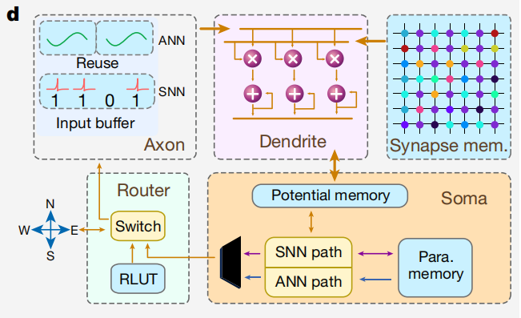

最近对AI芯片进行了进一步的了解，进行一些总结。

<!--more-->

[TOC]

- [芯片分类](#芯片分类)
  - [云端与边缘](#云端与边缘)
  - [神经网络运算芯片与类神经元芯片](#神经网络运算芯片与类神经元芯片)
- [神经网络运算芯片](#神经网络运算芯片)
- [类神经元芯片](#类神经元芯片)
- [我的想法](#我的想法)

# 芯片分类

## 云端与边缘

随着分布式智能、万物互联的发展，在云端的计算将会部分下沉至至边缘侧，云端侧AI芯片将主要负责训练，用户侧的边缘计算芯片更多地负责推理与预测，并支持一定程度的训练。边缘计算芯片及其开发板，在[边缘计算典型的开发板及其使用方法](http://mingg2333.top/2020/06/02/EDB/)一文中做了一定介绍。

## 神经网络运算芯片与类神经元芯片

这两类AI芯片是依据芯片架构进行的分类，前者为传统的“冯诺依曼架构”芯片，最大的特点就是存储器与运算单元分离开来，后者则为非“冯诺依曼架构”芯片，比如以清华天机、IBM的TrueNorth为代表的把存储与计算放在一个结构里（类似神经元）的芯片，再比如国内的直接在Flash存储单元里进行乘加法运算的“存算一体AI芯片”。

显然，类神经元芯片的一大优势就是加快了数据的读取速度，尤其是针对非易失性存储器（ROM），因此，AI芯片的一个研究方向就是挖掘高性能的存储器。

# 神经网络运算芯片

这种芯片就是目前常说的AI芯片，包括可以运行神经网络、进行AI计算的GPU、FPGA、ASIC。知乎有一篇比较详细的文章：[AI 芯片和传统芯片有何区别？](https://www.zhihu.com/question/285202403)。

# 类神经元芯片

通常被称为类脑芯片或者类神经计算芯片。从清华天机[Towards artificial general intelligence with hybrid Tianjic chip architecture](https://doi.org/10.1038/s41586-019-1424-8)这颗芯片来看，将其称之为类神经元芯片我认为更加合适。

整颗芯片的结构与神经元进行类比，天机团队将存储神经网络权值的存储部分称为synapse memory，类比神经元的突触，它与其他的运算部分共同形成了类神经元。

从老师那里了解到，目前像这样常见的类脑芯片，一般用基于传统的、技术成熟的硅基MOSFET来做成，但由于传统器件局限，需要大量MOSFET器件才能实现一个类脑神经元。因此，新型非硅基的非易失性核心器件也是AI芯片的一个发展方向。

# 我的想法

从目前的研究中也看出来，类脑芯片的研究仍是为了提供一个高效运行神经网络的平台，清华天机进步的重要一点就是提供了更加通用的平台、支持了混合的神经网络。这也让我重新思考，在芯片上快速地运行神经网络确实是人工智能芯片重要的一点，不过目前的芯片研究还是和我想象的有些不同。

最后，我发现我所想的是一种“功能主义[1]”的想法。从嵌入式SOC的角度来想，我把它和整个“神经系统”作比较而非神经元网络，它的非易失性存储器所存储的是有物理意义的“信息”而非权重，而“训练”的过程则为，根据特定的处理方法，信息（包括输入输出的硬件等一切事物的信息）不断地被积累、被增删查改，有一点面向对象的感觉。

而目前的AI芯片包括类脑芯片的发展趋势是根据“结构主义[1]”的思想，也就是根据人神经网络的微观结构（即非线性神经元之间的复杂连接）进行高相似度的模拟，从而模拟人脑认知的过程，也正是结构主义的思想创立了人工神经网络的理论。

[1][ANN百度百科](https://baike.baidu.com/item/ANN/4973123?fr=aladdin)