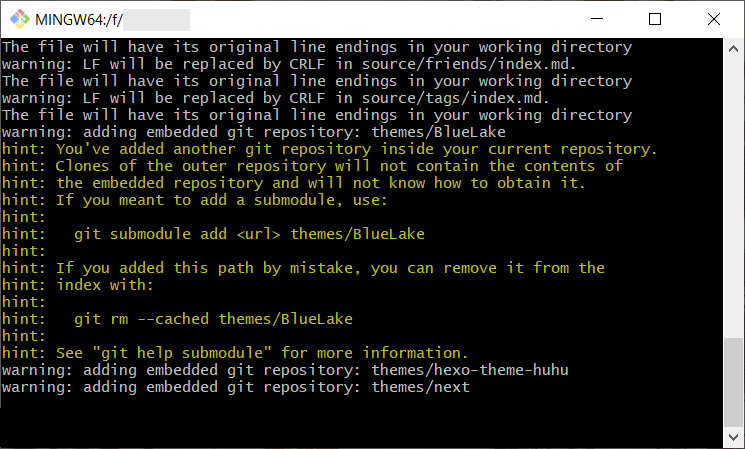

 how to build and publish your own blog

Created: 2021-06-06 23:57:18

Modified: 2021-7-5 09:35:48

<!--more-->

# quickly see

```shell
# configure a markdown apllication, like Typora, VScode

# Only one device
hexo n "<blog name>"
hexo clean
hexo s -g
hexo d -g

# Remove to new device
## install git
## set ssh key access to github; clone repo, configure user and build remote;
git clone https://github.com/MINGG2333/mingg2333topSource.git MyBlog
git remote rm origin
git remote add origin git@github.com:MINGG2333/mingg2333topSource.git
git config --global user.name <name>
git config --global user.email <email>
# if use hexo help to manage:
## install node.js [v12.16.2] for npm
## install hexo: npm install -g hexo
## cd <repo>
## install all modules listed as dependencies in package.json: npm install

# Multiple devices
git pull origin main
# if use hexo to create a artical:
hexo n "<blog name>"
git add .
git commit -m 'second commit'
git push origin main
## check building
```

Note: if use AppVeyor, you can check building in https://ci.appveyor.com/projects.

# use hexo

## Guides

Refer to [Documentation | Hexo](https://hexo.io/docs/).

In local, to build your blog by hexo, you need to make sure **Git** and **Node.js** installed in proper version, then you use `npm` to install **Hexo** globally:

```bash
npm install hexo-cli -g
```

In the beginning of a hexo blog, `hexo init` is used to create basic hexo source by cloning [hexo-starter](https://github.com/hexojs/hexo-starter) and default [themes/landscape](https://github.com/hexojs/hexo-theme-landscape), and installing some basic dependencies into `node_modules/` according to default `package.json`, before you change theme of your blog personally when you clone the [Themes](https://hexo.io/themes/) and install some specific theme dependencies according to related document like `README.md` by using the following line format:

```bash
npm install --save <module name>
```

Due to `--save` option and usage of `npm install` in root of hexo source, new modules installed manually are added to `package.json` which make it complete containing the whole blog dependencies.

Configure and rich your blog, make `_config.yml`, `themes/`(like `***/_config.yml`) and `source/` personal.

In order to deploy your blog to your GitHub Repo, `hexo generate` is used to generate static files in `public/`, then `hexo deploy` push them to your Repo in one shot, so you need to configure the Repo information in  `_config.yml` in advance, and you can set SSH key to skip the password-inputting process.

## what to do

In Windows 10,

refer to [搭建个人博客-hexo+github详细完整步骤 - 简书 (jianshu.com)](https://www.jianshu.com/p/189fd945f38f).

Note: there maybe some compatibility issues between latest Node v14 and hexo, you can downgraded to [Node v12.22.2 (LTS)](https://nodejs.org/en/blog/release/v12.22.2/) to solve it usually, refer to [Windows下完全卸载node.js并安装node.js的多版本管理工具nvm-windows_不积跬步，无以至千里-CSDN博客_windows卸载node](https://blog.csdn.net/lewky_liu/article/details/87959839), or upgrade to [hexo v4.2.1](https://github.com/hexojs/hexo/releases/tag/4.2.1), refer to [Regression in Node 14 · Issue #4260 · hexojs/hexo (github.com)](https://github.com/hexojs/hexo/issues/4260). There maybe other issues with stylus, refer to [NodeJS 14 warnings · Issue #2534 · stylus/stylus (github.com)](https://github.com/stylus/stylus/issues/2534).

In Ubuntu,

refer to [从零开始建立一个属于你个人的Hexo博客 | 可乐博客 (cokemine.com)](https://www.cokemine.com/hexo.html), [如何在Ubuntu 18.04上安装Node.js和npm (myfreax.com)](https://www.myfreax.com/how-to-install-node-js-on-ubuntu-18-04/).

## configure deploy

Configure the Repo information in  `_config.yml`, refer to [设置 SSH 使用 hexo deploy 时免输用户名密码 - SegmentFault 思否](https://segmentfault.com/a/1190000005125610):

```yaml
deploy:
  type: git
  repo: git@github.com:{user name}/{repo name}.git
  branch: master
```

## hexo

refer to [指令 | Hexo](https://hexo.io/zh-cn/docs/commands.html),  [hexo常用命令笔记 - SegmentFault 思否](https://segmentfault.com/a/1190000002632530).

## Migration

To rebuild your existing hexo blog on other local device, you need to make sure **Git** and **Node.js** installed in proper version, then you use `npm` to install **Hexo** globally:

```bash
npm install hexo-cli -g
```

Meanwhile, you can `clone` your hexo source from GitHub that you push from your initial device before. You need to configure the user of the source and would better set SSH key for `push` and `pull` later.

After that, you cannot use `hexo init` directly to Initializes this hexo source, but install all of the dependencies into `node_modules/` according to `package.json` instead

```bash
npm install
```

 and then make sure the specific theme dependencies installed as well, you can check modules list:

```bash
npm list [--depth 0]
```

After update you blog content in local, you can use `hexo generate` to generate static files in `public/`, and use `hexo deploy` to push them to your blog Repo. On the other hand, you need to update the hexo source on GitHub by `push`.

# AppVeyor

what is AppVeyor and how to use it generally, refer to [Welcome to AppVeyor | AppVeyor](https://www.appveyor.com/docs/).

## Guides

AppVeyor server works as a remote device, but you cannot set you SSH key easily on it and interact with it during its building work, instead you can use a [Personal Access Tokens](https://github.com/settings/tokens) to access your GitHub.

AppVeyor can monitor your source Repo and if there is something updated, it will handle your Repo according to a `appveyor.yml` file, like

```yaml
# set clone depth
clone_depth: 5

# environment variables
environment:
  nodejs_version: "12.16.2"
  # this is how to set encrypted variable. Go to "Settings" -> "Encrypt YAML" page in account menu to encrypt data.
  access_token:
    secure: TDe3jxjKP7nNejS+YYeTJS+r/3VhqtmrWtxfYpDZSYOwwEm78xGlAoCNQswAS2hU

# Install scripts. (runs after repo cloning)
install:
  # Get the latest stable version of Node.js or io.js
  - ps: Install-Product node $env:nodejs_version
  - node --version
  - npm --version
  # install modules
  - npm install
  - npm install hexo-cli -g
  - npm list

# to run your custom scripts instead of automatic MSBuild
build_script:
  - hexo generate

artifacts:
  - path: public

# on successful build
on_success:
  - git config --global credential.helper store
  - ps: Add-Content "$env:USERPROFILE\.git-credentials" "https://$($env:access_token):x-oauth-basic@github.com`n"
  - git config --global user.email "%GIT_USER_EMAIL%"
  - git config --global user.name "%GIT_USER_NAME%"
  - git clone --depth 5 -q --branch=%TARGET_BRANCH% %STATIC_SITE_REPO% %TEMP%\static-site
  - cd %TEMP%\static-site
  - del * /f /q
  - for /d %%p IN (*) do rmdir "%%p" /s /q
  - SETLOCAL EnableDelayedExpansion & robocopy "%APPVEYOR_BUILD_FOLDER%\public" "%TEMP%\static-site" /e & IF !ERRORLEVEL! EQU 1 (exit 0) ELSE (IF !ERRORLEVEL! EQU 3 (exit 0) ELSE (exit 1))
  - git add -A
  - echo %APPVEYOR_REPO_BRANCH%
  # %APPVEYOR_REPO_BRANCH% is source Repo branch
  - if "%APPVEYOR_REPO_BRANCH%"=="main" if not defined APPVEYOR_PULL_REQUEST_NUMBER (git diff --quiet --exit-code --cached || git commit -m "Update Static Site" && git push origin %TARGET_BRANCH% && appveyor AddMessage "Static Site Updated")
```

## what to do

refer to , [用Hexo、Github Pages和Appveyor搭建你的私人博客 | Richard Qiu的博客 (supermizar.github.io)](https://supermizar.github.io/2018/08/19/blog-build/), [Hexo博客进阶教程（二）| 使用Appveyor备份并持续集成博客 - 云+社区 - 腾讯云 (tencent.com)](https://cloud.tencent.com/developer/article/1662817).

# troubleshooting

## themes



there maybe problems with pushing `themes/***` because your theme is actually a git repo, my workaround is to push those directories manually:

```bash
# make submodule on GitHub become directory
## backup themes/***
rm themes/***/
touch themes/***/README.md
git add .
git commit -m 'delete submodule, create directory'
git push origin main
## restore themes/***
git add themes/***/
git commit -m 'update directory'
git push origin main
```

