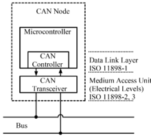
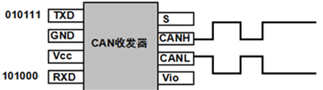

Created: 2021-12-11 22:56:28

Modified: 2021-12-12 20:51:29

CAN Bus

<!--more-->

# 1 简介

用于多设备通信。

目前包括ISO 11898-2（高速度CAN）和ISO 11898-3（低速/容错CAN）两个主要标准。

特点：复用通信线缆，多主机串行总线标准，消息传递协议，信息导向传输协定的广播机制（Broadcast Communication Mechanism）。

优点：增加节点而不用在现有软、硬件上做出调整；不基于特殊种类的节点。

# 2 硬件 物理层

节点和总线。

节点：即设备，包括ECU（传感器、驱动器等控制设备）、网关（与计算机连接）等。

节点的CAN相关硬件组成：MCU、CAN Controller、CAN Transceiver。

CAN Transceiver：转换逻辑电平（来自CAN Controller）和差分信号电平（兼容CAN Bus）。

ps. 从隐性信号（1）向显性信号（0）过渡的速度更快，因为此时CAN线缆被主动积极地驱动。显性向隐性的过渡速度主要取决于CAN网络的长度和导线的电容。

## 2.1 ISO 11898-2

总线：两根平行电线（CAN_H和CAN_L），双绞线，串终端阻抗（120Ω，电缆的特性阻抗为120Ω，为了模拟无限远的传输线，抑制信号反射，同时可以使总线电压回到隐性状态或者闲置状态）。

多主机与广播。

差分信号：不归零(NRZ)格式。

半双工：在一个主机上收发不同时进行。

波特率。

# 3 传输层

*CAN标准主要体现在总线上。*

消息帧：帧起始、仲裁段、CRC、ACK等。

- 帧起始：同步。

-  仲裁段：信息标识符（Message Identifier，每个标志符在整个网络中独一无二）表示优先级，实现无损位仲裁机制。

筛选。

邮箱。

# 5 应用

70个电子控制器（ECU）间通信