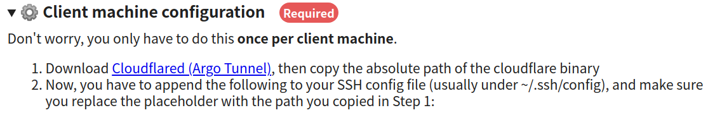

Created: 2021-12-08 18:37:30

Modified: 2021-12-08 18:37:30

Google Colab is a free platform to use GPUs and TPUs, different from Google Cloud.

It is based on `driver.google` to store jupyter notebook and your own data, though some public ram and rom delivered by colab.

<!--more-->

# use with vscode

## with colab_ssh, Cloudflare and Remote-SSH

refer to [Colab + Vs Code + GitHub + Jupyter (Perfect for Deep Learning)](https://medium.com/analytics-vidhya/colab-vs-code-github-jupyter-perfect-for-deep-learning-2b257ae94d01) and [How to Connect to VSCode to Colab](https://colab.research.google.com/github/JayThibs/jacques-blog/blob/master/_notebooks/2021-09-27-connect-to-colab-from-local-vscode.ipynb#scrollTo=BX7NF89XJ-NT).

1.  Push Colab to Cloudflare, then there will be tips for following steps in your screen.

   ```python
   !pip install colab_ssh --upgrade
   from colab_ssh import launch_ssh_cloudflared, init_git_cloudflared
   launch_ssh_cloudflared(password="yourpassword")
   ```
   
   
   
2. Following the tips in the screen, download binary file of [Cloudflare](https://developers.cloudflare.com/cloudflare-one/connections/connect-apps/install-and-setup/installation) as `/to/path/cloudflared-linux-amd64`, and

   ```bash
   chmod +x /to/path/cloudflared-linux-amd64
   ```

3. Remote Configuration modifying `~/.ssh/config`.

   ```bash
   # Read more about SSH config files: https://linux.die.net/man/5/ssh_config
   Host *.trycloudflare.com
           HostName %h
           User root
           Port 22
           ProxyCommand /to/path/cloudflared-linux-amd64 access ssh --hostname %h
   ```

4. Test the connection in local terminal.

   ```bash
   ssh channels-enhancing-aw-specifies.trycloudflare.com
   nvidia-smi
   exit
   ```

5. Connect with VSCode Remote SSH. Press`Ctrl+Shift+P` and type "Connect to Host..." and then paste the following hostname in the opened command palette.

   ```bash
   channels-enhancing-aw-specifies.trycloudflare.com
   ```

6. Test in the remote terminal.

   ```
   nvidia-smi
   ```

   # runtime
   
   ## restart
   
   ```python
   import os
   os.kill(os.getpid(), 9)
   ```
   
   