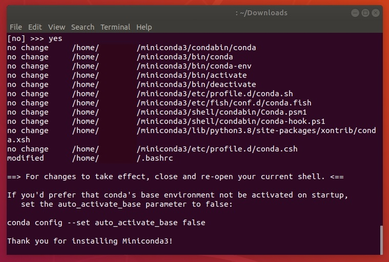

<!--more-->

refer to [Conda常用命令整理---创建环境----conda create --name your_env_name python=3.7_如何利用html码转载别人的博客-CSDN博客_conda create](https://blog.csdn.net/zjc910997316/article/details/93662410)

```bash

conda info --envs
conda activate {your_env_name}
conda deactivate

conda create --name {your_env_name} [python=3.7]
conda install -n {your_env_name} {package_name}

while read requirement; do conda install --yes $requirement; done < requirements.txt
while read requirement; do conda install --yes $requirement || pip install $requirement; done < requirements.txt


conda remove --name {your_env_name} --all

conda list --revisions
conda install --rev 0

 # delete all packager & cache
conda clean -y --all

```

for Miniconda3, refer to [Tensorflow with DirectML on WSL 2 - Win32 apps | Microsoft Docs](https://docs.microsoft.com/en-us/windows/win32/direct3d12/gpu-tensorflow-wsl#set-up-python-environment), [Installation — conda 4.10.2.post1+248741a84 documentation](https://conda.io/projects/conda/en/latest/user-guide/install/index.html).

```bash
# or wget https://repo.anaconda.com/archive/Miniconda3-latest-Linux-x86_64.sh
wget https://repo.anaconda.com/miniconda/Miniconda3-latest-Linux-x86_64.sh 
bash Miniconda3-latest-Linux-x86_64.sh
conda init
```




# use conda installed by root

https://blog.csdn.net/u010510962/article/details/109508896

https://blog.csdn.net/weixin_39518984/article/details/111766550

```bash
anaconda3/bin/conda init bash
source ~/.bashrc
source activate base
conda activate base

```

