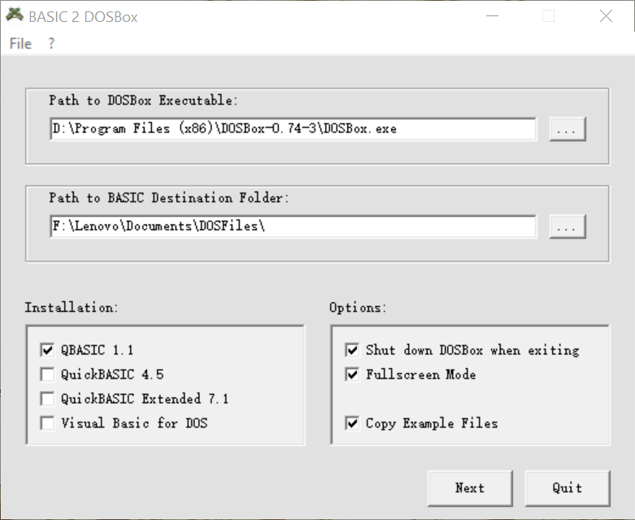
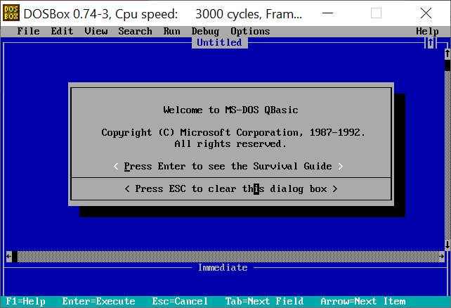
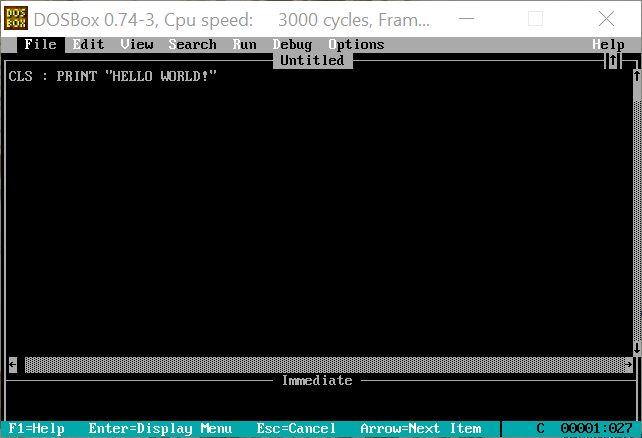
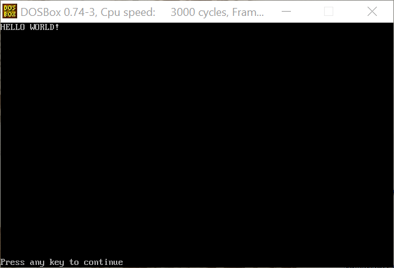
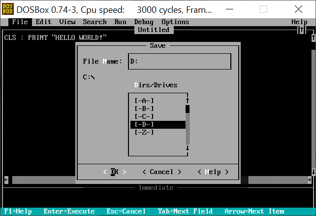
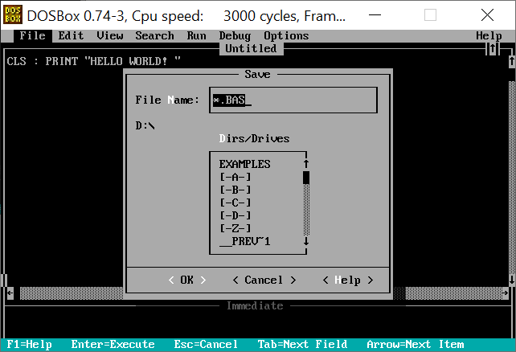
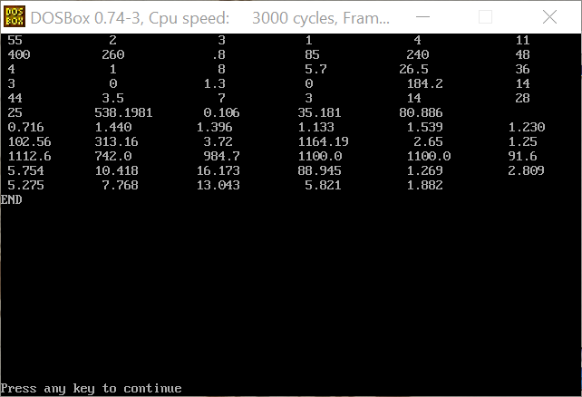

本文介绍QBASIC运行环境的搭建，以及电机核算程序的修改、运行与error处理。

<!--more-->

- [qbasic](#qbasic)
  - [简介](#简介)
  - [运行环境搭建](#运行环境搭建)
- [电机核算程序](#电机核算程序)
  - [qbasic](#qbasic-1)
  - [c](#c)

# qbasic

## 简介

BASIC语言原本是方便大学生学习计算机创造的高级语言，Quick BASIC、QBASIC、Visual Basic等都是从BASIC发展而来的，或者说是BASIC的变种，QBASIC在语法与功能上与其他两者相近，稍有不同的是它是一种解释型的语言。

## 运行环境搭建

参考[QBasic: Compiler, Interpreter, Software download, Articles...](https://www.qbasic.net/),使用仿真器的方法,比较便捷:

2.1 在当前Windows上需要借助DOS模拟器,请先下载模拟器比如[DOSBox](https://www.dosbox.com/download.php?main=1),下载后请自行安装,记住`DOSBox安装目录`;

2.2 下载DOS仿真器[Basic 2 DOSBox](https://www.qbasic.net/dl.php?id=SGXCC96dXclk.&file=qbdbox)(点击即下载),得到压缩包BASIC2DOSBox.zip,解压得同名文件夹;

2.3 安装DOS仿真器,参考`BASIC2DOSBox\docs\README.pdf`,

?		运行`BASIC2DOSBox\basic2dos.exe`,界面如图,

?		

?		(1)第一个空白框里选择`DOSBox安装目录`下的DOSBox.exe,即填写DOSBox.exe的全路径,

?		(2)第二个空白框里选择DOS仿真器将要安装存放的目录,

?		(3)Installation选项卡里选择将要安装的BASIC版本,这里仅选择了QBASIC 1.1,

?		(4)Options选项卡里选择安装配置,

?			Shut down DOSBox when exiting指退出QBASIC 1.1后自动退出DOSBox.exe,

?			Full Screen Mode指打开QBASIC 1.1后全屏(全屏后`Alt + Tab`可切换界面),

?			Copy Example Files指在DOS仿真器安装目录下`_source\EXAMPLES`提供例程,

?		(5)点击Next进入下一步,之后很快安装完成,点击Yes退出;

2.4 运行DOS仿真器,找到并运行DOS仿真器安装目录下`_shorcut\qb11`快捷方式,界面如图,

?		

?		界面包括菜单栏、提示框、快捷键提醒等,这里强调两个快捷键：`Esc`,相当于返回,几乎在任何提示框都可以使用;`F5`,在程序界面运行程序,下面即将介绍;

2.5 按`Esc`退出提示框,开始编辑程序,按`F5`运行,效果如下图(在菜单栏`Option-Display`中可以设置背景颜色);

``` basic
CLS : PRINT "HELLO WORLD!"
```

	

2.6 在菜单栏`File`中存取文件,以存文件为例,点击`File-Save`,如图,

	

选择D盘,它代表DOS仿真器安装目录下的`_source`文件夹(取文件也是在预先把文件放在`_source`里,打开`_shorcut\qb11`后在D盘读取),点击OK;重命名后点击OK即保存;

2.7 一种退出qb11的方法:`File-Exit`.

# 电机核算程序

## qbasic

本实验根据陈世坤老师主编的《电机设计》一书，源程序来自书P300-304,根据DOS仿真器提示与课程知识,程序修改为,

<details>
  <summary>点击展开QBASIC程序(165行)</summary>

``` basic
10 : CLS : LET SPCLEN = 8'RAD'rad
20 : READ PN, P, X, C, A, DW, D, G, DK, L, Z, BK, HK, B, R, H
30 : READ N, U, V, W, Y, ZZ, DR, SR, PW
40 : DATA 55, 2, 3, 1, 4, 400, 260, .8, 85, 240, 48, 4,  1,  8, 5.7, 26.5
50 : DATA 36, 3, 0, 1.3, 0, 44, 184.2, 14, 1100
60 : IF X = 1 THEN READ BU, BL, HH
70 : IF X > 1 THEN READ BU, BV, BL, HG, HH
80 : IF DW > 270 THEN LET M = 11'READ M 'no value?
90 : DATA 3.5, 7, 3, 14, 28
100 : PRINT PN; SPC(SPCLEN + 2); P; SPC(SPCLEN + 4); X; SPC(SPCLEN + 1); C; SPC(SPCLEN + 4); A; SPC(SPCLEN + 3); M
110 : IF DW <= 270 THEN PRINT "IGNORE THE LAST 1"
120 : PRINT DW; SPC(SPCLEN); D; SPC(SPCLEN + 2); G; SPC(SPCLEN + 1); DK; SPC(SPCLEN + 2); L; SPC(SPCLEN + 2); Z
130 : PRINT BK; SPC(SPCLEN + 3); HK; SPC(SPCLEN + 4); B; SPC(SPCLEN + 1); R; SPC(SPCLE + 8); H; SPC(SPCLEN + 2); N
140 : PRINT U; SPC(SPCLEN + 3); V; SPC(SPCLEN + 2); W; SPC(SPCLEN + 1); Y; SPC(SPCLEN + 3); DR; SPC(SPCLEN); SR
150 : IF X = 1 THEN PRINT ZZ; SPC(SPCLEN); BU; SPC(SPCLEN); BL; SPC(SPCLEN); HH
160 : IF X > 1 THEN PRINT ZZ; SPC(SPCLEN + 1); BU; SPC(SPCLEN + 3); BV; SPC(SPCLEN + 1); BL; SPC(SPCLEN + 3); HG; SPC(SPCLEN + 3); HH
170 : J = PN / 1.14 * SQR(C): LET PI = 3.1415926#'calcu1
180 : LD = 25: IF DW < 390 THEN LET LD = 20: IF DW < 270 THEN LET LD = 15: IF DW < 125 THEN LET LD = 10
190 : TY = PI / 2 / P * (D + 2 * HK + 2 + H + R)'PI=3.1415926...
200 : BB = 1: IF DW > 270 THEN LET BB = 2 * M * P / Z
210 : BC = PI / Z * (D + 2 * HK + (B - BK) / SQR(3)) - B
220 : BD = PI / Z * (D + 2 * HK + 2 * H) - 2 * R
230 : IF X = 1 THEN LET BE = PI / ZZ * (D - 2 * G - 1 - (BU - 1) / SQR(3)) - BU: BF = PI / ZZ * (D - 2 * G - 1 - 2 * HH) - BL'zhuanzichi
240 : IF X = 2 THEN LET BE = PI / ZZ * (D - 2 * G - 2 * HG) - BU
250 : IF X = 3 THEN LET BE = PI / ZZ * (D - 2 * G - 1.6 - 2 * HG) - BU
260 : IF X > 1 THEN LET BF = PI / ZZ * (D - 2 * G - 2 * HG - 4 / 3 * HH) - (2 * BL + BV) / 3
270 : IF DW <= 270 GOTO 310
280 : M = (B + 2 * R) / (B + 2 * R + BC + BD) 'DW>270
290 : CS = TY * BB / 2 / SQR(1 - M * M)
300 : LS = 2 * (LD + CS): GOTO 340 'DW>270 END LD=25 RIGHT CS SHOULD=124
310 : LS = 2 * LD + TY'zhuanzichi end 'DW<270
320 : IF P = 1 THEN LET LS = 2 * LD + 2.9 / 3 * TY
330 : IF P > 3 THEN LET LS = 2 * LD + 25 / 24 * TY 'DW<270 END
340 : LZ = L + LS: ZF = N * Z / 3 / A 'L=240
350 : E = .25: IF DW > 200 THEN LET E = .3: IF DW > 280 THEN LET E = .35
360 : KW = .08: IF W < 1 THEN LET KW = .06
370 : K = (H - 2) * (B / 2 + R) + PI / 2 * R * R - E * (2 * H + B + PI * R)
380 : IF DW > 270 THEN LET K = K - E * (B + 2 * R) 'differ
390 : K = (U * (W + KW) * (W + KW) + V * (Y + KW) * (Y + KW)) * N / K * 100
400 : SC = PI / 4 * (U * W * W + V * Y * Y)
410 : U = ZF * LZ / A / 46000! / SC: V = U * J / 380 / SQR(C)'differ
420 : W = .0000095 * Z * N * LZ * SC'calcu1 end
430 : PRINT LD; SPC(SPCLEN); LZ; USING "##.###"; SPC(SPCLEN - 3); U; SPC(SPCLEN); W; SPC(SPCLEN); K
440 : '
450 : Q = Z / 6 / P: XB = Z / 2 / P * (1 - BB)'calcu2
460 : IF Q - INT(Q) THEN LET Q = 2 * Q: IF Q - INT(Q) THEN LET Q = 2 * Q
470 : KQ = .5 / Q / SIN(PI / 6 / Q): E = SIN(BB * PI / 2): KW = KQ * E
480 : Q = Z / 6 / P: S = PI * PI / 54 / Q / Q * ((5 * Q * Q + 1) + XB / 4 / Q * (XB * XB - 1) - 3 * XB * XB / 2) - KW * KW
490 : K = 3 * ZF * ZF * KW * KW
500 : IF X = 1 THEN LET SB = (BU * BU - 1) / 4 / SQR(3) + (BU + BL) / 2 * (HH - (BU - 1) / 2 / SQR(3))
510 : IF X = 2 THEN LET SD = (BV + BL) / 2 * HH: SB = (BU + 1.5) / 2 * HG + SD
520 : IF X = 3 THEN LET SD = (BV + BL) / 2 * HH: SB = (BU * BU - 2.25) / 4 / SQR(3) + BU * (HG - (BU - 1.5) / 2 / SQR(3)) + SD  'differ
530 : Y = 1.19E-07 * K * L / SB / ZZ * J * SQR(C)
540 : KK = 1.821E-10 * K * DR / P / P / SR * J * SQR(C)'differ
550 : K = Y + KK: LE = L + 2 * G: U = PI * D / Z: W = PI * (D - 2 * G) / ZZ  'differ
560 : CX = 1 + BK * BK / (U * (4.4 * G + .75 * BK) - BK * BK)
570 : E = 1 + .5 * INT(X / 2): E = 1 + E * E / (W * (4.4 * G + .75 * E) - E * E): GE = CX * E * G
580 : CX = 4.5533E-10 * PN * LE * ZF * ZF * KW * KW * C / P'differ
590 : Q = 1.5 / PI * D / P / GE * CX
600 : RS = PI * PI / 3 * P * P / ZZ / ZZ * (1 + ZZ * ZZ / Z / Z / 2)
610 : KU = (3 * BB + 1) / 4: KL = (9 * BB + 7) / 16
620 : LB = HK / BK + (B - BK) / SQR(3) / (B + BK)
630 : LC = (H - C * B - BK / SQR(3) / 2) / 3 / B + .135 / SQR(B / 2 / R)'differ
640 : LA = KU * LB + KL * LC
650 : XA = 6 * P * L * LA / LE / KW / KW / Z * CX
660 : XC = (1.2 * LD + .6 * CS * M) / LE * CX
670 : IF DW <= 270 THEN LET XC = .47 * (LS - 1.6 / 3 * TY) / LE / KW / KW * CX
680 : IF X = 1 THEN LET LD = .5 + (BU - 1) / (SQR(3) * BU + 1) + (HH - (BU - 1) / SQR(3) / 2) / 3 / BL / (BU + BL) ^ (16 / 15): GOTO 790'differ
690 : IF X = 3 GOTO 750
700 : U = BU / 1.5: T = BL / BV'X <> 3
710 : KP = .009 + .324 * U + .053 * (U - 1) * (U - 1)
720 : KR = .5 + (U / (1 - U)) ^ 2 * (1 / U - LOG(1 / U) - 1): KS = U / (1 - U) * LOG(1 / U)
730 : KT = .009 + .324 * T + .053 * (T - 1) * (T - 1)
740 : LD = (1.5 * HG ^ 3 * KP + SD * HG * HG * KR + SD * SD * HG / BU * KS + BV * HH ^ 3 * KT) / SB / SB: GOTO 790'X <> 3 end
750 : U = HG - (BU - 1.5) / 2 / SQR(3): T = BL / BV'X = 3
760 : KT = .009 + .324 * T + .053 * (T - 1) * (T - 1)
770 : LD = .8 / 1.5 + (BU - 1.5) / SQR(3) / (BU + 1.5)
780 : LD = LD + (BU * U ^ 3 / 3 + SD * U * U + SD * SD * U / BU + BV * HH ^ 3 * KT) / SB / SB'X = 3 end
790 : XD = 6 * P * L * LD / LE / ZZ * CX'differ
800 : XF = .3785 / LE * DR / P * CX'differ
810 : SG = PI * D / 2 / P * LE: SZ = .2375 * (BC + BD) * L * Z / P: SY = .95 * (DW - D - 2 * (HK + H) - 4 / 3 * R) * L
820 : M = 1: IF P = 1 THEN LET M = 1 / 3
830 : IF X = 1 THEN LET SX = .15833 * (BE + 2 * BF) * L * ZZ / P: SJ = .95 * (D - 1 - 2 * G - M * DK - 2 * HH) * L
840 : IF X > 1 THEN LET SW = .475 * BE * L * ZZ / P: SX = .475 * BF * L * ZZ / P
850 : IF X > 1 THEN LET SJ = .95 * (D - 2 * G - M * DK - 2 * HG - 2 * HH) * L: IF X = 3 THEN LET SJ = SJ - 1.52 * L
860 : IF DW > 280 THEN LET SZ = SZ * 92 / 95: SY = SY * 92 / 95: SX = SX * 92 / 95: SJ = SJ * 92 / 95: SW = SW * 92 / 95
870 : T = PI / 4 / P * (DW - SY / 1.9 / L): IF DW > 280 THEN LET T = PI / 4 / P * (DW - SY / 1.84 / L)'homework
880 : L = PI / 4 / P * (M * DK + SJ / 1.9 / L): IF DW > 280 THEN LET L = PI / 4 / P * (M * DK + SJ / 1.84 / L)
890 : LS = 2 * P * SZ * (H + R / 3): LZ = 2 * P * SY * T
900 : PW = PW / PN / 1000!
910 : PS = (3 - P / 2) / 100: IF P > 3 THEN LET PS = .015
920 : DK = .931 + .011 * LOG(PN) - .013 * P: IF P = 1 THEN LET DK = .92 + .00866 * LOG(PN)'calcu2 end P=2 LN？？？
930 : F = DK * 3.8E+08 / SQR(C) / 111 / ZF / KW: M = 1.46'总磁通量 F:每极磁通 M:波幅系数假设值
940 : BG = M * F / SG: AG = 800 * BG * GE'气隙及齿磁路 BG:气隙磁密 AG:及所需磁势
950 : BZ = M * F / SZ: AZ = .3472 * BZ / (1.754 - BZ) * (H + R / 3)'齿
960 : IF X = 1 THEN LET BX = M * F / SX: AX = .3472 * BX / (1.754 - BX) * HH'齿下部
970 : IF X > 1 THEN LET BW = M * F / SW: BX = M * F / SX: AX = .3472 * (BW / (1.754 - BW) * HG + BX / (1.754 - BX) * HH)'气隙及齿磁路 end
980 : E = 1 + (AZ + AX) / AG: W = 1.971 - .4 * E'波幅系数比较
990 : IF E > 1.25 THEN LET W = W + .42 * (E - 1.25) ^ 2
1000 : IF ABS(W - M) < .0005 GOTO 1020
1010 : M = W - (W - M) / 3: GOTO 940'波幅系数 end
1020 : BY = F / SY: AY = .3472 * BY / (1.754 - BY) * T * (1.1 - .5 * BY)'总磁化电流与漏抗
1030 : BJ = F / SJ: AJ = .3472 * BJ / (1.754 - BJ) * L * (1.1 - .5 * BJ)
1040 : JM = 1.48 * (AG + AZ + AX + AY + AJ) * P / ZF / KW / J'总磁化电流与漏抗 end
1050 : XB = Q * S / KW / KW / E: XE = Q * RS / E'有功 无功电流 损耗
1060 : XS = XA + XB + XC: XR = XD + XE + XF: XX = XS + XR
1070 : E = 1 + JM * XS
1080 : BE = (2 - E) / DK * BZ: BF = .00005 * (BE - .7) * LS
1090 : BC = (2 - E) / DK * BY: BD = .00005 * (BC - .7) * LZ
1100 : PF = (2.5 * BF + 2 * BD) / PN / 1000!
1110 : M = 1 / E / XX: F = M * (V + K) + 2 * JM * V
1120 : BB = 1 + PF + PW + PS + JM * JM * V: M = (M - 2 * F * BB) / 2: F = 1 + F * F
1130 : JX = (M - SQR(M * M - F * BB * BB)) / F: JR = JX + JM
1140 : JP = SQR((1 / E / XX - JX) * JX)'有功 无功电流 损耗 end
1150 : DW = 1 - JP * V - JR * XS '电压（电势）系数比较
1160 : IF ABS(DW - DK) < .0005 GOTO 1180
1170 : DK = DW - (DW - DK) / 8: GOTO 930'电压系数 end
1180 : PRINT USING "##.###"; BG; SPC(SPCLEN - 2); BZ; SPC(SPCLEN); BY; SPC(SPCLEN); BW; SPC(SPCLEN + 1); BX; SPC(SPCLEN); BJ         '运行性能
1190 : IF X = 1 THEN PRINT "REPLACE THE LAST 3:"; SPC(SPCLEN); BX; SPC(SPCLEN); BJ
1200 : PC = (JP * JP + JR * JR) * V: PA = (JP * JP + JX * JX) * K
1210 : JC = SQR(JP * JP + JR * JR): JN = SQR(3 / C) * JC * J
1220 : S = 30 * ZF * JC * J / PI / D: DW = JC * J / A / SC: DK = S * DW
1230 : '
1240 : DR = 3 * SQR(JP * JP + JX * JX) * J * ZF * KW / ZZ / SB '导条电流密度
1250 : SR = DR * SB * ZZ / PI / 2 / P / SR / 100 '段环电流密度
1260 : PRINT USING "####.##"; JN; SPC(SPCLEN - 3); S; SPC(SPCLEN - 2); DW; SPC(SPCLEN + 1); DK; SPC(SPCLEN - 2); DR; SPC(SPCLEN - 2); SR
1270 : C = 1 / JC * JP
1280 : S = PA / (1 + PA + PF + PS + PW - (BD + BF) / PN / 1000!)
1290 : PRINT USING "#####.#"; PC * PN * 1000!; SPC(SPCLEN - 4); PA * PN * 1000!; SPC(SPCLEN); PF * PN * 1000!; SPC(SPCLEN - 1); PW * PN * 1000!; SPC(SPCLEN); PS * PN * 1000!; SPC(SPCLEN - 3); 100 / JP
1300 : 'PRINT  USING "###.##" PC(JX JM V) PA(JX K) PF(BF BD) WRONG; JP(JX E XX) LW;  PW PS(P) RIGHT
1310 : T = (1 - S) / 2 / (V + SQR(V * V + XX * XX))
1320 : PRINT USING "##.###"; XS * 100; SPC(SPCLEN - 1); XR * 100; SPC(SPCLEN); XX * 100; SPC(SPCLEN); C * 100; SPC(SPCLEN); S * 100; SPC(SPCLEN); T
1330 : 'PRINT '运行性能 end
1340 : U = PI * D / Z: W = PI * (D - 2 * G) / ZZ'启动性能数据 启动电流
1350 : M = .707 * SQR(2 - E) * N / A * (KU + KW * KQ * Z / ZZ) / (.64 + 2.5 * SQR(G / (U + W))) / .16 / G
1360 : Q = (HK + (B - BK) / 6) / BK
1370 : IF X = 1 GOTO 1500
1380 : BB = 1 - .06 * (BV / BU - 1) + .012 * (BV / BU - 1) * (BV / BU - 1)'x = 2, 3
1390 : B = BB / .0675: A = 1.5 * B
1400 : DR = BL + (BV - BL) * (HG + HH - B) / HH: RS = B - HG
1410 : R = V + SB / (SB - SD + (DR + BV) / 2 * RS) * Y + KK
1420 : DR = BL + (BV - BL) * (HG + HH - A) / HH: RS = A - HG: SB = SB - SD + (DR + BV) / 2 * RS
1430 : IF X = 3 GOTO 1460
1440 : H = DR / BV: KT = .009 + .324 * H + .053 * (H - 1) * (H - 1): SD = (BV + DR) / 2 * RS'x=2
1450 : LE = (1.5 * HG ^ 3 * KP + SD * HG * HG * HR + SD * SD * HG / BU * KS + BV * RS ^ 3 * KT) / SB / SB: GOTO 1520'x=2
1460 : A = HG - (BU - 1.5) / 2 / SQR(3): H = DR / BV'x=3
1470 : KT = .009 + .324 * H + .053 * (H - 1) * (H - 1): SD = (BV + DR) / 2 * RS'x=3
1480 : LE = (BU - 1.5) / SQR(3) / (BU + 1.5) + (BU * A ^ 3 / 3 + SD * A * A + SD * SD * A / BU + BV * RS ^ 3 * KT) / SB / SB'x=3
1490 : GOTO 1520'x<>1 end
1500 : H = .0675 * HH: R = V + (1 + .4 * (H - .5) ^ 2 / SQR(BU / BL)) * Y + KK' x=1
1510 : LE = (LD - .5) * (1 - .11 * (H - .5) * (H - .5) / (BU / BL) ^ .16)'x=1
1520 : P = 2.7 * T * J'启动性能数据 启动电流 end
1530 : K = .234 / (M * P / 100000!) ^ .86: IF K < .85 THEN LET K = .85'启动性能
1540 : CS = (U - BK) * (1 - K): C = (W - 1) * (1 - K): IF X > 1 THEN LET C = (W - 1.5) * (1 - K)
1550 : L = KU * (LB - Q * (CS / (CS + 1.5 * BK))) + KL * LC
1560 : D = L / LA * XA: H = K * XB: XS = D + H + XC
1570 : N = LE + .5 / (C + 1): IF X > 1 THEN LET N = LE + 1.5 / .8 / (C + 1.5): IF X = 2 THEN LET N = LE
1580 : F = N / LD * XD: G = K * XE: XR = F + G + XF: XX = XS + XR
1590 : Z = SQR(R * R + XX * XX): B = J / Z'启动性能 end
1600 : IF ABS((B - P) / B) < .001 GOTO 1630'启动电流比较
1610 : IF K = .85 GOTO 1630
1620 : P = B + (B - P) / 8: GOTO 1530'启动电流比较 end
1630 : T = (R - V) / Z / Z * (1 - S)
1640 : PRINT USING "##.###"; XS * 100; SPC(SPCLEN - 1); XR * 100; SPC(SPCLEN); XX * 100; SPC(SPCLEN); 1 / JC / Z; SPC(SPCLEN); T
1650 : PRINT "END"
```
</details>

程序运行结果如图,



结果与书上一致.

## c


解决错误：

C语言语法问题：1.int/int 2.sqrs(-)[^注释]
