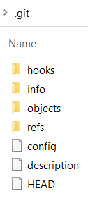
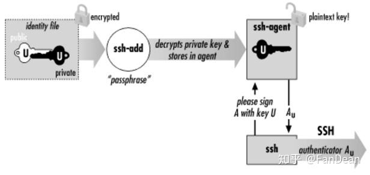
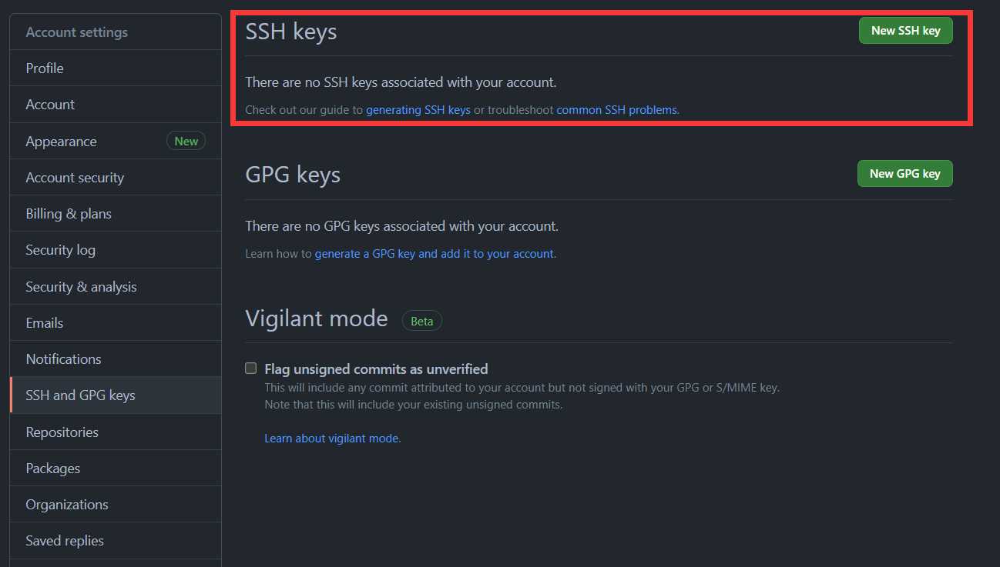

Created: 2021-05-28 09:09:58

Modified: 2021-7-29 12:09:56

Git installation and usage.

<!--more-->

- [quickly see](#quickly-see)
- [install](#install)
  - [windows 10](#windows-10)
- [basic use](#basic-use)
  - [create new repository](#create-new-repository)
  - [clone existing repository](#clone-existing-repository)
  - [Configure repository](#configure-repository)
  - [work with repository](#work-with-repository)
  - [Git GUI use](#git-gui-use)
- [prepare with Github](#prepare-with-github)
  - [Create SSH Key](#create-ssh-key)
  - [Configure ssh-agent](#configure-ssh-agent)
  - [Add SSH key to Github](#add-ssh-key-to-github)
- [prepare with Gitee](#prepare-with-gitee)
  - [Create SSH Key](#create-ssh-key-1)
  - [Add SSH key to Gitee](#add-ssh-key-to-gitee)
- [what is git](#what-is-git)

# quickly see

details later, make it quick

```shell
ls -al ~/.ssh
ssh-keygen -t ed25519 -C "<personal code, like a email>" [-f ~/.ssh/gitee_id_ed25519]

eval `ssh-agent -s`
ssh-add -l
ssh-add <SSH private key>
ssh-agent -k

ssh -T git@github.com
ssh -T git@gitee.com

git --version

mkdir [<directory>]
cd [<directory>]
git init [<directory>]
git clone <repository> [<directory>]

git config --list
git config --global user.name MINGG2333
git config --global user.email 54434036+MINGG2333@users.noreply.github.com
git config user.email "{ID}+{username}@users.noreply.github.com"

git status -s
git log

touch README.md
cat README.md
git add README.md
git commit -m "first commit"

git remote -v
git remote add origin git@github.com:<name>/<repository>.git
git remote add origin2 git@gitee.com:<name>/<repository>.git
git remote rename origin oschina
git remote set-url origin 仓库地址
git remote rm origin2

git push -u origin2 master
git pull -u origin2 master

git branch -M main

git branch
git checkout master

git fetch origin2
git diff --stat main origin2/main

git submodule add <url> <directoty>
git rm --cached <object>

git clone --recursive https://github.com/RishabhMaheshwary/query-attack.git

# git lfs: An open source Git extension for versioning large files
curl -s https://packagecloud.io/install/repositories/github/git-lfs/script.deb.sh | sudo bash
sudo apt-get install git-lfs
git-lfs install
git lfs pull
```

*origin, origin2 are personal names for repository

to clear commits, [清除github所有历史提交记录的方法 (ops-coffee.cn)](https://ops-coffee.cn/t/remove-github-commit-log.html)

for private email, [git - Error "Your push would publish a private email address" - Stack Overflow](https://stackoverflow.com/questions/43863522/error-your-push-would-publish-a-private-email-address), then change email in ,

- [Projects - AppVeyor](https://ci.appveyor.com/projects), setting-envs

# install

check your installation using command line( like Git CMD, Git Bash):

```shell
git --version
```

## windows 10

official website:

[Git for Windows](https://gitforwindows.org/) or [Git - Downloads (git-scm.com)](http://www.git-scm.com/download/)

you can refer to( remember your installation directory of git if you want to set it as environment variable later):

[ Windows系统Git安装教程（详解Git安装过程）_IT技术实战-CSDN博客](https://blog.csdn.net/yyykj/article/details/103201960?utm_medium=distribute.pc_relevant.none-task-blog-2~default~BlogCommendFromMachineLearnPai2~default-9.control&depth_1-utm_source=distribute.pc_relevant.none-task-blog-2~default~BlogCommendFromMachineLearnPai2~default-9.control)

*set `{installation directory}\cmd\git.exe` as environment variable in `Path ` if you want to use it in other command line like cmd.exe

## Ubuntu/Debian

For the latest stable Git version in Ubuntu/Debian:

```bash
sudo apt-get install git
```

# basic use

you can create a new repository or clone a existing one


<center>construction of a git repository
    (HEAD is the core, local repository)</center>

## create new repository

create a local repository(版本库), a directory of '.git', in the 'directory ' using Git Bash :

```shell
git init [<directory>]
```



## clone existing repository

clone a existing repository in 'directory ' using Git Bash:

```shell
git clone <repository> [<directory>]
```

## Configure repository

check your configuration:

```shell
git config --list
```

set your information for local repository before "commit":

```shell
git config --global user.name "<name>"
git config --global user.email <email>
```

more configuration, refer to [Git 创建仓库 | 菜鸟教程 (runoob.com)](https://www.runoob.com/git/git-create-repositorysitory.html)

## work with repository


<center>frequency use</center>

more use, refer to [Git 仓库基础操作 - Gitee](https://gitee.com/help/articles/4114), [Git 基本操作 | 菜鸟教程 (runoob.com)](https://www.runoob.com/git/git-basic-operations.html), [Git 远程仓库(Github) | 菜鸟教程 (runoob.com)](https://www.runoob.com/git/git-remote-repo.html), [Git Gitee | 菜鸟教程 (runoob.com)](https://www.runoob.com/git/git-gitee.html).

*you can place your remote repositories in Github, preparation see [prepare with Github](# prepare with Github).

### checkout

refer to [git checkout 命令详解](https://www.cnblogs.com/hutaoer/archive/2013/05/07/git_checkout.html),

## Git GUI use

refer to [使用Git 总结-msysGit与GitHub 使用_荒野之鹰-CSDN博客](https://blog.csdn.net/NOOBBB/article/details/65627240?utm_medium=distribute.pc_relevant.none-task-blog-2~default~BlogCommendFromMachineLearnPai2~default-2.control&depth_1-utm_source=distribute.pc_relevant.none-task-blog-2~default~BlogCommendFromMachineLearnPai2~default-2.control) or [ Windows平台下Git的安装msysgit与配置_睡得香吃得好胆子大的专栏-CSDN博客](https://blog.csdn.net/u010388829/article/details/41055813)

# prepare with Github

configure your account SSH Key, refer to [使用 SSH 连接到 GitHub - GitHub Docs](https://docs.github.com/cn/github/authenticating-to-github/connecting-to-github-with-ssh)

## Create SSH Key

check existing keys:

```shell
ls -al ~/.ssh
```

*"~/.ssh" is the default directory of SSH keys.

otherwise, create a SSH key for your device using Git Bash:

```shell
ssh-keygen -t [algorithm] -C "<personal code, like a email>"
```

*algorithm(optional): rsa [-b 4096], ed25519(recommend).

## Configure ssh-agent

ssh-agent stores unencrypted keys in memory( for Unix-like OS) and communicates with SSH clients using a Unix domain socket



<center>ssh-agent principle
</center>

run ssh-agent using Git Bash:

```bash
# Windows
eval `ssh-agent -s`
# Linux
eval "$(ssh-agent -s)"
```

check keys loaded in the ssh-agent:

```bash
ssh-add -l
```

 if none, add SSH private key to the ssh-agent:

```shell
ssh-add <SSH private key>
```

*SSH private key example: ~/.ssh/id_ed25519

switch off the agent using Git Bash, refer to [ssh agent详解 - 知乎 (zhihu.com)](https://zhuanlan.zhihu.com/p/126117538):

```shell
ssh-agent -k
```

*if not use agent, there maybe warnings, solution refer to: [Win10 从零搭建Git环境_feng991254的专栏-CSDN博客](https://blog.csdn.net/feng991254/article/details/80506119?utm_medium=distribute.pc_relevant.none-task-blog-2~default~BlogCommendFromMachineLearnPai2~default-3.control&depth_1-utm_source=distribute.pc_relevant.none-task-blog-2~default~BlogCommendFromMachineLearnPai2~default-3.control) or[ win10 git环境搭建_ydf8525的专栏-CSDN博客](https://blog.csdn.net/ydf8525/article/details/52968373)

## Add SSH key to Github

1. open responding SSH public key with a editor like Notepad, then copy the contents of the .pub file to your clipboard,

*SSH public key example: ~/.ssh/id_ed25519.pub, so you can print it in line:

```bash
# windows
cat ~/.ssh/id_ed25519.pub
# Linux
sudo apt-get update
sudo apt-get install xclip
xclip -selection clipboard < ~/.ssh/id_ed25519.pub
```

2. go into your own Github setting -> SSH and GPG keys, and create a new SSH key,



then give a name of the key filling in the "title", and paste the SSH public key contents into the "Key" field.


3. test SSH connection:

```shell
ssh -T git@github.com
```

if something wrong, baidu or google.

# prepare with Gitee

configure your account SSH Key

## Create SSH Key

check existing keys:

```shell
ls -al ~/.ssh
```

*"~/.ssh" is the default directory of SSH keys.

otherwise, create a SSH key for your device using Git Bash:

```shell
ssh-keygen -t [algorithm] -C "<personal code, like a email>"
```

*algorithm(optional): rsa [-b 4096], ed25519(recommend).

## Add SSH key to Gitee

1. open responding SSH public key with a editor like Notepad, then copy the contents of the .pub file to your clipboard,

*SSH public key example: ~/.ssh/id_ed25519.pub, so you can print it in line:

```shell
cat ~/.ssh/id_ed25519.pub
```

2. go into your own Gitee setting -> SSH keys, then fill the blank and add a new SSH key: give a name of the key filling in the "title", and paste the SSH public key contents into the "Key" field.
3. test SSH connection:

```shell
ssh -T git@gitee.com
```

if something wrong, baidu or google.

# more about git

[谈谈 Git 存储原理及相关实现 - 知乎 (zhihu.com)](https://zhuanlan.zhihu.com/p/361367094),

[看完这篇还不会用Git，那我就哭了！ - 知乎 (zhihu.com)](https://zhuanlan.zhihu.com/p/94008510),

http://git.oschina.net/progit/,

https://www.liaoxuefeng.com/wiki/896043488029600/896067008724000,

https://gitee.com/help/articles/4104,
