Created: 2021-06-07 00:29:11

Modified: 2021-09-10 10:31

use ascend

<!--more-->

# quickly see

```shell
python -c "import mindspore;print(mindspore.__version__)"
```

```python
import mindspore
from mindspore import context
from mindspore.context import ParallelMode
# data parallel - training data divided
# after BP: AllReduce
context.set_auto_parallel_context(parallel_mode=ParallelMode.DATA_PARALLEL)
# op level model parallel
self.matmul=ops.MatMul().shard(((1,2),(2,1)))
c=self.matmul(A,B)
context.set_auto_parallel_context(parallel_mode=ParallelMode.SEMI_AUTO_PARALLEL)

context.set_auto_parallel_context(parallel_mode=ParallelMode.AUTO_PARALLEL)

self.matmul=ops.MatMul.set_strategy({[4,1],[1,1]})
c=self.matmul(A,B)
context.set_auto_parallel_context(parallel_mode=ParallelMode.SEMI_AUTO_PARALLEL)
# pipline level model parallel
# I think it is better that all of the pieces of pipline occupy the same time of calculation.
self.subnet1 = subnet().pipeline_stages(0)
self.subnet2 = subnet().pipeline_stages(1)
x = self.subnet1(x)
x = self.subnet2(x)
context.set_auto_parallel_context(pipeline_stages=2)
# Rematerialization -- reduce the ocupation of training data in DRAM
# there is gradient value produced in DRAM too
# there are weight and other parameter(like EMA for optimizer) stored in SRAM
x = self.net1(x)
self.net1.recompute() # ?
x = self.net2(x)
x = self.net1(x)
self.net1.recompute()
x = self.net2(x)
# data parallel - parameter shard -- divide parameter of inner layers into SRAMs
# befor FP: AllGether
# after BP: ReduceScatter
# example: fusion every 10 layers of transformer for OpenAI - gpt3
for i in range(config.num_layers):
    self.blocks.append(Block(config, i+1)).set_comm_fusion(int(i/10)+2)
context.set_auto_parallel_context(enable_parallel_optimizer=True,parallel_mode=ParallelMode.DATA_PARALLEL)

```


# ModelArts use

## guide

local code in PC -> cloud code in [obs](https://console.huaweicloud.com/console/?region=cn-north-4#/obs/manager/buckets) -> [my ModelArts algorithm](https://console.huaweicloud.com/modelarts/?agencyId=08786f8df980109b1fc0c01eb6fc25f8&region=cn-north-4&locale=zh-cn#/algorithms) /algorithm subscribed in [AI Gallery](https://marketplace.huaweicloud.com/markets/aihub/modelhub/list/) -> [Training Jobs](https://console.huaweicloud.com/modelarts/?agencyId=08786f8df980109b1fc0c01eb6fc25f8&region=cn-north-4&locale=en-us#/trainingJobs) -> 

local dataset in PC/cloud dataset in [AI Gallery](https://marketplace.huaweicloud.com/markets/aihub/datasets/list/)  -> cloud dataset in [obs](https://console.huaweicloud.com/console/?region=cn-north-4#/obs/manager/buckets)-> [Training Jobs](https://console.huaweicloud.com/modelarts/?agencyId=08786f8df980109b1fc0c01eb6fc25f8&region=cn-north-4&locale=en-us#/trainingJobs) -> 

-> output in [Training Jobs](https://console.huaweicloud.com/modelarts/?agencyId=08786f8df980109b1fc0c01eb6fc25f8&region=cn-north-4&locale=en-us#/trainingJobs) -> output in [obs](https://console.huaweicloud.com/console/?region=cn-north-4#/obs/manager/buckets) 

## local code

according to PyCharm with the Plugin of ModelArts:

### online training

local code in PC -> cloud code in [obs](https://console.huaweicloud.com/console/?region=cn-north-4#/obs/manager/buckets) -> [my ModelArts algorithm](https://console.huaweicloud.com/modelarts/?agencyId=08786f8df980109b1fc0c01eb6fc25f8&region=cn-north-4&locale=zh-cn#/algorithms) -> [Training Jobs](https://console.huaweicloud.com/modelarts/?agencyId=08786f8df980109b1fc0c01eb6fc25f8&region=cn-north-4&locale=en-us#/trainingJobs) -> output in [Training Jobs](https://console.huaweicloud.com/modelarts/?agencyId=08786f8df980109b1fc0c01eb6fc25f8&region=cn-north-4&locale=en-us#/trainingJobs) -> output in [obs](https://console.huaweicloud.com/console/?region=cn-north-4#/obs/manager/buckets) 

=> local code in PC -> the whole job & log in **PyCharm** 

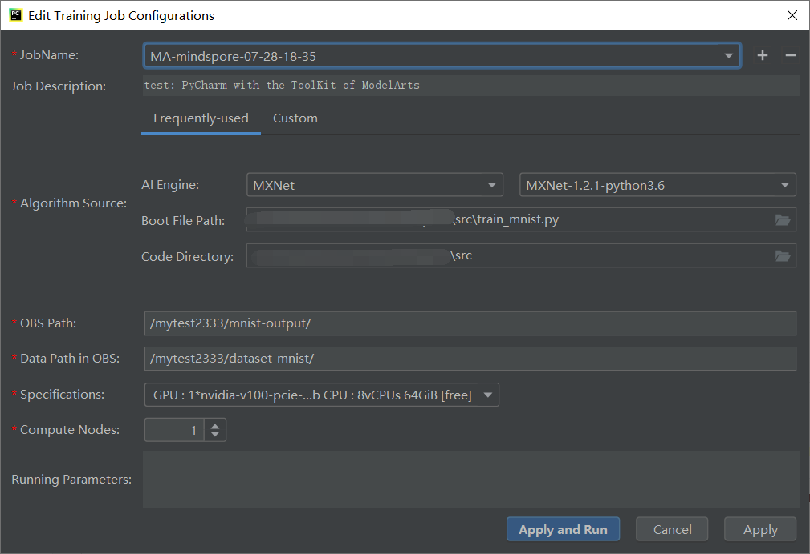

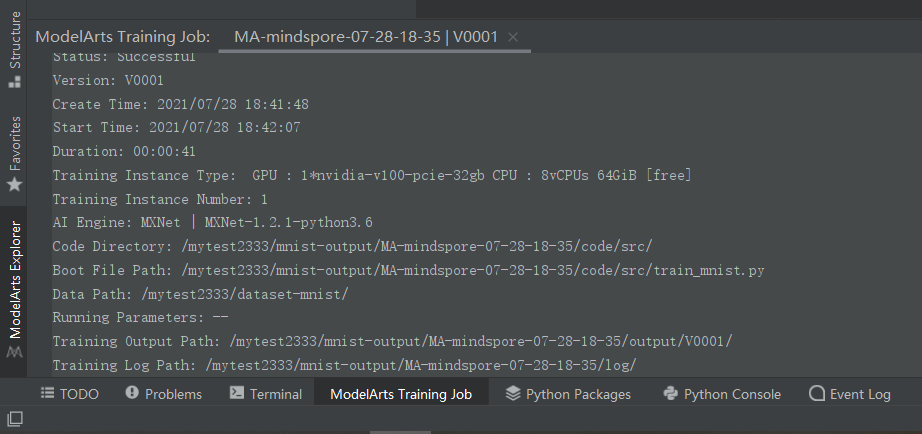

what you need to install are 3 items, refer to https://support.huaweicloud.com/bestpractice-modelarts/modelarts_10_0021.html:

- install the [Plugin of ModelArts](https://modelarts-pycharm-plugin.obs.cn-north-1.myhuaweicloud.com/Pycharm-ToolKit-2.2.zip);
- create the Access Key and set it for your ModelArts(you can still use the Agency type Authorization if existing), refer to [获取访问密钥](https://support.huaweicloud.com/prepare-modelarts/modelarts_08_0008.html#section0);
- set it for the Plugin of ModelArts, refer to [使用访问秘钥登录](https://support.huaweicloud.com/tg-modelarts/modelarts_15_0005.html).

### PyCharm

create and open one on Notebook -> remote configure on PyCharm -> restart and wait -> enter remote interpreter environment opening a script(connecting to remote host) -> upload files(synch and auto-upload files) -> wait a while(after index files) and then open requirements.txt and install dependency ->

open terminal -> cd work/pangu_alpha -> ls -> python src/preprocess.py -> bash myrun.sh -> debug train.py（trial）

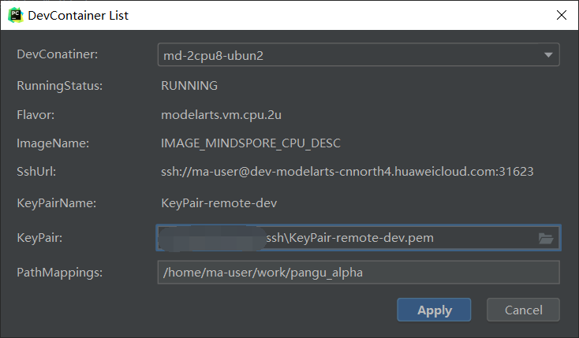

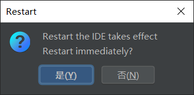


Update the whitelist of Notebook -> connect in PyCharm-> (tool-deployment) ->  (change remote host) enter remote interpreter environment opening a script -> upload files(synch and auto-upload files) -> wait a while(after index files) and then open requirements.txt and install dependency ->

open terminal -> cd work/PanguGit-> ls -> python src/preprocess.py -> bash myrun.sh -> (configure first, like python interpreter)run train.py

Test, refer to https://bbs.huaweicloud.com/forum/thread-133615-1-1.html:

```shell
ssh ma-user@dev-modelarts-cnnorth4.huaweicloud.com -p 31261 -i .ssh/KeyPair-remote-dev.pem
python -c "import mindspore;print(mindspore.__version__)"
exit
```

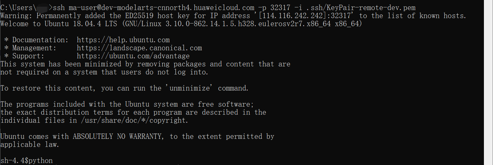

### VS Code

refer to [配置本地IDE（VSCode手动连接）](https://support.huaweicloud.com/engineers-modelarts/modelarts_30_0016.html).

Firstly, make sure you use [VSCode 1.57.1](https://code.visualstudio.com/updates/v1_57) with Extensions installed including Python and Remote-SSH, create a Notebook with SSH and prepare a pair of SSH key of Huawei Cloud.

```bash
Host {name of Notebook1}
     HostName 114.116.242.242
     Port {Port of Notebook1}
     User ma-user
     IdentityFile ~\.ssh\KeyPair-xxx.pem
     UserKnownHostsFile=/dev/null
     StrictHostKeyChecking no
Host {name of Notebook2}
     HostName dev-modelarts-cnnorth4.huaweicloud.com
     Port {Port of Notebook2}
     User ma-user
     IdentityFile ~\.ssh\KeyPair-xxx.pem
     UserKnownHostsFile=/dev/null
     StrictHostKeyChecking no
```


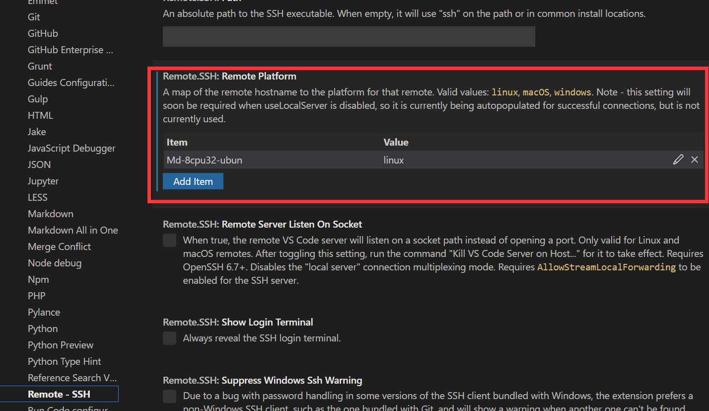

Ensure consistency between Nootbook and `config` file(Host, Port, path of key pair in particular) -> make sure Remote-SSH configured -> Update the whitelist of [IP](https://tool.lu/ip/) and open Notebook -> click the button of `Connect to Host in New Window` in vscode and wait a while(download VS Code server and copy it to host with scp) -> use VS Code server like a New one (install Extensions of VS code -> manage Folder in Cloud(drag and drop files from PC) -> Select Interpreter of Python (need to open a py file first in vscode) -> open New Terminal -> run and debug) -> close the Romote Connection and stop Notebook:


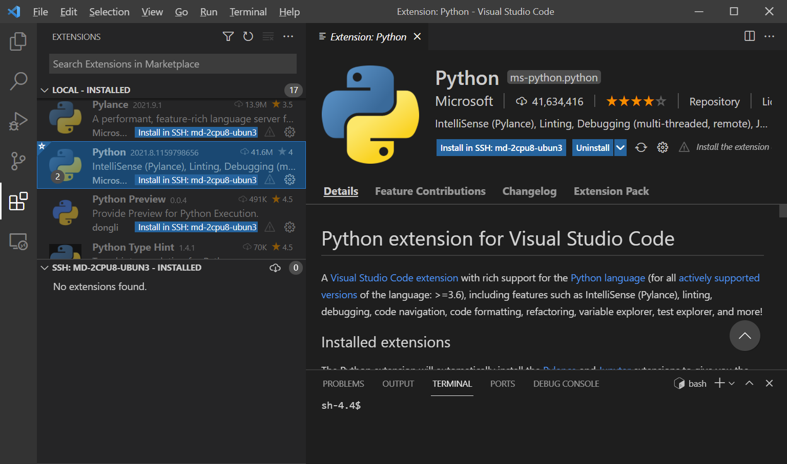

Note that you may want to disable the software update:

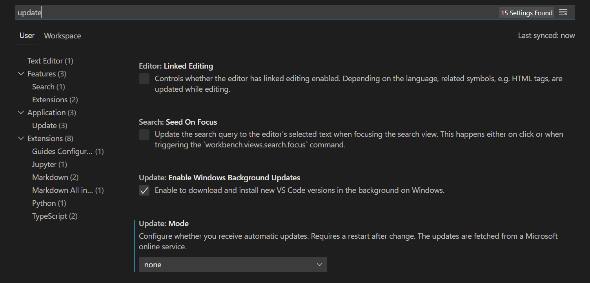

## local dataset

local dataset in PC -> cloud dataset in [obs](https://console.huaweicloud.com/console/?region=cn-north-4#/obs/manager/buckets)->

use `OBS Browser+` or `obsutil` to make it easily.

```shell

```

## local development with SDK

use ModelArts SDK, refer to https://support.huaweicloud.com/sdkreference-modelarts/modelarts_04_0002.html

there is only python package version.

### python package

```python
from modelarts.session import Session
session = Session(access_key='***',secret_key='***', project_id='***', region_name='cn-north-4')
session.obs.upload_file(src_local_file='/home/ma-user/file1.txt', dst_obs_dir='obs://bucket-name/dir1/')
session.obs.upload_dir(src_local_dir='/home/ma-user/', dst_obs_dir='obs://bucket-name/dir1/')
session.obs.download_file(src_obs_file="obs://bucket-name/dir1/file1.txt", dst_local_dir="/home/ma-user/")
session.obs.download_dir(src_obs_dir="obs://bucket-name/dir1/", dst_local_dir="/home/ma-user/")

```

Note: it seems not to support `\` of path of Windows. and there is something wrong with `dir` operation?

# CANN

refer to  [CANN社区版安装指南(5.0.3.alpha002)](https://support.huaweicloud.com/instg-cli-cann503-alpha002/atlasdeploy_03_0003.html),

1. Prepare your devices including both hardware and software ahead. For example, you can [rent a server and run an Image in Huawei Cloud](#Ascend in Huawei Cloud).

2. (optional)Create and substitute with a User for installation or running, or use an image with user created in the step 1.

3. Install and check dependency of `apt` and `pip` and firmware with root right, or use an image with dependency and firmware installed in the step 1. What's more, 

   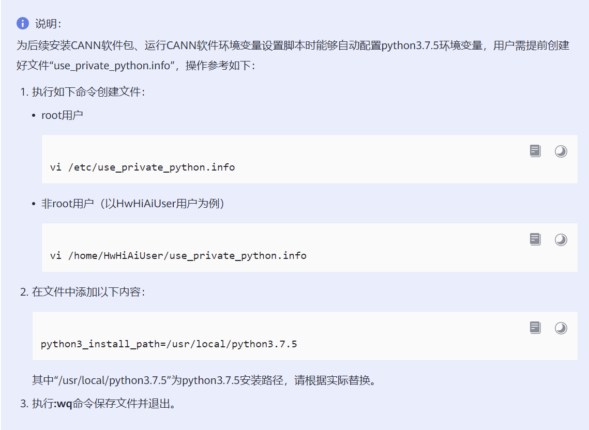

   Besides, add environmental variables:

   ```bash
   # in ~/.bashrc
   export LD_LIBRARY_PATH=/usr/local/python3.7.5/lib:$LD_LIBRARY_PATH
   export PATH=/usr/local/python3.7.5/bin:$PATH
   ```

   For firmware of Driver,

   ```bash
   # dowaload before
   chmod +x A*
   su
   ./A300-3010-npu-driver_21.0.2_linux-x86_64.run --full
   # install in /usr/local/Ascend
   reboot
   ```

   

4. Prepare the `.run` package of CANN to the device and then install it. In insider version you can use command line to download and install it. The default installation path is `/usr/local/Ascend` or `~/Ascend`.

5. validated the environmental variables of CANN

   ```bash
   source ${install_path}/bin/setenv.bash
   source ~/.bashrc
   ```
   
   ```bash
   # farther
   # 存在多个python版本时，需要指定为python3.7.5的安装路径，请根据实际情况修改
   export PATH=/usr/local/python3.7.5/bin:$PATH
   # for non-root user
   export install_path=~/Ascend
   # for root user
   export install_path=/usr/local/Ascend
   # ascend driver
   export a_driver_path=/usr/local/Ascend/driver
   # 加载Driver的so文件存在路径
   export LD_LIBRARY_PATH=/usr/local/Ascend/driver/lib64/common/:/usr/local/Ascend/driver/lib64/driver:$LD_LIBRARY_PATH
   # Runtime使用到的so文件存在路径
   # 如环境中存在Driver，则配置如下。
   export LD_LIBRARY_PATH=${install_path}/runtime/lib64:$LD_LIBRARY_PATH
   # 如环境中不存在Driver，则配置如下。
   export LD_LIBRARY_PATH=${install_path}/runtime/lib64:$LD_LIBRARY_PATH:${install_path}/runtime/lib64/stub
   # Compiler使用的python路径
   export PYTHONPATH=${install_path}/compiler/python/site-packages:$PYTHONPATH
   # 如果用户环境存在多个python3版本，则指定使用python3.7.5版本，python3.7.5安装路径请根据实际情况进行替换；同时设置ATC工具可执行文件所在路径
   export PATH=/usr/local/python3.7.5/bin:${install_path}/compiler/ccec_compiler/bin:${install_path}/compiler/bin:$PATH
   # Compiler的库文件存在路径
   export LD_LIBRARY_PATH=${install_path}/compiler/lib64:${install_path}/compiler/lib64/plugin/opskernel:${install_path}/compiler/lib64/plugin/nnengine:${install_path}/compiler/lib64/stub
   # FwkPlugin使用的python路径
   export PYTHONPATH=${install_path}/fwkplugin/python/site-packages:$PYTHONPATH
   # Toolkit使用的python路径
   export PYTHONPATH=${install_path}/toolkit/python/site-packages:$PYTHONPATH
   export TOOLCHAIN_HOME=${install_path}/toolkit
   # 算子库根目录
   export ASCEND_OPP_PATH=${install_path}/opp
   #AI CPU组件的安装路径
   export ASCEND_AICPU_PATH=${install_path}/
   
   ```
   
   

# Ascend in Huawei Cloud

refer to https://support.huaweicloud.com/ecs/index.html


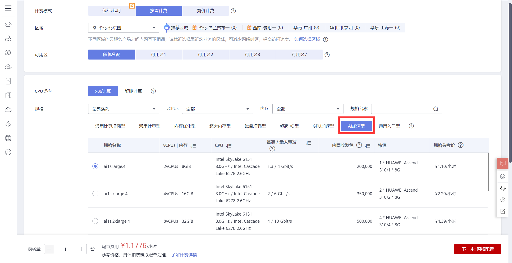

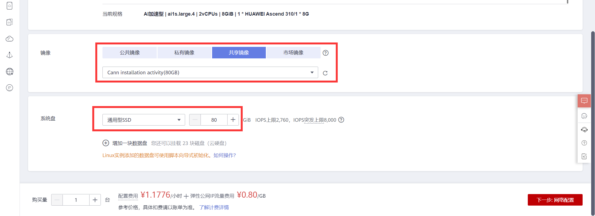

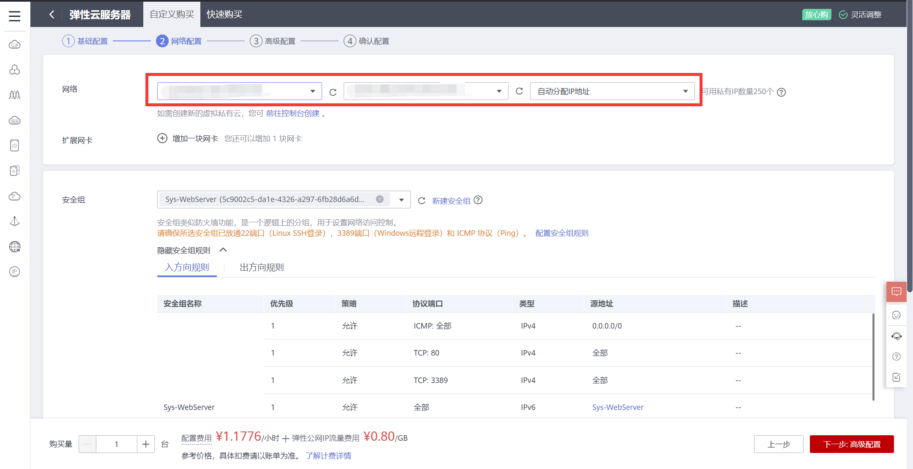


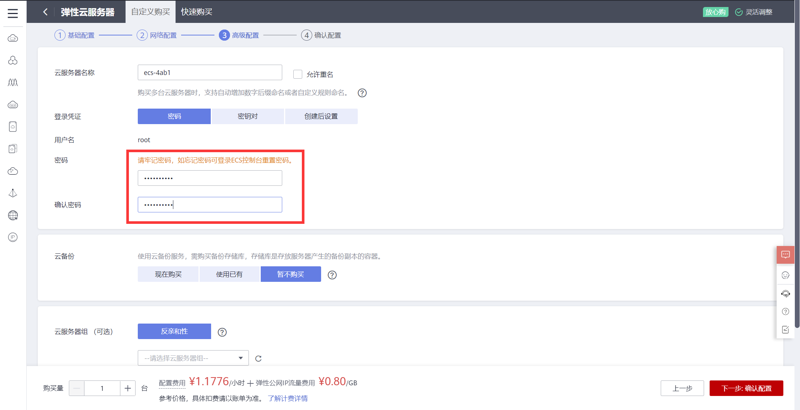


remote login with a software in PC, like `Termius` in Mac OS, `MobaXterm` in Windows, 

articles about MobaXterm: [MobaXterm技巧](https://webcache.googleusercontent.com/search?q=cache:Ay3YKLf-pxgJ:https://www.huaweicloud.com/articles/bc1baba84f0ee5578f417003c1f1c811.html+&cd=7&hl=zh-CN&ct=clnk&gl=id), 

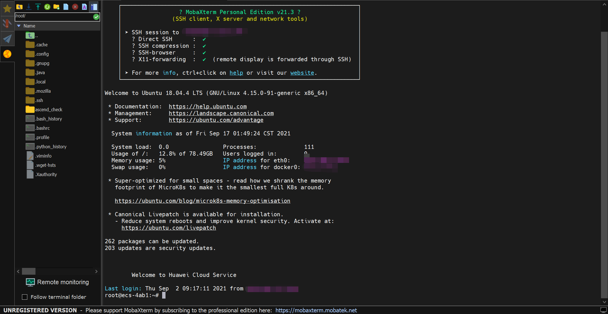

Note that it is supported to drag and drop files from PC.


# MindSpore installation

Make sure dependency installed first, refer to [MindSpore安装指南](https://www.mindspore.cn/install), [ML environment](http://mingg2333.top/2021/07/04/ai-env/).

Taking the installation of  `MindSpore 1.2` on Ubuntu-x86(GPU CUDA 10.1) for example, only one line refer to [MindSpore安装指南](https://www.mindspore.cn/install):

```shell
pip install https://ms-release.obs.cn-north-4.myhuaweicloud.com/1.2.1/MindSpore/gpu/ubuntu_x86/cuda-10.1/mindspore_gpu-1.2.1-cp37-cp37m-linux_x86_64.whl --trusted-host ms-release.obs.cn-north-4.myhuaweicloud.com -i https://pypi.tuna.tsinghua.edu.cn/simple
# Successfully installed asttokens-2.0.5 astunparse-1.6.3 cffi-1.14.5 decorator-5.0.9 easydict-1.9 mindspore-gpu-1.2.1 mpmath-1.2.1 numpy-1.21.0 packaging-20.9 pillow-8.2.0 protobuf-3.17.3 psutil-5.8.0 pycparser-2.20 pyparsing-2.4.7 scipy-1.7.0 six-1.16.0 sympy-1.8
```

Check your installation:

```shell
pip show mindspore-gpu
# Name: mindspore-gpu
# Version: 1.2.1
# Summary: MindSpore is a new open source deep learning training/inference framework that could be used for mobile, edge and cloud scenarios.
# Home-page: https://www.mindspore.cn
# Author: The MindSpore Authors
# Author-email: contact@mindspore.cn
# License: Apache 2.0
# Location:
# Requires: cffi, sympy, protobuf, scipy, setuptools, astunparse, easydict, wheel, psutil, packaging, numpy, decorator, asttokens, pillow
# Required-by: 
python -c "import mindspore;print(mindspore.__version__)"
# 1.2.1
```

Test 1:

```python
import numpy as np
import mindspore.context as context
import mindspore.nn as nn
from mindspore import Tensor
from mindspore.ops import operations as P

context.set_context(mode=context.GRAPH_MODE, device_target="GPU")

class Mul(nn.Cell):
    def __init__(self):
        super(Mul, self).__init__()
        self.mul = P.Mul()

    def construct(self, x, y):
        return self.mul(x, y)

x = Tensor(np.array([1.0, 2.0, 3.0]).astype(np.float32))
y = Tensor(np.array([4.0, 5.0, 6.0]).astype(np.float32))

mul = Mul()
print(mul(x, y))
# [4.0, 10.0, 18.0]
```

Test 2:

```python
import numpy as np
from mindspore import Tensor
import mindspore.ops as ops
import mindspore.context as context

context.set_context(device_target="GPU")
x = Tensor(np.ones([1,3,3,4]).astype(np.float32))
y = Tensor(np.ones([1,3,3,4]).astype(np.float32))
print(ops.add(x, y))
# [[[ 2.  2.  2.  2.],
#     [ 2.  2.  2.  2.],
#     [ 2.  2.  2.  2.]],

#     [[ 2.  2.  2.  2.],
#     [ 2.  2.  2.  2.],
#     [ 2.  2.  2.  2.]],

#     [[ 2.  2.  2.  2.],
#     [ 2.  2.  2.  2.],
#     [ 2.  2.  2.  2.]]]
```

Test 3:

refer to [体验快速入门](https://www.mindspore.cn/tutorial/training/zh-CN/r1.2/quick_start/quick_video/quick_start_video.html),

```bash
git clone https://gitee.com/mindspore/docs.git
cd docs
git checkout r1.2
```

# Euler OS


```bash
# check your system
uname -a
# Linux notebook-c4f2050c-c720-44cd-a6bc-ca40ad2e7bfd 3.10.0-862.14.1.5.h328.eulerosv2r7.x86_64 #1 SMP Mon Jul 22 00:00:00 UTC 2019 x86_64 x86_64 x86_64 GNU/Linux

# or
uname -r
# 3.10.0-862.14.1.5.h328.eulerosv2r7.x86_64

# unavailable
export HELLO="Hello!"
```

# Mind Studio

refer to [昇腾CANN训练营-应用营第一讲——开发&运行环境部署](https://www.bilibili.com/video/BV1m64y1D7Q1) (0:46:36).

# MindX SDK

https://education.huaweicloud.com/courses/course-v1:HuaweiX+CBUCNXA042+Self-paced/about?isAuth=0&cfrom=hwc

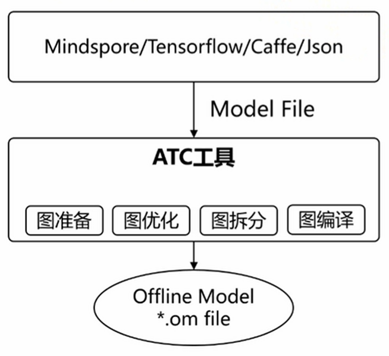


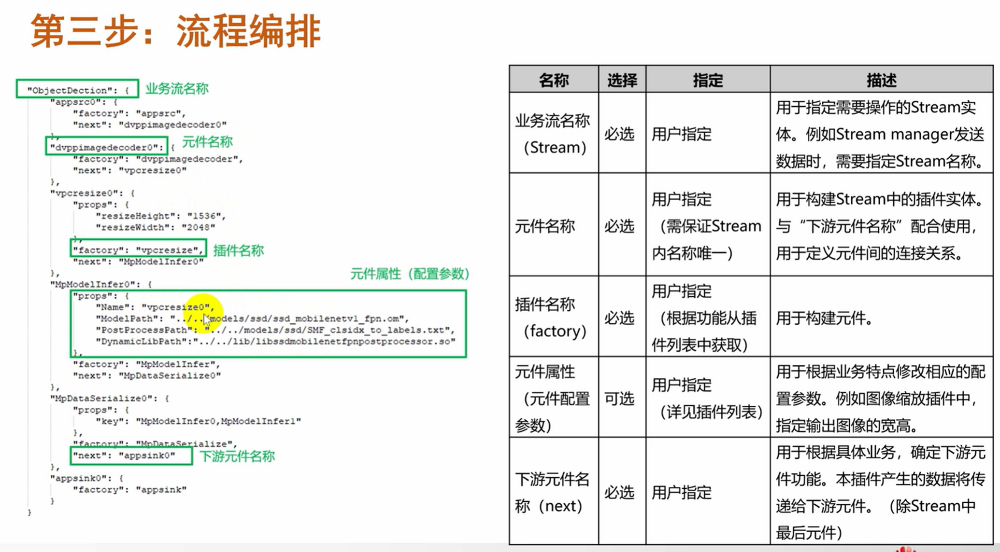

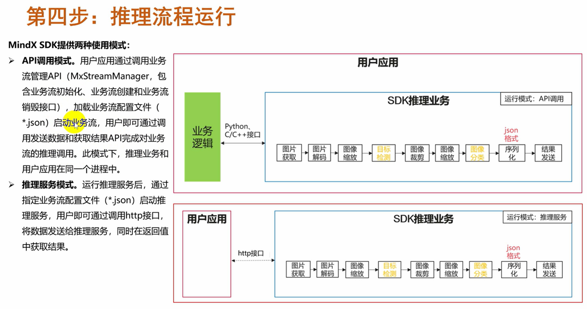

7个API


