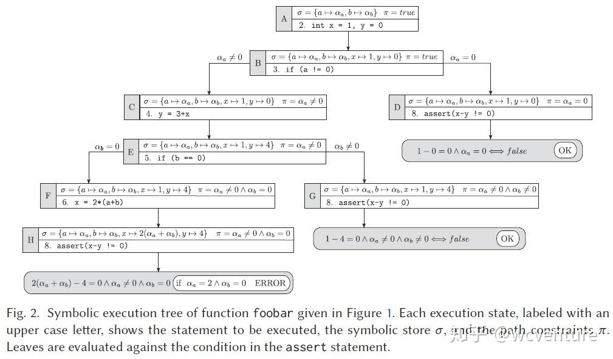

Created: 2021-11-16 23:39:58

Modified: 2021-11-16 23:39:58


<!--more-->

# instruction book

1. simple introduction.
2. detailed introduction with example.
3. analysis based on the example.

```
1. Symbolic Execution, a means of analyzing a program, determines inputs (in symbolic values) of each part of the program, and 
use those symbols to make up expressions for  variables in the program and constraints for the possible outcomes of each conditional branch.
2. For example, there is a symbolic state σ including variable expressions, and symbolic execution path constraint π presented by branches. 
The symbolic store σ and are updated each turn where new line is analyzed.
When analysis is interrupted, like meeting assert, a judge of error happens by combining σ with π.
3. advantages. 
 - finding precise ranges of variables instead of specific value of variables.
 - easily creating some specific value of variables.
 - higher code coverage due to  higher variable coverage.
 - more sorts of error types, like assertion violations, uncaught exceptions, security vulnerabilities, and memory corruption.
 4. disadvantage.
  - infinite constraint in certain occasion, like loop with specical ending condition.
```



