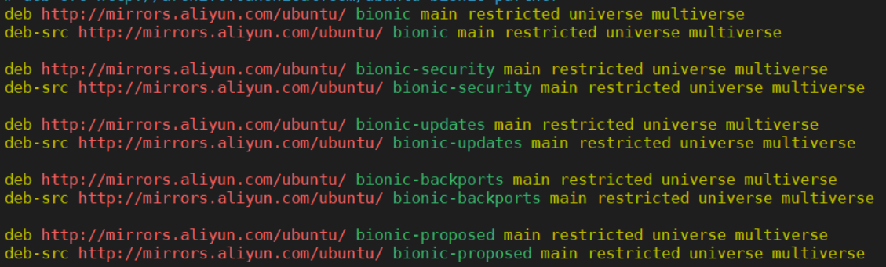

Created: 2021-07-02 21:51:30

Modified: 2021-08-26 22:44

<!--more-->

use `Ctrl + T` to open `CLI`.

# System

check your system, refer to https://www.huaweicloud.com/articles/1d7ee487bde77c3df14d144f4c0c136c.html

```bash
cat /etc/*release && uname -m
uname -a
# number of CPUs, cpu cores, logic processors, type
cat /proc/cpuinfo| grep "physical id"| sort| uniq| wc -l
cat /proc/cpuinfo| grep "cpu cores"| uniq
cat /proc/cpuinfo| grep "processor"| wc -l
cat /proc/cpuinfo | grep name | cut -f2 -d: | uniq -c
```


# User

```bash
# show all users
cat /etc/passwd
# current user
whoami
# change user password
# for the first time to `sudo passwd`, current root password is the installation user password, valid after restart PC
sudo passwd [root]
passwd [current user]
# su: substitute user, use `man su` for more help
su [root]
su - [root]
sudo su root
# Linux中创建非root用户，并授权对某个应用的操作权限，https://blog.csdn.net/panchang199266/article/details/86765007
# 以root用户来创建新的用户 ， groupadd 添加一个用户组
[root@localhost home]# groupadd elk
# 添加一个用户，-g是在用户组下 -p是密码
[root@localhost home]# useradd elk -g elk -p elk
# 进入es的安装目录
[root@localhost home]# cd /home/elasticsearch 
# 给用户elk授权
[root@localhost home]# chown -R elk:elk elasticsearch-6.3.1/
# 切换到 elk用户
[root@localhost elasticsearch]# su elk
# add to sudo group
# su
# vi /etc/sudoers
# wq!
```

related: [Linux下修改用戶模式（usermod，sudo權限等）](https://kknews.cc/tech/mqmk4g.html).

## root


# Source

## apt

```bash
su
cd
cd /etc/apt
ll
vim sources.list
cp sources.list sources.list.bak
>sources.list
vim sources.list
```



## pip

```bash
cd
mkdir .pip
cd .pip
vim pip.conf
cd
```

pip source: https://support.huaweicloud.com/instg-cli-cann503-alpha002/atlasdeploy_03_0071.html#ZH-CN_TOPIC_0000001197460367

# Install dependency

## offline

you can install some basic tools or libraries offline by using Ubuntu installation file, like ubuntu-18.04.5-desktop-amd64.iso, refer to [Ubuntu-离线安装基本依赖（gcc、make、dkms等）_快乐学术猿-CSDN博客_ubuntu安装dkms](https://yuanbaoqiang.blog.csdn.net/article/details/109596767).

```bash
sudo dpkg -i ***.deb
```


Notice: not suggested because of the old versions and special installation order.

## online

```bash
sudo apt-get update
sudo apt-get upgrade
sudo apt install build-essential

sudo apt --fix-broken install

pip3 install --upgrade pip
```


# hosts and proxy

for faster access

## local site

refer to [ubuntu加速github - Jarvis_Xu - 博客园 (cnblogs.com)](https://www.cnblogs.com/JarvisCJ/p/8395569.html),

search DNS of `github.global.ssl.fastly.net` and `assets-cdn.github.com` in http://tool.chinaz.com/dns/.

```bash
sudo gedit /etc/hosts
# search one by one and modify the file
# after modifying
/etc/init.d/networking restart
```

## system

use [clash for Linux: A rule-based tunnel in Go](https://github.com/Dreamacro/clash).

1. Using the following instruments, download and extract software clash from [Releases · clash](https://github.com/Dreamacro/clash/releases), and move the executable file to be customized `/usr/local/bin/clash`, then execute it to automatically get `~/.config/clash` and two configuration file in it.

   ```bash
   export VERSION_CLASH=v1.6.5
   export CLash_VERSION=clash-linux-amd64-${VERSION_CLASH}
   wget https://github.com/Dreamacro/clash/releases/download/${VERSION_CLASH}/${CLash_VERSION}.gz
   ls
   sudo gzip -d ${CLash_VERSION}.gz
   export CLASH=/usr/local/bin/clash
   sudo mv ${CLash_VERSION} ${CLASH}
   sudo chmod +x ${CLASH}
   # run clash to create a default ~/.config/clash/
   sudo ${CLASH}
   cd ~/.config/clash
   ls
   ```

   Press `Ctrl + C` to stop clash.

   Notice: you can build locally referring to [Home · Dreamacro/clash Wiki · GitHub](https://github.com/Dreamacro/clash/wiki).

2. Update your own `config.yaml` to `~/.config/clash/config.yaml`,

   ```bash
   export CLASH_URL={your own subscription address}
   sudo wget --no-check-certificate -O ~/.config/clash/config.yaml ${CLASH_URL}
   # or
   # curl -L -o ~/.config/clash/config.yaml ${CLASH_URL}
   # or, refer to https://blog.csdn.net/Undefinedefity/article/details/117171436
   # curl -H "User-Agent: ClashX/1.20.4.1" https://*****.yaml > config.yaml 
   
   ```
   
   Optional: you can update the `~/.config/clash/Country.mmdb` too, use the following command lines or download from [GeoLite2-Country.mmdb · Gitee 极速下载/Pingtunnel - Gitee.com](https://gitee.com/mirrors/Pingtunnel/blob/master/GeoLite2-Country.mmdb).
   
   ```bash
   export Countrymmdb_URL=https://www.sub-speeder.com/client-download/Country.mmdb>
   # or
   export Countrymmdb_URL=https://whiter.cc/cached-apps/linux/Country.mmdb
   wget --no-check-certificate -O ~/.config/clash/Country.mmdb ${Countrymmdb_URL}
   ```
   
3. Configure Ubuntu system proxy responding to `~/.config/clash/config.yaml`, 

   ```bash
   gedit ~/.config/clash/config.yaml
   ```

   suggest to use GUI in `Settings -> Network -> Network Proxy -> Manual`, or use shell command lines referring to [Linux下安装&配置Clash以实现代理上网 - 知乎 (zhihu.com)](https://zhuanlan.zhihu.com/p/369344633). 

4. Configure clash in [external controller](http://clash.razord.top/#/proxies)  with a browser, refer to [Clash For Linux 安装及使用](https://www.cnblogs.com/sundp/p/13541541.html).

5. Set automatical action, like Boot and Update. you can refer to [在 Ubuntu 上使用 clash 代理工具_dongheli的专栏-CSDN博客](https://blog.csdn.net/dongheli/article/details/114788088#commentBox), [Ubuntu 18.04 使用clash_Undefinedefity的博客-CSDN博客](https://blog.csdn.net/Undefinedefity/article/details/117171436), and [Linux下安装&配置Clash以实现代理上网 - 知乎 (zhihu.com)](https://zhuanlan.zhihu.com/p/369344633). Some frequent usage:

   ```bash
   systemctl status clash
   systemctl start clash
   systemctl kill clash
   ```

   Notice: if you plan to write a systemd unit `.service` yourself, you need to put it at `/lib/systemd/system` on Ubuntu and use an absolute path to an executable or a simple file name without any slashes while writing `ExecStart=`, for example you cannot use `~`, refer to [systemd.service (www.freedesktop.org)](https://www.freedesktop.org/software/systemd/man/systemd.service.html#ExecStart=). Besides, you must use `systemctl daemon-reload` in shell to make changes and modification of `.service` valid, refer to [How to Manage 'Systemd' Services and Units Using 'Systemctl' in Linux (tecmint.com)](https://www.tecmint.com/manage-services-using-systemd-and-systemctl-in-linux/) and [技术|systemctl 命令完全指南 (linux.cn)](https://linux.cn/article-5926-1.html).

   Otherwise, you can use a native software `Startup Application`, refer to [Ubuntu 18.04 使用clash_Undefinedefity的博客-CSDN博客](https://blog.csdn.net/Undefinedefity/article/details/117171436).

   ```bash
   echo ${CLASH}
   ```

6. set for terminal 

   ```bash
   export http_proxy=http://127.0.0.1:7890
   export https_proxy=http://127.0.0.1:7890
   ```

   

Notice: if your system time is not correct, there would be something wrong with clash.


# shell

how to execute `.sh` file, refer to [ubuntu执行.sh文件几种方式区别_yao伟斌-CSDN博客](https://blog.csdn.net/u012336923/article/details/50474692).

command lines syntax, [echo和Shell特殊变量：Shell $0, $#, $*, $@, $?, $$和命令行参数_weixin_33890499的博客-CSDN博客](https://blog.csdn.net/weixin_33890499/article/details/92389451).

## apt-get

```bash
sudo apt update
sudo apt-get install git
# refer to https://gauliang.github.io/blog/2020/how-to-install-java-with-apt-get-on-ubuntu/
sudo apt install default-jre

```

refer to [2020最详细安装Ubuntu指南 - 知乎 (zhihu.com)](https://zhuanlan.zhihu.com/p/135953477), [ubuntu新安装完成后配置_sinat_40025092的博客-CSDN博客](https://blog.csdn.net/sinat_40025092/article/details/79785185),

## chmod

```bash
# Executable permission
chmod +x A*
```

## ln

```bash
ln -s {src} {des}
```


## tar gz tgz

refer to [Ubuntu 常用解压与压缩命令_songbinxu的博客-CSDN博客_ubuntu zip](https://blog.csdn.net/songbinxu/article/details/80435665),

```bash
# .tgz & .tar.gz 
tar -zxvf FileName.tar.gz -C DesDirName
# .zip
unzip FileName.zip -d DesDirName
zip -r FileName.zip srcName
# .tar
tar -xvf FileName.tar
# .gz
gunzip FileName.gz
```


## makefile

refer to [MakeFile 文件的使用 - CTHON - 博客园 (cnblogs.com)](https://www.cnblogs.com/cthon/p/9076787.html), [Makefile的使用方法 - linqiaozhou - 博客园 (cnblogs.com)](https://www.cnblogs.com/qiaozhoulin/p/4896326.html), https://www.jianshu.com/p/c70afbbf5172: 

```bash
./configure --prefix=/usr
make
sudo make install
```

## directory store

```bash
pwd
mkdir
rm -rf
rm -rf {directory name}/*

# Ubuntu查看文件大小或文件夹大小
du -lh --max-depth=1
ls -l filename
du -sh filename
# 查看磁盘的使用情况命令：
df -h
df -hl
```


## file

refer to [Linux vi/vim | 菜鸟教程 (runoob.com)](https://www.runoob.com/linux/linux-vim.html), [linux下的Source命令的基本功能_百度知道 (baidu.com)](https://zhidao.baidu.com/question/59790034.html?qq-pf-to=pcqq.c2c), 

```bash
touch
vim
# d delet line
source
rm -rf ./
cat
```

## tree

```bash
sudo apt-get install tree
tree .
```


## process

```bash
# refer to https://blog.csdn.net/andy572633/article/details/7211546
ps -aux | grep 46730
ps -fe
ps -ef | grep cyber_monitor{name of process}
pgrep {name of process}

kill {PID of process}
kill -s 9 {PID of process}
pkill - 9 {name of process}
```

## nohup

```bash
# https://www.runoob.com/linux/linux-comm-nohup.html
# https://blog.51cto.com/u_15088375/3247580
nohup /root/runoob.sh &
nohup /root/runoob.sh > runoob.log 2>&1 &

ps -aux | grep "runoob.sh" 
# ps -def | grep "runoob.sh"
kill -9  进程号PID
```


## cpu

```bash
# refer to https://www.cnblogs.com/ggjucheng/archive/2012/01/08/2316399.html
top
```


## Environment Variables

refer to [ubuntu－设置系统环境变量 - 简书 (jianshu.com)](https://www.jianshu.com/p/12fbfa8c7489),

## IP

```bash
ifconfig -a
```


## PORT

```python
lsof -a -i4 -i6 -itcp
lsof -i TCP:2000
```


## system

```
sudo vim ~/.bashrc
```

## driver

```bash
ubuntu-drivers devices
sudo ubuntu-drivers autoinstall
```

## ssh

```bash
# refer to https://bicmr.pku.edu.cn/~wenzw/pages/filetransfer.html
# sshfs, refer to https://cloud.tencent.com/developer/article/1168897
sudo apt install sshfs
mkdir ~/workstation
sshfs username@ip_address: ~/workstation
fusermount -u workstation
# scp
scp file username@ip_address:Documents/
scp -rf folder username@ip_address:
```


## root

refer to [ubuntu18.04获取root权限并用root用户登录 - 不妨不妨，来日方长 - 博客园 (cnblogs.com)](https://www.cnblogs.com/masbay/p/10744900.html),

# Application

```bash
# refer to https://code.visualstudio.com/docs/setup/linux
# install deb file
sudo apt install ./<file>.deb

# If you're on an older Linux distribution, you will need to run this instead:
sudo dpkg -i <file>.deb
# Install dependencies
sudo apt-get install -f
```

## language

1. click https://pinyin.sogou.com/linux/?r=pinyin to download and install sogou.

   

   Note that you must use `fcitx` if you use sogou, refer to https://pinyin.sogou.com/linux/help.php.

## editor


1. use [Typora](https://typora.io/) to editor `markdown`, for configuration refer to http://mingg2333.top/2021/07/06/Typora/.


2. use vim


```bash
sudo apt-get install vim
```

3. for code, use [VS code](https://code.visualstudio.com/),


if it is too slow to download the software done, refer to https://zhuanlan.zhihu.com/p/112215618.


## browser

Download deb from https://www.google.cn/chrome/.


## network disk

Download deb from https://www.dropbox.com/install.


Note that you need to install Dropbox Headless manually if there are something wrong with access to Dropbox website.

## other tool

1. install Git,

   ```bash
   sudo apt-get install git
   ```

   For create ssh key, refer to https://docs.github.com/cn/github/authenticating-to-github/connecting-to-github-with-ssh, then you can configure for it in [Keys for Github](https://github.com/settings/keys) or [Keys for Gitee](https://gitee.com/profile/sshkeys). And you can configure for your Git refering to http://mingg2333.top/2021/07/29/git/.
   
2. for making video,

   ```bash
   sudo apt install ffmpeg
   ```

   refer to https://www.liangye.site/2019/01/22/python-animation/.

3. screen recorder. 

   ```bash
   sudo apt install kazam
   ```

   refer to https://itsfoss.com/best-linux-screen-recorders/

4. 

3. 


# local net

## share folder

refer to https://content.jianguoyun.com/32175.html.
