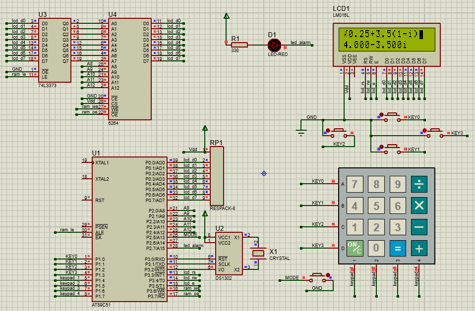
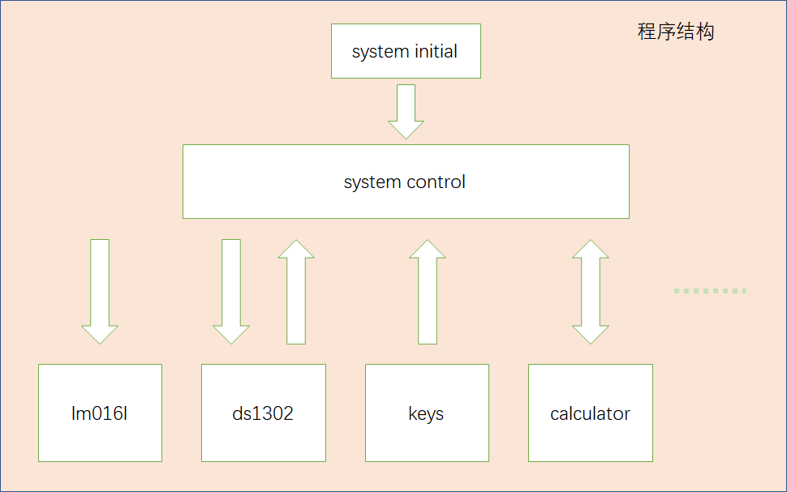
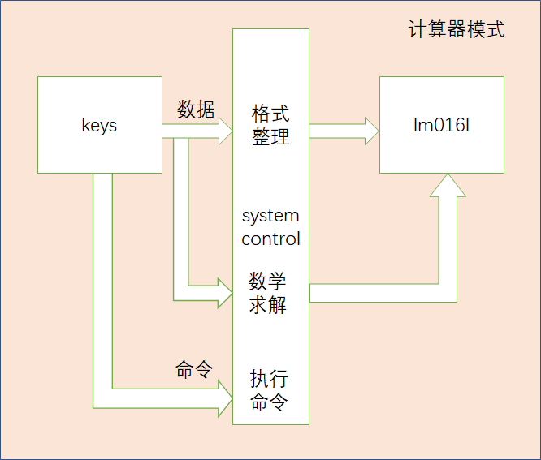

介绍近期的一项微机原理课程设计——电子计算器。

<!--more-->

[TOC]

- [1 功能简介](#1-功能简介)
  - [1 1 计算器模式](#1-1-计算器模式)
  - [1 2 其他附加模式](#1-2-其他附加模式)
- [2 电路设计](#2-电路设计)
- [3 主要程序详解](#3-主要程序详解)
  - [3 1 程序框架](#3-1-程序框架)
  - [3 2 system control](#3-2-system-control)
    - [3 2 1 系统模式管理](#3-2-1-系统模式管理)
    - [3 2 2 输入输出处理](#3-2-2-输入输出处理)
  - [3 3 calculator](#3-3-calculator)
  - [3 n 细节处理](#3-n-细节处理)
- [4 想法与总结](#4-想法与总结)

# 1 功能简介

本系统为电子计算器，非计算时可以显示时间且时间可以调整，还可以滚动显示随机的乘法表算式。系统功能概括为4种模式，模式间可以相互切换。

## 1 1 计算器模式

支持加、减、乘、除、开方运算；

支持带括号的混合运算；

支持小数、复数运算；

实时显示运算结果或者异常信息；

输出精度到0.001,大小不超过31位（二进制）；

支持计算溢出、表达式错误、除以零等异常提醒；

支持运算结果的存储与查看；

支持负数不加括号、括号前不加乘号等输入习惯。

## 1 2 其他附加模式

**显示时间模式**

显示日期与时间，支持月份末自动调整、闰年校正。

**调整时间模式**

支持设置年、月、日、时、分、秒的每一位；

保存上次时间设置。

**滚动显示随机乘法表算式模式**

滚动显示随机的乘法表算式。

# 2 电路设计

基于`proteus`单片机单片机仿真软件,电路原理图如下,



下表简单介绍一下元器件,

|   模块   |   元器件    | 备注                                           |
| :------: | :---------: | ---------------------------------------------- |
|   MCU    |   AT89C51   | 含有片内振荡器，没有特殊要求时可以不接外部晶振 |
|          |   8位排阻   | 用于51单片机P0端口的上拉                       |
| LCD模块  |   LM016L    | 基于液晶内置的HD44780芯片控制                  |
| 按键模块 | 4×4矩阵按键 |                                                |
|          |  独立按键   |                                                |
| 时钟模块 |   DS1302    | 一般需要32.768KHz标准时钟晶振                  |
|          |    晶振     | 32.768KHz                                      |
| 存储模块 |    6264     | 8KB的RAM                                       |
|          |   74LS373   | 用于地址线低八位的锁存                         |
| LED模块  |    LED灯    | 红色                                           |
|          |    电阻     | 330Ω,用于限流                                  |

注：实际电路中，考虑电源波动的影响一般需要在元器件电源处并联电容。

# 3 主要程序详解

## 3 1 程序框架



系统初始化包括液晶lm016(等同于lcd1602)、时钟芯片ds1302、单片机定时器等的初始化.

`system control`相关程序负责管理系统的模式状态、进行输入输出的处理.

`lm016`、`ds1302`、`key`、`calculator`代表不同模块,分别是显示、读取时钟、输入、计算的实现或者说驱动.

## 3 2 system control

### 3 2 1 系统模式管理

``` c
//系统状态枚举
typedef enum
{
    TimesDisplay      = 0,     //时间显示
	
    CalculationInput ,         //计算器

    MultiplicationTable ,      //滚动乘法表

    TimesChange                //调整时间
    
} SystemStatus;

extern SystemStatus system_status;//系统状态
extern SystemStatus system_laststatus;//上次系统状态
```

定义枚举类型`enum`来表示不同的系统状态,而模式切换通过条件判断语句`if`即可实现(省略部分代码在后面介绍),

``` c
if (system_status <= CalculationInput && ch == 'o')//显示时间与计算器模式间的切换
    {
        ch = 0;
        system_status ^= CalculationInput;//设置状态
        //……设置屏幕
    }
else if (system_status <= CalculationInput && ch == 'O')//进入模拟滚动
    {
        ch = 0;
        system_laststatus = system_status;
        system_status  = MultiplicationTable;//设置状态
        //……设置屏幕
    }//其他的模式切换放在下面的状态处理中

switch (system_status)//状态判断与处理
    {
    case CalculationInput:
        //……key_lcd_calc_connect
        break;
    case TimesChange:
        //……key_lcd_ds_connect
        break;
    case TimesDisplay:
        //……ds_lcd_connect
        break;
    case MultiplicationTable:
        //……multab_lcd_connect
        break;
    default:
            //restart
        break;
    }
```

### 3 2 2 输入输出处理

通过条件判断语句`switch`实现不同状态下的输入输出的管理.

上一块代码的`switch`语句中的`key_lcd_calc_connect` `key_lcd_ds_connect` `ds_lcd_connect` `multab_lcd_connect`就是对输入输出的中间处理,它们把多个模块间进行连接(有的"connect"中融入了模式切换).

以`key_lcd_calc_connect` 为例,它的输入输出处理框图如下,



从`key`输入的"数据"分两条路径到达输出侧`lm016l`，一条是输入经过`system control`调用`calculator`的数据格式整理后到输出，一条是输入与过去输入累积经过`system control`调用`calculator`的求解算法后到输出；

从`key`输入的"命令"经过`system control`调用`calculator`执行命令.

相关代码如下:

``` c
if ((ch >= '0' && ch <= '9') || prority(ch) >= 0)//输入数字0-9或者运算符
{
    if (cursor >= CalcOverflow)//alarm: input overflow
    {
        ch = 0;
    }
    else
    {
        //……输入直接到输出的格式整理
        //……输入累积(存储)
        SimpleCalc();//数学求解
        pos(cursor);//设置光标
        delay(2);
    }
}
else if (panic_instruct(ch))//输入命令
{
    CalcOpera();//执行命令
    pos(cursor);//设置光标
    delay(2);
}
```

## 3 3 calculator

下面介绍`calculator`模块的实现.

(未完待续)

## 3 n 细节处理


# 4 想法与总结

状态切换

`system control`中状态切换